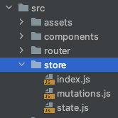

# 加入vuex

> 分类: Web > vite
> 更新时间: 2026-01-10T23:34:09.929712+08:00

---

## 安装
`npm install vuex@4 -S`

+ 想要将vuex数据持久化，还需要安装vuex-along

`npm install vuex-along -S` 

## 创建配置文件


1. src/store/index.js

```javascript
import {createStore} from 'vuex'
import mutations from '@/store/mutations'
import state from "@/store/state";
import createVuexAlong from 'vuex-along'

export default createStore({
	state,
	mutations,
	plugins: [
		createVuexAlong({
			local: {
				list: [],
			},
			session: {
				list: ["count"],
			}
		})
	]
})
```

2. src/store/state.js

```javascript
const state = {
	count: 0
}
export default state
```

3. src/store/mutations.js

```javascript
const mutations = {
	add(state) {
		state.count++
	}
}
export default mutations
```

## 在 main.js中引入
```javascript
import {createApp} from 'vue'
import App from './App.vue'
import router from "@/router";
import store from '@/store';

const app = createApp(App)
app.use(router)
app.use(store)
app.mount('#app')
```

## 在Home.vue中使用store
```html
<template>
  <h1>{{ msg }}</h1>
  <h1></h1>
  <button @click="$store.commit('add')">count is: {{ $store.state.count }}</button>
  <p>Edit <code>components/HelloWorld.vue</code> to test hot module replacement.</p>
</template>

<script>
export default {
  name: 'HelloWorld',<template>
  <h1>这是首页</h1>
  <button @click="valueAdd">{{ value }}</button>
</template>

<script setup>
import store from '@/store/index'
import {computed} from "vue";

const value = computed(() => store.state.count)
const valueAdd = () => {
  store.commit('add')
}
</script>

<style scoped>

</style>
  props: {
    msg: String
  }
}
</script>
```

