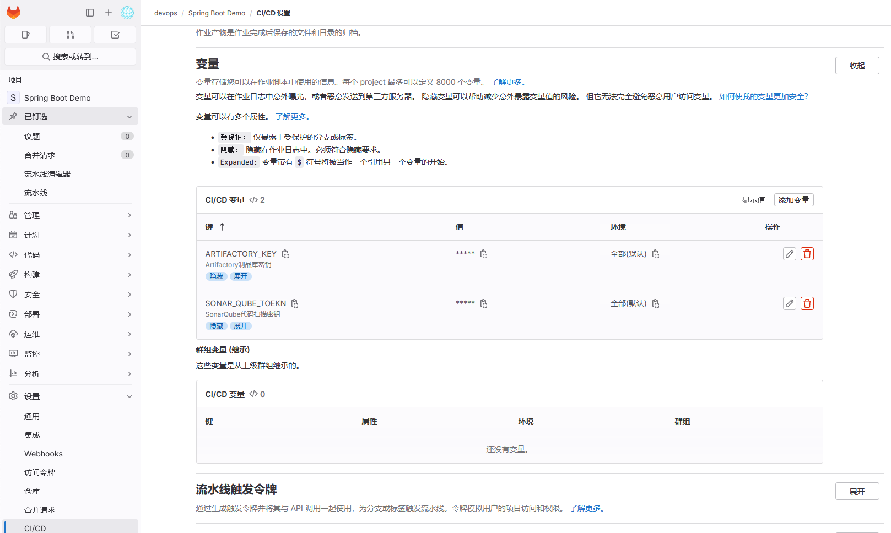
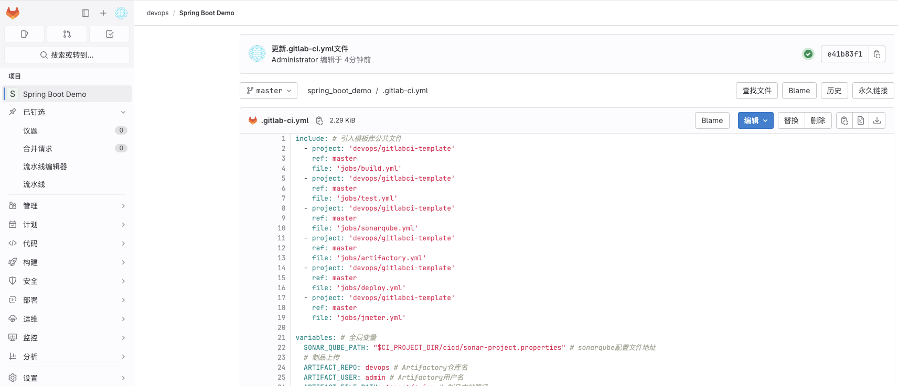
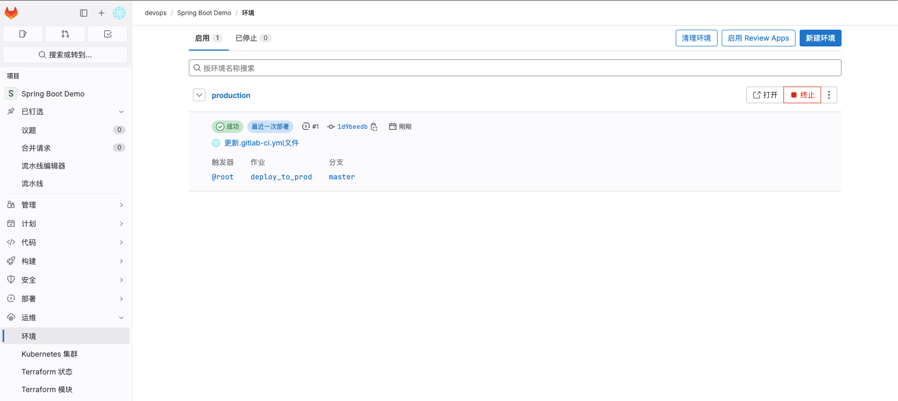
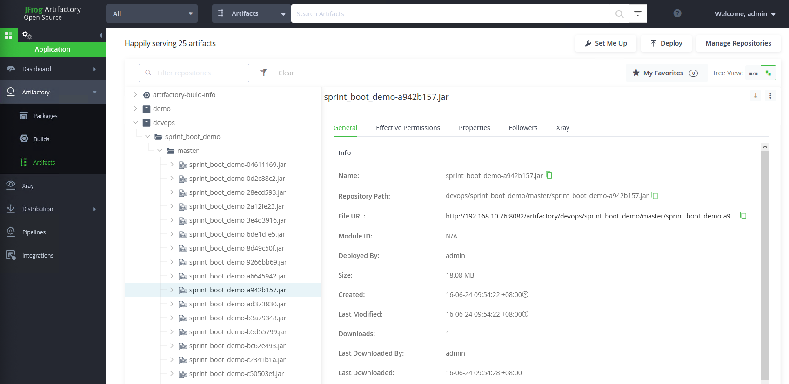
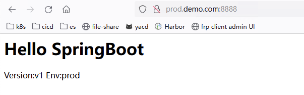

# gitlab+linux项目实践
# 项目简介
<font style="color:rgb(48, 49, 51);">利用Gitlab、Gitlab Runner(rpm)、SonarQube、Artifactory、Jmeter、Maven、Java技术，搭建一个完整的 CI/CD 管道，实现当开发人员完成代码提交后，开始流水线工作，完成编译打包、单元测试、源码扫描、上传制品、部署服务到Linux主机、自动化测试工作。通过自动化构建、测试、代码质量检查和容器化部署，将开发人员从繁琐的手动操作中解放出来，提高团队的开发效率、软件质量和安全性，实现持续更新迭代和持续部署交付。</font>

## <font style="color:rgb(48, 49, 51);">CI/CD流程图</font>


## <font style="color:rgb(48, 49, 51);">流程说明</font>
1. <font style="color:rgb(48, 49, 51);">开发人员将代码提交到Gitlab代码仓库时，触发持续构建和持续部署流程。</font>
2. <font style="color:rgb(48, 49, 51);">使用Maven环境的Gitlab Runner实现编译打包、单元测试、源码扫描和上传制品操作。</font>
3. <font style="color:rgb(48, 49, 51);">使用Java环境的Gitlab Runner实现服务springboot部署。</font>
4. <font style="color:rgb(48, 49, 51);">使用JMeter环境的Gitlab Runner实现自动化测试。</font>
5. <font style="color:rgb(48, 49, 51);">流水线执行完成后，将结果邮件通知给开发和运维人员。</font>
6. <font style="color:rgb(48, 49, 51);">用户访问项目服务器。</font>

## <font style="color:rgb(48, 49, 51);">服务器列表</font>
| **<font style="color:rgb(48, 49, 51);">服务器名称</font>** | **<font style="color:rgb(48, 49, 51);">主机名</font>** | **<font style="color:rgb(48, 49, 51);">IP</font>** | **<font style="color:rgb(48, 49, 51);">部署服务</font>** | **<font style="color:rgb(48, 49, 51);">Runner标签</font>** |
| --- | --- | --- | --- | --- |
| <font style="color:rgb(48, 49, 51);">代码审查服务器</font> | <font style="color:rgb(48, 49, 51);">sonarqube</font> | <font style="color:rgb(48, 49, 51);">192.168.10.71</font> | <font style="color:rgb(48, 49, 51);">SonarQube</font> | <font style="color:rgb(48, 49, 51);"></font> |
| <font style="color:rgb(48, 49, 51);">代码托管服务器</font> | <font style="color:rgb(48, 49, 51);">gitlab</font> | <font style="color:rgb(48, 49, 51);">192.168.10.72</font> | <font style="color:rgb(48, 49, 51);">Gitlab</font> | <font style="color:rgb(48, 49, 51);"></font> |
| 打包编译服务器 | maven | 192.168.10.74 | Java、Maven | build |
| <font style="color:rgb(48, 49, 51);">服务部署服务器</font> | springboot | 192.168.10.75 | Java | <font style="color:rgb(48, 49, 51);">deployment</font> |
| <font style="color:rgb(48, 49, 51);">制品库服务器</font> | <font style="color:rgb(48, 49, 51);">artifactory</font> | <font style="color:rgb(48, 49, 51);">192.168.10.76</font> | <font style="color:rgb(48, 49, 51);">artifactory</font> | <font style="color:rgb(48, 49, 51);"></font> |
| 自动化测试服务器 | jmeter | <font style="color:rgb(48, 49, 51);">192.168.10.77</font> | Java、jmeter | test |


## 服务部署
+ Gitlab：[https://www.cuiliangblog.cn/detail/section/92727905](https://www.cuiliangblog.cn/detail/section/92727905)
+ <font style="color:rgb(48, 49, 51);">SonarQube</font>：[https://www.cuiliangblog.cn/detail/section/131467837](https://www.cuiliangblog.cn/detail/section/131467837)
+ Artifactory：[https://www.cuiliangblog.cn/detail/section/172000978](https://www.cuiliangblog.cn/detail/section/172000978)
+ Jmeter：[https://www.cuiliangblog.cn/detail/section/173491430](https://www.cuiliangblog.cn/detail/section/173491430)

# 模板库创建
## 模板库功能介绍
通常情况下项目流水线大部分的内容都是相同的，为了实现模板复用，减少重复代码，我们可以创建一个git仓库用于存放模板，然后创建一个templates目录存放所有pipeline的模板，创建一个jobs目录存放job模板。

这样我们可以将一些maven、golang、npm工具通过一个job模板和不同的构建命令实现。templates的好处是我们在其中定义了模板流水线，这些流水线可以直接让项目使用。当遇到个性化项目的时候就可以在当前项目创建.gitlab-ci.yml文件来引用模板文件，再进一步实现个性化需要。

## 模板库地址
gitee：[https://gitee.com/cuiliang0302/gitlabci-template](https://gitee.com/cuiliang0302/gitlabci-template)

## 模板库创建
创建模板库项目Gitlabci Template


项目文件目录结构如下所示：

```bash
[root@tiaoban gitlabci-template]# tree .
.
├── jobs
│   ├── artifactory.yml
│   ├── build.yml
│   ├── deploy.yml
│   ├── jmeter.yml
│   ├── sonarqube.yml
│   └── test.yml
├── README.md
└── templates
    ├── java-docker.yml
    ├── java-k8s.yml
    └── java-linux.yml
```

artifactory.yml

```yaml
# 制品库上传与下载
variables: # 全局变量
  ARTIFACTORY_PUBLIC_URL: http://192.168.10.76:8081/artifactory # Artifactory地址

.upload-artifact:
  stage: upload-artifact
  tags:
    - build
  script:
    - echo "curl -u$ARTIFACT_USER:$ARTIFACTORY_KEY -T $ARTIFACT_FILE_PATH "$ARTIFACTORY_PUBLIC_URL/$ARTIFACT_REPO/$ARTIFACT_URL_PATH""
    - curl -u$ARTIFACT_USER:$ARTIFACTORY_KEY -T $ARTIFACT_FILE_PATH "$ARTIFACTORY_PUBLIC_URL/$ARTIFACT_REPO/$ARTIFACT_URL_PATH"

.download-artifact:
  stage: download-artifact
  tags:
    - build
  script:
    - curl -u${ARTIFACT_USER}:${ARTIFACT_PASSWD} -O "$ARTIFACTORY_PUBLIC_URL/$ARTIFACT_REPO/$ARTIFACT_URL_PATH"
    - ls
```

build.yml

```yaml
# 打包编译
.mvn-build:
  stage: build
  tags:
    - build
  script: 
    - mvn clean package -DskipTests -Dmaven.repo.local=/home/gitlab-runner/cache/maven
  after_script:
    - ls target/
  artifacts: 
    paths: # 收集打包后的制品
      - target/
  cache:
    policy: pull  # 不下载缓存
```

deploy.yml

```yaml
# 服务部署
.deploy-linux: # 部署到linux系统
  stage: deploy
  tags:
    - deploy
  script:
    - sh -x $DEPLOY_PATH $ARTIFACT_USER $ARTIFACTORY_KEY /opt/$ARTIFACT_URL_PATH $ARTIFACTORY_PUBLIC_URL/$ARTIFACT_REPO/$ARTIFACT_URL_PATH
```

jmeter.yml

```yaml
# jmeter自动化测试
.jmeter: 
  stage: test
  tags: 
    - jmeter
  script:
    - "jmeter -n -t $JMETER_PATH -l $CI_PROJECT_NAME-$CI_COMMIT_SHORT_SHA.jt1 -e -o $PWD/public -Jjemter.save.saveservice.output_format=csv"
  after_script:
    - ls $PWD/public/
  artifacts: # 收集站点page页内容
    paths:
      - public
```

sonarqube.yml

```yaml
# sonarqube代码扫描
variables: 
  SONAR_QUBE_URL: http://192.168.10.71:9000 # sonarqube服务地址

.sonarqube:
  stage: code_scan
  tags:
    - build
  script:
    - "sonar-scanner -Dsonar.projectKey=$CI_PROJECT_NAME -Dproject.settings=$SONAR_QUBE_PATH \
      -Dsonar.branch.name=$CI_COMMIT_REF_NAME -Dsonar.host.url=$SONAR_QUBE_URL -Dsonar.login=$SONAR_QUBE_TOEKN"
```

test.yml

```yaml
# 单元测试
.mvn_unit_test:
  stage: build
  tags:
    - build
  script:
    - mvn test -Dmaven.repo.local=/home/gitlab-runner/cache/maven
  after_script:
    - ls target/surefire-reports/
  artifacts:
    reports:
      junit: target/surefire-reports/TEST-*.xml
```

# 流水线项目创建
## 项目代码仓库地址
gitee：[https://gitee.com/cuiliang0302/spring_boot_demo](https://gitee.com/cuiliang0302/spring_boot_demo)  
github：[https://github.com/cuiliang0302/spring-boot-demo](https://github.com/cuiliang0302/spring-boot-demo)

## gitlab项目权限配置
具体参考文档：[https://www.cuiliangblog.cn/detail/section/169621642](https://www.cuiliangblog.cn/detail/section/169621642)

## Runner部署配置
Runner安装：[https://www.cuiliangblog.cn/detail/section/123128550](https://www.cuiliangblog.cn/detail/section/123128550)

Runner注册：[https://www.cuiliangblog.cn/detail/section/123863613](https://www.cuiliangblog.cn/detail/section/123863613)

注册后记得修改Runner为特权用户，避免部署阶段无法创建目录导致部署失败。

注册的Runner执行器类型为Shell，作用范围为<font style="color:rgb(48, 49, 51);">shared类型，注册</font>后效果如下：


## 配置密钥变量
进入项目——>设置——>CI/CD——>变量

新建ARTIFACTORY_KEY、SONAR_QUBE_TOEKN两个变量，取消保护变量，并勾选隐藏变量。

变量配置信息内容如下：



## 配置邮件发送
具体可参考文档：[https://www.cuiliangblog.cn/detail/section/173068275](https://www.cuiliangblog.cn/detail/section/173068275)

## 流水线配置
在项目根目录下创建.gitlab-ci.yml文件



文件内容如下

```yaml
include: # 引入模板库公共文件
  - project: 'devops/gitlabci-template'
    ref: master
    file: 'jobs/build.yml'
  - project: 'devops/gitlabci-template'
    ref: master
    file: 'jobs/test.yml'
  - project: 'devops/gitlabci-template'
    ref: master
    file: 'jobs/sonarqube.yml'
  - project: 'devops/gitlabci-template'
    ref: master
    file: 'jobs/artifactory.yml'
  - project: 'devops/gitlabci-template'
    ref: master
    file: 'jobs/deploy.yml'
  - project: 'devops/gitlabci-template'
    ref: master
    file: 'jobs/jmeter.yml'


variables: # 全局变量
  SONAR_QUBE_PATH: "$CI_PROJECT_DIR/cicd/sonar-project.properties" # sonarqube配置文件地址
  # 制品上传
  ARTIFACT_REPO: devops # Artifactory仓库名
  ARTIFACT_USER: admin # Artifactory用户名
  ARTIFACT_FILE_PATH: target/*.jar # 制品本地路径
  ARTIFACT_URL_PATH: "$CI_PROJECT_NAME/$CI_COMMIT_BRANCH/$CI_PROJECT_NAME-$CI_COMMIT_SHORT_SHA.jar" # 制品仓库路径
  # 服务部署
  DEPLOY_PATH: "$CI_PROJECT_DIR/cicd/deployment-linux.sh" # 服务部署脚本路径
  # 自动化测试
  JMETER_PATH: "$CI_PROJECT_DIR/cicd/jmeter/demo.jmx" # 自动化测试脚本路径

default:
  cache: # 全局缓存配置
    paths:
      - target/

stages:
  - build
  - code_scan
  - product
  - deploy
  - test

mvn: # 编译打包
  stage: build
  extends: .mvn-build
  tags:
    - build
  
unit_test: # 单元测试
  stage: build
  extends: .mvn_unit_test
  tags:
    - build

code_scan: # SonarQube代码扫描
  stage: code_scan
  extends: .sonarqube
  tags:
    - build
  
product: # 上传到制品库
  stage: product
  extends: .upload-artifact
  tags: 
    - build

deploy_to_prod: # 部署到生产环境
  stage: deploy
  extends: .deploy-linux
  rules:
    - if: '$CI_COMMIT_BRANCH == "master"'
  tags: 
    - deployment
  after_script:
    - sleep 10
    - ss -tunlp | grep 8888
  environment: # 生产环境
    name: production
    url: http://prod.demo.com:8888

deploy_to_test: # 部署到测试环境
  stage: deploy
  extends: .deploy-linux
  rules:
    - if: '$CI_COMMIT_BRANCH == "test"'
  tags: 
    - build
  after_script:
    - sleep 10
    - ss -tunlp | grep 8888
  environment: # 测试环境
    name: test
    url: http://test.demo.com:8888

pages: # 自动化测试并收集测试报告
  stage: test
  extends: .jmeter
  tags: 
    - test
```

# 结果验证
创建完pipeline后，自动触发流水线，效果如下：

## 流水线信息


## 环境信息


## 单元测试报告


## 制品库内容


## 自动化测试结果


## 服务器进程信息
```bash
[root@client1 ~]# ss -tunlp | grep java
tcp   LISTEN 0      100                *:8888            *:*    users:(("java",pid=35089,fd=9)) 
[root@client1 ~]# curl 127.0.0.1:8888
<h1>Hello SpringBoot</h1><p>Version:v1 Env:prod</p>
```

## 邮件通知


## 访问验证
修改hosts地址，新增hosts解析记录 192.168.10.74 prod.demo.com




