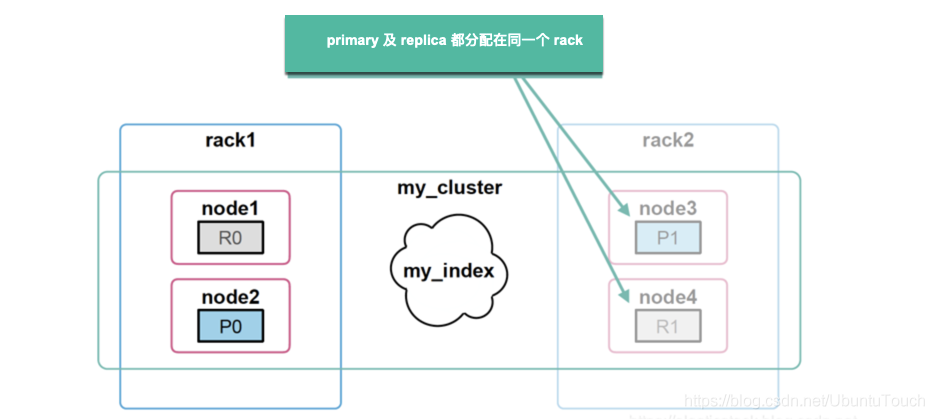
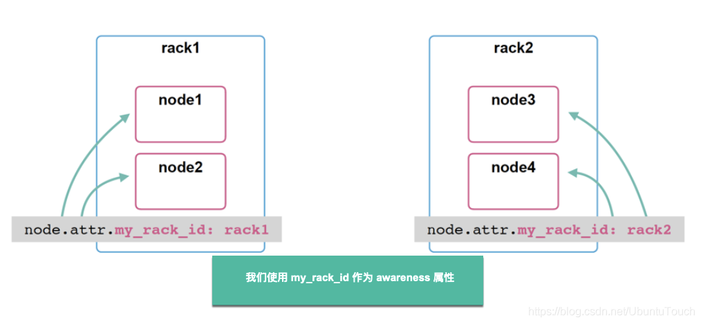

# ES分片分配感知
# <font style="color:rgb(51, 51, 51);">简介</font>
## 什么是分片分配感知
通常情况下服务器配置较高时，可能一台服务器会运行多个Elasticsearch服务，我们可以将自定义节点属性用作感知属性，以使 Elasticsearch 在分配分片时考虑物理硬件配置。 如果 Elasticsearch 知道哪些节点在同一台物理服务器上，在同一机架中或在同一区域中，则它可以分发主分片及其副本分片，以最大程度地减少发生故障时丢失所有分片副本的风险。

通过 cluster.routing.allocation.awareness.attributes 设置启用分片分配感知后，分片仅分配给已为指定感知属性设置值的节点。 如果您使用多个感知属性，那么 Elasticsearch 在分配分片时会分别考虑每个属性。

可以在 elasticsearch.yml 中配置分配感知设置，并使用 cluster-update-settings API 动态更新。

默认情况下，Elasticsearch 使用 adaptive replica selection 来路由搜索或GET请求。 但是，由于存在分配感知属性，Elasticsearch将更喜欢在相同位置（具有相同的感知属性值）使用分片来处理这些请求。 可以通过在群集的每个节点上指定 export ES_JAVA_OPTS =“ $ ES_JAVA_OPTS -Des.search.ignore_awareness_attributes = true” 系统属性来禁用此行为。

## <font style="color:rgb(51, 51, 51);">适用场景</font>
假设您的硬件分布于两个不同的物理机架中：


在上面我们可以看到：我们的 my_index 的 shard 分布于两个不同的物理机架中 rack1 及 rack2。在上面我们可以看出来 P0 及 R0 分布于 rack1 中，而 P1 和 R1 分布于 rack2 中。假如有一种情况我们的 rack1 或者 rack2 由于某种事故从而导致它们其中的一个不可用，那么我们的 my_index 将导致不可用。这是因为分片0或分片1将不存在。



为了避免这种情况我们可以让我们的 Elasticsearch 知道我们的硬件的物理分配。这个在 Elasticsearch 中称之为 shard allocation awareness。这种解决方案非常实用于当我们的 Elasticsearch 的多个 node 分享同样的资源：disk，host mache，netowork switch，rack 等。

## 操作部署
1. 对node 打上标签
2. 更新cluster 配置

# 设置分配分配感知
## <font style="color:rgb(0, 0, 0);">对 node 打上标签</font>
我们可以使用 node.attr 来对我们的 node 进行打上标签。

+ node 的属性可以是你任何喜欢的名字及值
+ 你也可以在命令行中使用 -E 命令行参数来定义，比如./bin/elasticsearch -Enode.attr.my_rack_id=rack1
+ 或者直接在 elasticsearch.yml 中来定义



## <font style="color:rgb(0, 0, 0);">对 cluster 进行配置</font>
我们必须告诉 Elasticsearch 我们使用哪个属性或哪些属性用于我们的 Shard allocation awareness。我们可以通过使用 cluster.routing.allocation.awareness 这个 cluster 级的配置来告诉我们的 Elasticsearch:

```json
PUT _cluster/settings
{
  "persistent": {
    "cluster.routing.allocation.awareness.attributes": "my_rack_id"
  }
}
```

# <font style="color:rgb(0, 0, 0);">均衡的 Shard 分布</font>
经过上面的 step1 及 step2 的配置后，现在，你可以确保所有分片至少有一个副本将存在于每个索引的每个机架中。


如果在 rack1 或 rack2 其中的一个 rack 在损坏的情况下，我们可以确保我们的数据访问是不间断的。当然如果两个机架同时都被损坏，那么我们也无能为力了。

# <font style="color:rgb(0, 0, 0);">强迫感知</font>
默认情况下，如果一个位置失败，Elasticsearch 会将所有丢失的副本分片分配给其余位置。 尽管你可能在所有位置上都有足够的资源来承载您的主和副本分片，但单个位置可能无法承载所有分片。

为了防止发生故障时单个位置过载，可以设置 cluster.routing.allocation.awareness.force，以便在其他位置的节点可用之前，不分配任何副本。

例如，如果你有一个名为 my_rack_id 的感知属性并在 rack1 和 rack2 中配置了节点，则可以使用强制感知来防止 Elasticsearch 在只有一个区域可用的情况下分配副本：


```javascript
cluster.routing.allocation.awareness.attributes: "my_rack_id"
cluster.routing.allocation.awareness.force.zone.values: "rack1,rack2"
```

使用此示例配置，如果你启动两个节点并将 node.attr.my_rack_id 设置为 rack1 并创建具有5个分片和1个副本的索引，Elasticsearch 将创建索引并分配5个主分片，但不分配副本。 仅当将 node.attr.my_rack_id 设置为 rack2 的节点可用时，才分配副本。

# 参考文档
es分片分配感知配置：[https://www.elastic.co/guide/en/elasticsearch/reference/8.9/modules-cluster.html#enabling-awareness](https://www.elastic.co/guide/en/elasticsearch/reference/8.9/modules-cluster.html#enabling-awareness)

