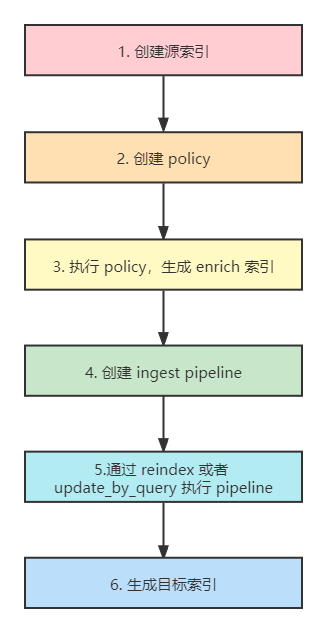

# 跨索引关联数据(Enrich processor)
## enrich简介
### 定义
<font style="color:rgb(77, 77, 77);">借助 enrich 预处理管道，可以将已有索引中的数据添加到新写入的文档中</font>

### <font style="color:rgb(77, 77, 77);">使用场景</font>
<font style="color:rgb(77, 77, 77);">根据已知 IP 添加 web 服务或供应商。</font>

<font style="color:rgb(77, 77, 77);">根据产品 ID 添加零售订单。</font>

<font style="color:rgb(77, 77, 77);">根据电子邮件补充添加联系信息。</font>

<font style="color:rgb(77, 77, 77);">根据用户地址添加邮政编码。</font>

### <font style="color:rgb(77, 77, 77);">原理</font>
<font style="color:rgb(77, 77, 77);">新写入的文档通过 enrich processor 达到了跨索引丰富数据的目的，最终写入目标索引。</font>


### 实现步骤


## encich实战
index_test_a索引包含field_a、title、publish_time三个字段，现在需要对index_test_a进行扩充。

从index_test_b索引查找field_a字段值和index_test_a索引field_a字段值相同的文档，将index_test_b索引的author和publisher字段扩充进来。

### 创建源索引
```json
PUT index_test_a
{
  "mappings":{
    "properties":{
      "field_a":{
        "type":"keyword"
      },
      "title":{
        "type":"keyword"
      },
      "publish_time":{
        "type":"date"
      }
    }
  }
}
 
POST index_test_a/_bulk
{"index":{"_id":1}}
{"field_a":"aaa", "title":"elasticsearch in action", "publish_time":"2017-07-01T00:00:00"}
DELETE index_test_b
PUT index_test_b
{
  "mappings": {
    "properties": {
      "field_a": {
        "type": "keyword"
      },
      "author": {
        "type": "keyword"
      },
      "publisher": {
        "type": "keyword"
      }
    }
  }
}
POST index_test_b/_bulk
{"index":{"_id":1}}
{"field_a":"aaa", "author":"jerry", "publisher":"Tsinghua"}
```

### 创建policy
```json
PUT /_enrich/policy/data-policy
{
  "match": {
    "indices": "index_test_b",
    "match_field": "field_a",
    "enrich_fields": ["author","publisher"]
  }
}
```

indices:一个或多个源索引的列表，存储的是待 enrich 扩展的数据(从哪个index中匹配)

match_field：源索引中用于匹配传入文档的匹配字段(匹配的字段)

enrich_field：源索引中的字段列表，用于添加到新传入的文档中(需要扩充的字段)

### 执行policy，生成enrich索引
```json
POST /_enrich/policy/data-policy/_execute
```

### 创建ingest pipeline
```json
PUT /_ingest/pipeline/data_lookup
{
  "processors": [
    {
      "enrich": {
        "policy_name": "data-policy",
        "field": "field_a",
        "target_field": "field_from_bindex",
        "max_matches": "1"
      }
    },
    {
      "append": {
        "field": "author",
        "value": ["{{{field_from_bindex.author}}}"]
      }
    },
    {
      "append": {
        "field": "publisher",
        "value": ["{{{field_from_bindex.publisher}}}"]
      }
    },
    {
      "remove": {
        "field": "field_from_bindex"
      }
    }
  ]
}
```

append实现了字段的追加

remove实现了字段的删除

enrich实现了将b索引的<font style="color:rgb(79, 79, 79);">field_a 相关联数据，和新写入索引数据融合，使得新索引“丰富”，其中</font>policy_name是enrich索引的名称，field是匹配的字段，target_field是匹配到的结果，max_matches是匹配文档最大值，允许最多128

### 执行reindex
```json
POST _reindex
{
  "source": {
    "index": "index_test_a"
  },
  "dest": {
    "index": "index_test_c",
    "pipeline": "data_lookup"
  }
}
```

### 查看目标索引
```json
GET index_test_c/_search
# 响应
{
  "took" : 2,
  "timed_out" : false,
  "_shards" : {
    "total" : 1,
    "successful" : 1,
    "skipped" : 0,
    "failed" : 0
  },
  "hits" : {
    "total" : {
      "value" : 1,
      "relation" : "eq"
    },
    "max_score" : 1.0,
    "hits" : [
      {
        "_index" : "index_test_c",
        "_type" : "_doc",
        "_id" : "1",
        "_score" : 1.0,
        "_source" : {
          "field_a" : "aaa",
          "publish_time" : "2017-07-01T00:00:00",
          "author" : [
            "jerry"
          ],
          "publisher" : [
            "Tsinghua"
          ],
          "title" : "elasticsearch in action"
        }
      }
    ]
  }
}

```

## 参考文档
enrich your data：[https://www.elastic.co/guide/en/elasticsearch/reference/7.13/ingest-enriching-data.html](https://www.elastic.co/guide/en/elasticsearch/reference/7.13/ingest-enriching-data.html)

es enrich processor：[https://www.elastic.co/guide/en/elasticsearch/reference/7.13/enrich-processor.html](https://www.elastic.co/guide/en/elasticsearch/reference/7.13/enrich-processor.html)


