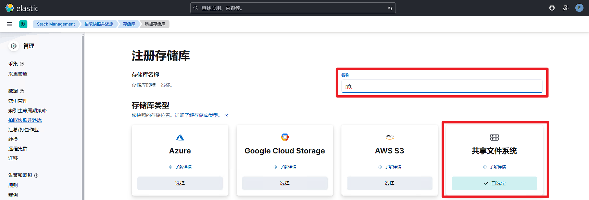
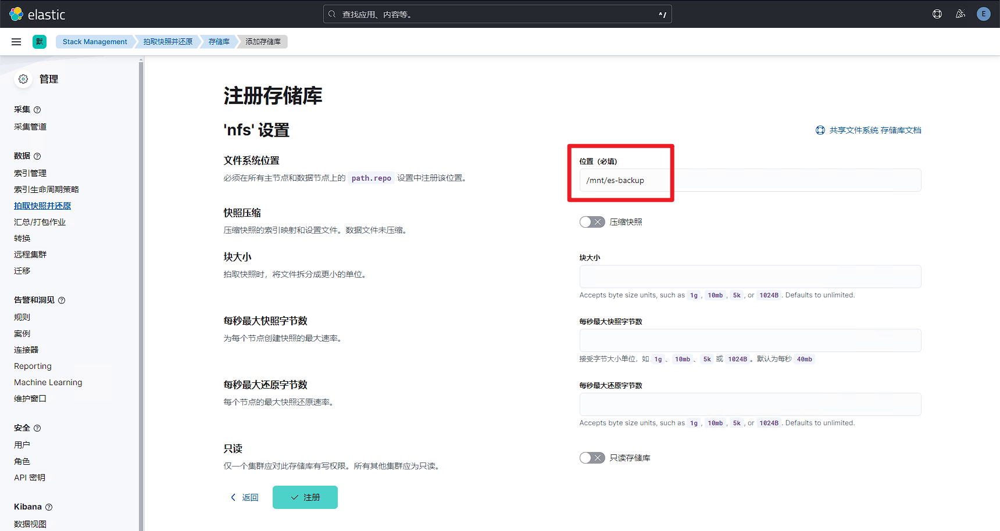
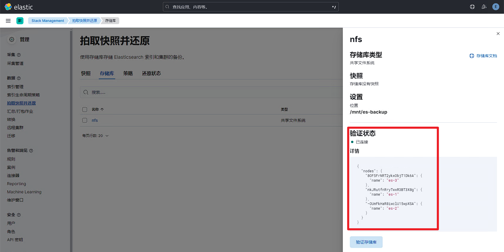
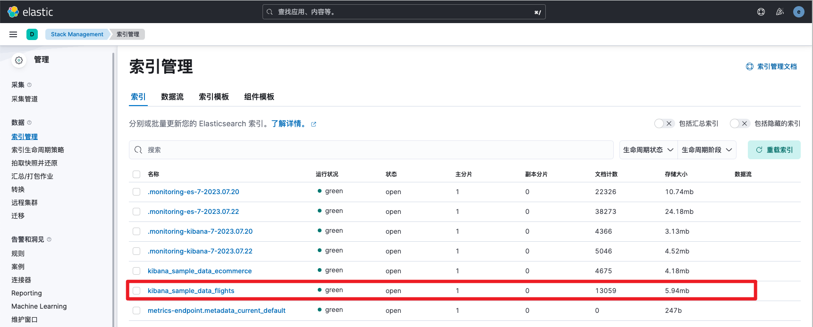
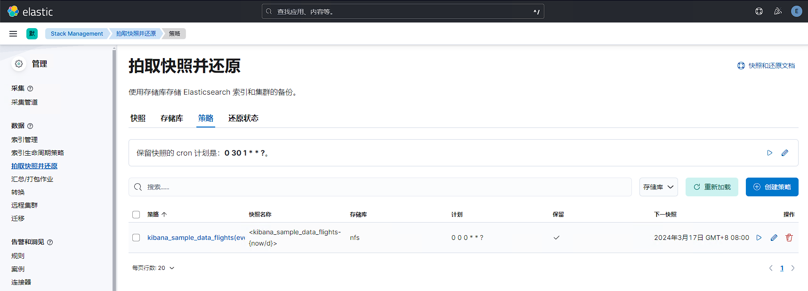
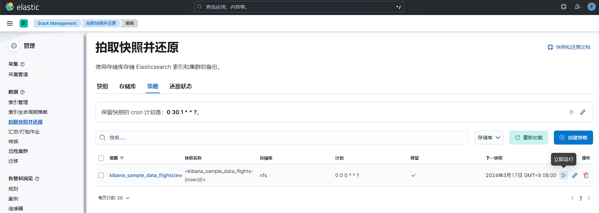
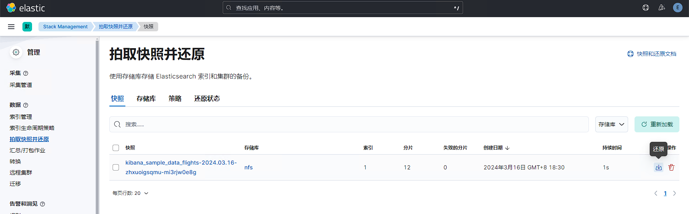
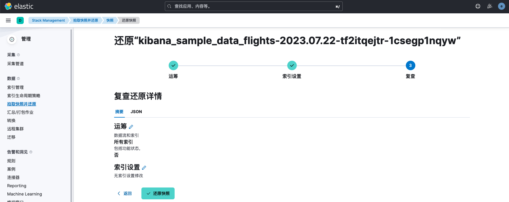
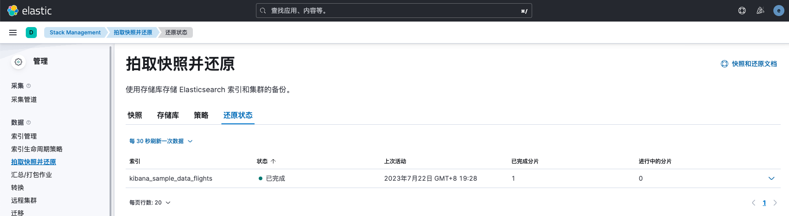

# 集群备份与恢复(NFS)
ES支持快照功能，用于实现数据的备份与恢复。我们可以生成单个索引或整个集群的快照，并将其存储在共享文件系统上的存储库中，并且有一些插件支持 S3、HDFS、Azure、Google Cloud Storage 等上的远程存储库。

本实验以NFS为例演示es的快照备份与恢复。

| **<font style="color:rgb(48, 49, 51);">主机名</font>** | **<font style="color:rgb(48, 49, 51);">ip</font>** | **<font style="color:rgb(48, 49, 51);">角色</font>** |
| --- | --- | --- |
| <font style="color:rgb(48, 49, 51);">tiaoban</font> | <font style="color:rgb(48, 49, 51);">192.168.10.100</font> | <font style="color:rgb(48, 49, 51);">nfs存储服务器</font> |
| <font style="color:rgb(48, 49, 51);">es-1</font> | 192.168.10.61 | <font style="color:rgb(48, 49, 51);">nfs客户端</font> |
| <font style="color:rgb(48, 49, 51);">es-2</font> | 192.168.10.62 | <font style="color:rgb(48, 49, 51);">nfs客户端</font> |
| <font style="color:rgb(48, 49, 51);">es-3</font> | 192.168.10.63 | <font style="color:rgb(48, 49, 51);">nfs客户端</font> |


# 部署NFS服务器
## 安装nfs服务
```bash
[root@tiaoban ~]# dnf install -y nfs-utils
# 创建目录并授权
[root@tiaoban ~]# mkdir -p /data/es-backup
[root@tiaoban ~]# chmod 666 /data/es-backup
[root@tiaoban ~]# chown nobody /data/es-backup
# 导出文件系统
[root@tiaoban ~]# cat > vim  << EOF
/data/es-backup *(rw,sync,insecure,no_subtree_check,no_root_squash)
EOF
# 启动服务
[root@tiaoban ~]# systemctl start nfs-server
[root@tiaoban ~]# systemctl enable nfs-server
# 查看验证
[root@tiaoban ~]# exportfs -rv
exporting *:/data/es-backup
```

## 参数说明
<font style="color:rgb(106, 115, 125);">/data/nfs *(rw,sync,insecure,no_subtree_check,no_root_squash)说明：</font>

+ <font style="color:rgb(106, 115, 125);">/data/nfs： nfs server 目录</font>
    - <font style="color:rgb(106, 115, 125);">： 表示所有的服务器都可以挂载该nfs，当然也可以指定ip地址/ip地址段</font>
+ <font style="color:rgb(106, 115, 125);">rw： 读写权限</font>
+ <font style="color:rgb(106, 115, 125);">sync：同步写入,即数据写入服务器后再返回响应，保证数据的可靠性和一致性</font>
+ <font style="color:rgb(106, 115, 125);">insecure： 表示不进行端口校验，允许客户端使用非保留端口进行连接</font>
+ <font style="color:rgb(106, 115, 125);">no_subtree_check: 禁止子树检查</font>
+ <font style="color:rgb(106, 115, 125);">no_root_squash: 表示禁用 root 用户映射机制，即来自客户端的 root 用户被映射为匿名用户而没有特权</font>

# 配置es以支持NFS备份恢复
> 以下操作在每个ES节点都要执行，在挂载nfs时必须确保每台机器的elasticsearch用户的uid和gid一致
>

## 安装nfs客户端并挂载
```bash
# 安装软件包
[root@es-1 ~]# dnf install -y nfs-utils
# 测试挂载
[root@es-1 ~]# showmount -e 192.168.10.100
[root@es-1 ~]# mount -t nfs 192.168.10.100:/data/es-backup /mnt/es-backup
# 设置开机自动挂载
[root@es-1 ~]# vim /etc/fstab
192.168.10.100:/data/es-backup       /mnt/es-backup            nfs     defaults        0 0
# 修改所属组
[root@es-1 ~]# chown elasticsearch:elasticsearch /mnt/es-backup
```

## 修改elasticsearch配置
```bash
[root@es-master ~]# vim /etc/elasticsearch/elasticsearch.yml
path.repo: ["/mnt/es-backup"]
```

## 重启es服务
```bash
[root@es-master ~]# systemctl restart elasticsearch
```

# 备份恢复验证
## 创建快照仓库
登录kibana——>点击菜单按钮——>Stack Management——>拍摄快照并还原——>存储库——>注册存储库，然后设置名称并选择类型为共享文件系统



填写位置为/mnt/es-backup，其他保持默认即可



注册完成后点击验证存储库，显示已连接



## 创建数据策略
接下来，我们以导入的**<font style="color:rgb(0, 107, 184);background-color:rgb(250, 251, 253);">kibana_sample_data_flights</font>**索引为例，演示数据的备份与恢复。



创建备份策略，名称自定义，快照表达式填写<kibana_sample_data_flights-{now/d}>


选择索引为kibana_sample_data_flights


设置快照保留策略


备份策略创建后，界面如下所示

## 数据备份
创建完策略后，es会在每天8点自动将数据上传至nfs备份，我们也可以点击立即执行，手动触发一次备份任务操作。

点击立即执行后，查看快照信息，显示已备份完成。


查看mfs目录信息，发现已成功上传数据

```bash
[root@tiaoban ~]# cd /data/es-backup/
[root@tiaoban es-backup]# ll
总用量 64
-rw-r--r--  1 fluentd fluentd  3638 3月  16 18:30 index-0
-rw-r--r--  1 fluentd fluentd     8 3月  16 18:30 index.latest
drwxr-xr-x 14 fluentd fluentd  4096 3月  16 18:30 indices
-rw-r--r--  1 fluentd fluentd 45063 3月  16 18:30 meta-1z7lR0r5SdCpni3XKl6c5Q.dat
-rw-r--r--  1 fluentd fluentd   698 3月  16 18:30 snap-1z7lR0r5SdCpni3XKl6c5Q.da
```

## 数据恢复
接下来删除index，模拟误操作情况发生。


在快照菜单点击恢复按钮，执行恢复操作



使用默认选项还原即可



查看还原状态显示已完成



接下来打开索引管理，发现index已正常还原，且文档数、分片数、存储大小等信息与先前保持一致。


## 快照删除注意事项
如果需要删除快照，一定要使用kibana或者用 API 删除快照，而不能用其他机制（比如手动删除，或者用 S3 上的自动清除工具）。因为快照是增量的，有可能很多快照依赖于过去的数据文件。delete API 知道哪些数据还在被近期快照使用，只删除不再被使用的那部分数据。

# 参考文档
备份策略创建：[https://www.elastic.co/guide/en/elasticsearch/reference/8.8/api-conventions.html#api-conventions](https://www.elastic.co/guide/en/elasticsearch/reference/8.8/api-conventions.html#api-conventions)

创建快照：[https://www.elastic.co/guide/en/elasticsearch/reference/8.8/snapshots-take-snapshot.html](https://www.elastic.co/guide/en/elasticsearch/reference/8.8/snapshots-take-snapshot.html)

恢复快照：[https://www.elastic.co/guide/en/elasticsearch/reference/8.8/snapshots-restore-snapshot.html](https://www.elastic.co/guide/en/elasticsearch/reference/8.8/snapshots-restore-snapshot.html)

注册s3存储地址：[https://www.elastic.co/guide/en/elasticsearch/reference/8.8/repository-s3.html](https://www.elastic.co/guide/en/elasticsearch/reference/8.8/repository-s3.html)

