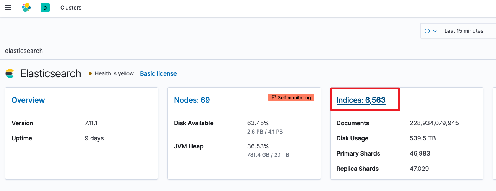
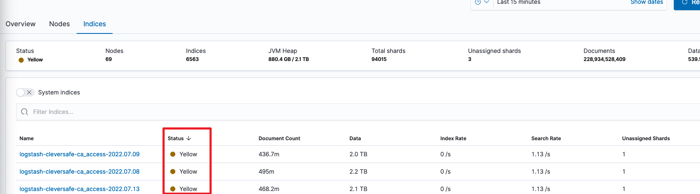

# 集群异常处理
# 集群状态
## 集群颜色
绿色状态：表示集群健康；

黄色状态：表示所有主分片均已分配，但有一个或多个副本分片未分配。如果集群中的某个节点发生故障，则在修复该节点之前，某些数据可能不可用；

红色状态：表示存在一个或多个主分片未分配，因此某些数据不可用。在集群启动期间，伴随着主分片的分配过程，这可能会短暂发生。

我们通常说集群状态变红了，实际上集群中某个索引出了问题，更精确的说，是某个索引上的某个分片出了问题。

## 注意事项
集群处于黄色状态：

索引仍在工作，并且数据也全部可以被索引、搜索，只是速度和可靠性可能达不到预期。

当前出问题的副本分片可能：丢失、损坏或存在其他问题；或者集群可能处于移动或重建副本分片的过程中。

我们要做的工作是：手动或者自动重新处理这些可能出问题的副本分片以实现集群恢复绿色状态。

集群处于红色状态：

代表一个或多个索引缺少主分片，即无法索引、搜索或提供数据。

健康状态基于每个分片的，假设集群中有50个分片，其中一个主分片出问题，其所在索引状态是红色，整个集群也都会变成红色。

我们要做的工作是：手动查找或修复这些未分配的主分片，否则一旦索引数据丢失，只能从快照或原始源数据中重新创建索引。

## 常见未分配原因
节点离开集群，其上的分片无法使用

分配规则配置有误

+ 如基于节点属性等配置后，无足够可用的节点
+ total_shards_per_node 配置后，导致无法找到可用的节点

# 排查思路
## 排查节点系统原因
当节点宕机、节点网络异常、节点磁盘异常等问题时，都会导致集群状态的变化。

一个节点的主分片出了问题，系统会将副本分片升级为主分片，然后重新创建新副本，但这需要几分钟到更长的时间，具体取决于：分片数量、大小，集群负载，磁盘速度等。

但是，除非明确系统正在修复，否则你不能仅指望系统自身修复这一招。有时情况确实是主分片或者副本分片出了问题，这也是为什么要了解历史记录的原因。日志和慢日志都有助于辅助排查历史记录。

## 确定哪些索引有问题
```json
GET _cat/indices?v&health=red
GET _cat/indices?v&health=yellow
GET _cat/indices?v&health=green
```


## 查看索引的哪个分片出现了问题
```json
GET _cluster/health?level=shards
```

## 使用kibana查找异常分片
stack monitoring


选择indices



筛选yellow状态分片



查看异常分片


## 查看有问题的分片原因
但是索引列表只会告诉你哪些索引存在问题，现在还需要我们根据索引列表形成问题列表。

```bash
GET _cat/shards?h=index,shard,prirep,state,unassigned.reason
```

搜索state状态为UNASSIGNED的分片，记住分片数和是否为主分片


只提示一个字段的含义：unassigned.reason 未分配分片的原因，返回值包括：

+ ALLOCATION_FAILED：由于分片分配失败而未分配。
+ CLUSTER_RECOVERED：由于集群恢复而未分配。
+ DANGLING_INDEX_IMPORTED：由于导入了悬空索引导致未分配。
+ EXISTING_INDEX_RESTORED：由于恢复为已关闭的索引导致未分配。
+ INDEX_CREATED：由于API创建索引而未分配。
+ INDEX_REOPENED：由于打开已关闭索引而未分配。
+ NEW_INDEX_RESTORED：由于恢复到新索引而未分配。
+ NODE_LEFT：由于托管的节点离开集群而未分配。
+ REALLOCATED_REPLICA：确定了更好的副本位置，并导致现有副本分配被取消。
+ REINITIALIZED：当分片从开始移动回初始化，导致未分配。
+ REPLICA_ADDED：由于显式添加副本而未分配。
+ REROUTE_CANCELLED：由于显式取消重新路由命令而未分配。

通过未分配列原因unassigned.reason似乎是已经够详细了，但是有时候我们需要更多细节，特别是如果我们有节点路由或其他更复杂的问题。

## 进一步查看未分配的原因
```bash
GET /_cluster/allocation/explain
{
  "index": "my_index_003", // 索引名称
  "shard": 0, // 分片数
  "primary": false // 是否是主分片
}
# 响应
{
  "index" : "logstash-cleversafe-tj-ca_report-2022.04.16",
  "shard" : 0,
  "primary" : false,
  "current_state" : "unassigned",
  "unassigned_info" : {
    "reason" : "INDEX_CLOSED",
    "at" : "2022-05-06T02:00:07.832Z",
    "last_allocation_status" : "no_attempt"
  },
  "can_allocate" : "no",
  "allocate_explanation" : "cannot allocate because allocation is not permitted to any of the nodes",
  "node_allocation_decisions" : [
    {
      "node_id" : "1CQ3wVr2QSqk3UnFfHzCOw",
      "node_name" : "elasticsearch-es-hot2-0",
      "transport_address" : "192.168.55.176:9300",
      "node_attributes" : {
        "k8s_node_name" : "k8s-node-tj-79.elk.com",
        "xpack.installed" : "true",
        "box_type" : "hot",
        "transform.node" : "true"
      },
      "node_decision" : "no",
      "deciders" : [
        {
          "decider" : "filter",
          "decision" : "NO",
          "explanation" : """node does not match index setting [index.routing.allocation.include] filters [box_type:"warm"]"""
        }
      ]
    }]
}
```

在explanation中详细描述了问题原因

## 常见的问题包括
+ 磁盘空间不足——没有磁盘空间来分配分片；
+ 分片数限制 ——每个节点的分片数量过多，在创建新索引或删除某些节点且系统找不到它们的位置时很常见；
+ JVM或内存限制——一些版本在内存不足时可以限制分片分配；
+ 路由或分配规则——通用高可用云云或大型复杂系统会遇到；
+ 崩溃或严重问题——可能会出现更多问题，每个问题都需要特别注意或解决，或者在许多情况下，需要重新导入数据解决。

# 问题处理
## 让Elasticsearch集群自行修复
+ 适用于：临时状况、集群启动阶段。
+ 操作方法：节点重启。

## 将副本设置为0
删除所有副本，针对场景：也许你无法修复副本或手动移动或分配它。

在这种情况下，只要拥有主分片（健康状态为黄色，而不是红色），就可以始终使用以下命令将副本数设置为0，等待一分钟，然后再设置为1或任意你业务场景需要设置的值。

```plain
PUT my_index_003/_settings
{
  "index": {
    "number_of_replicas": 0
  }
}
```

## 手动分配分片
举例：

```plain
POST /_cluster/reroute
{
  "commands": [
    {
      "move": {
        "index": "test", 
        "shard": 0,
        "from_node": "node1", 
        "to_node": "node2"
      }
    },
    {
      "allocate_replica": {
        "index": "test", "shard": 1,
        "node": "node3"
      }
    }
  ]
}
```

共做了：move 移动分片 和 allocate_replica 分配副本两个操作。

## 检查路由、分配规则
许多高可用或复杂的系统使用路由或分配规则来控制分片分配，随着情况的变化，这会创建无法分配的分片。

这个时候，explain API 有助于排查问题。

# 常见问题处理
## 分片未正常分配导致索引不可用
**背景**

配置ILM策略，集群重启，发现集群存在大量异常未分配分片。

**排查思路**

```json
# 查看问题索引列表
GET _cat/shards?h=index,shard,prirep,state,unassigned.reason
# 查看分片异常详情
GET /_cluster/allocation/explain
{
  "index": "messages-2023.09.21", 
  "shard": 10,
  "primary": false 
}
# 在explanation字段输出内容如下：node does not match index setting [index.routing.allocation.require] filters [_id:"hGeTqq5_Rw6FjTRfSkP5MQ"]


```

**原因**

```json
# 查看索引setting设置,在routing中存在id属性。
GET message-2023.09.21/_settings

# 查看节点属性，未发现配置id属性的节点
GET /_cat/nodes?v
```

索引需要分配到id名为XXX的节点，但集群中未存在设置了id为XXX属性的节点，导致分片分配异常，集群状态为red。

**解决方案**

如果大量分片存在该问题，取消所有索引分片分配id属性

```json
PUT */_settings
{
  "index.routing.allocation.require._id": null
}
```

## <font style="color:rgb(0, 0, 0);">shard自动分配达到了最大重试次数</font>
**背景**

集群长时间停止后，重新拉起集群发现index状态是yellow，手动修改副本数为0再改为1无法重新分配副本。

**排查思路**

执行`GET index_name/_recovery?active_only=true`发现集群并没有进行副本恢复。

执行`GET _cluster/allocation/explain?pretty`发现：`"current_state" : "no_attempt"`

**原因**

shard 自动分配 已经达到最大重试次数5次，仍然失败了，所以导致"shard的分配状态已经是：no_attempt"。

这时在Kibana Dev Tools，执行命令：`POST /_cluster/reroute?retry_failed=true`即可。由index.allocation.max_retries参数来控制最大重试次数。

当执行reroute命令对分片重新路由后，ElasticSearch会自动进行负载均衡，负载均衡参数cluster.routing.rebalance.enable默认为true。

过一段时间后：执行 `GET /_cat/shards?index=index_name` 可查看 user 索引中所有的分片分配情况已经正常了。

**总结**

一般来说，ElasticSearch会自动分配 那些 unassigned shards，当发现某些shards长期未分配时，首先看下是否是因为：为索引指定了过多的primary shard 和 replica 数量，然后集群中机器数量又不够。另一个原因就是本文中提到的：由于故障，shard自动分配达到了最大重试次数了，这时执行 reroute 就可以了。

## shard分配速度慢
执行命令`GET _cluster/allocation/explain?pretty`发现打印的结果如下：

```json
"current_state" : "unassigned",
"explanation":"reached the limit of incoming shard recoveries [2], cluster setting [cluster.routing.allocation.node_concurrent_incoming_recoveries=2] (can also be set via [cluster.routing.allocation.node_concurrent_recoveries])"
```

这种情况通常出现在集群重启，或者某一个节点重启后。且由于设置的分片并发恢复的值较低导致。为了尽快恢复集群健康状态。

解决方法：可以通过调用下面的API来提升分片恢复的速度和并发度：

```json
PUT /_cluster/settings
{
  "persistent": {
    "indices.recovery.max_bytes_per_sec": "200mb", # 限制恢复操作的带宽。默认值是 40MB/s
    "cluster.routing.allocation.node_concurrent_recoveries":5, # 每个节点上并发恢复操作的数量。默认值是 2。
    "cluster.routing.allocation.cluster_concurrent_rebalance":5 # 控制整个集群中同时进行的重平衡操作的数量。默认值是 2。
    "cluster.routing.allocation.node_initial_primaries_recoveries":10 # 控制分配给每个节点的并行初始主分片恢复操作的数量。默认值是 4。
  }
}
```

# 文档
es查看分片异常原图：[https://www.elastic.co/guide/en/elasticsearch/reference/7.13/cluster-allocation-explain.html](https://www.elastic.co/guide/en/elasticsearch/reference/7.13/cluster-allocation-explain.html)

es cat-indices API：[https://www.elastic.co/guide/en/elasticsearch/reference/7.13/cat-indices.html](https://www.elastic.co/guide/en/elasticsearch/reference/7.13/cat-indices.html)

es cat-shards API： [https://www.elastic.co/guide/en/elasticsearch/reference/7.13/cat-shards.html](https://www.elastic.co/guide/en/elasticsearch/reference/7.13/cat-shards.html)

es cluster-reroute API： [https://www.elastic.co/guide/en/elasticsearch/reference/7.13/cluster-reroute.html](https://www.elastic.co/guide/en/elasticsearch/reference/7.13/cluster-reroute.html)

es分片异常排查：[https://www.elastic.co/guide/en/cloud/current/ec-analyze_shards_with-api.html](https://www.elastic.co/guide/en/cloud/current/ec-analyze_shards_with-api.html)


