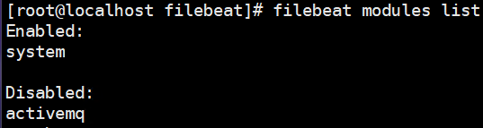
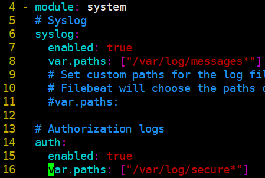
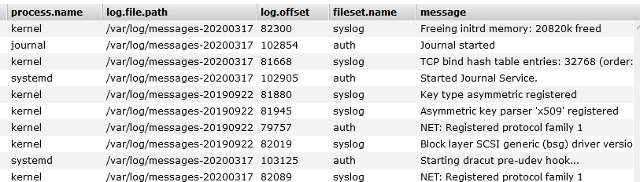

# system-module
# 一、查看内置module
在Filebeat中，有大量的Module，可以简化我们的配置，直接就可以使用，如下：

`# filebeat modules list` 


# 二、启用系统默认module
1. 启用system的module

`# filebeat modules enable system` 

2. 查看module信息



# 三、配置module文件
1. 编辑/etc/filebeat/modules.d/system.yml配置文件
+ 改文件默认定义了系统日志路径，不用再配置



2. 编辑filebeat.yml文件

```yaml
filebeat.inputs:
#- type: log 
#  enabled: true
#  paths:
#    - /var/log/*.log
setup.ilm.enabled: false
setup.template.name: "filebeat"
setup.template.pattern: "filebeat-*"
setup.template.overwrite: false
setup.template.settings:
 index.number_of_shards: 2
 index.number_of_replicas: 2
output.elasticsearch:
  # Array of hosts to connect to.
  hosts: ["192.168.10.17:9200","192.168.10.18:9200","192.168.10.19:9200"]
  index: "filebeat-%{+yyyy.MM.dd}"
filebeat.config.modules:
  path: ${path.config}/modules.d/*.yml
 reload.enabled: false
```

# 四、测试验证


 

