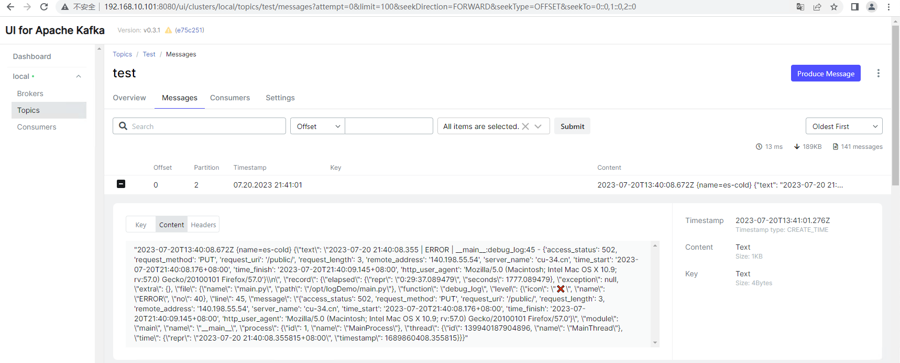

# 输出插件-kafka
# Logstash配置
```bash
input {
    kafka {
        bootstrap_servers => "192.168.10.101:9092,192.168.10.102:9092,192.168.10.103:9092"
        auto_offset_reset => "latest" # 从最新的偏移量开始消费
        consumer_threads => 1 
        decorate_events => true # 此属性会将当前topic、offset、group、partition等信息也带到message中
        topics => ["log_demo"]
        codec => "json"
        group_id => "logstash" # 消费组id，如果需要重新从头消费的话，可更换id
    }
}
#filter { #过滤，对数据进行分割、截取等处理
#       ...
#}
output {
    kafka {
        bootstrap_servers => "192.168.10.101:9092,192.168.10.102:9092,192.168.10.103:9092"
        topic_id => "test"
  }
}
```

# 查看kafka信息


 

