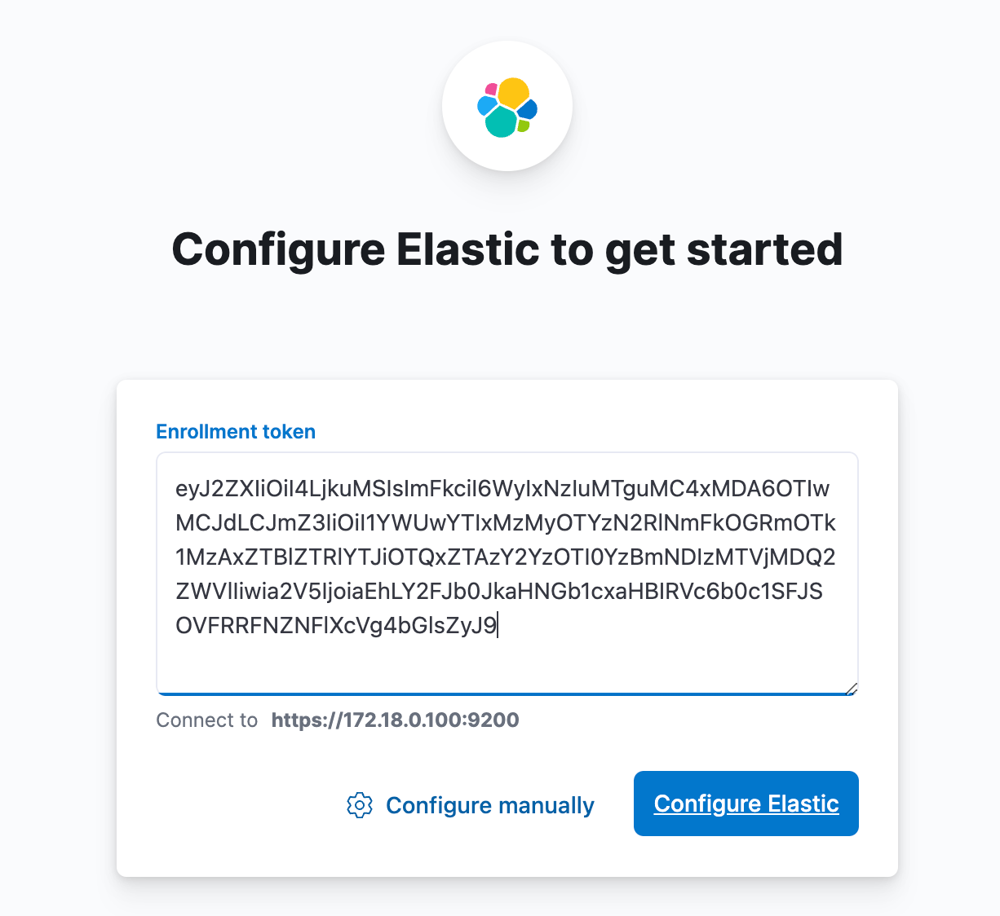
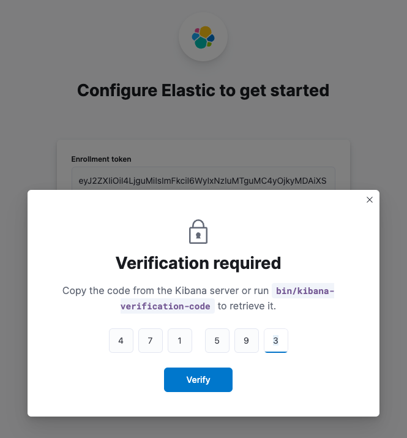
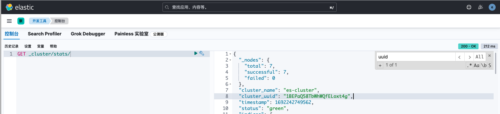
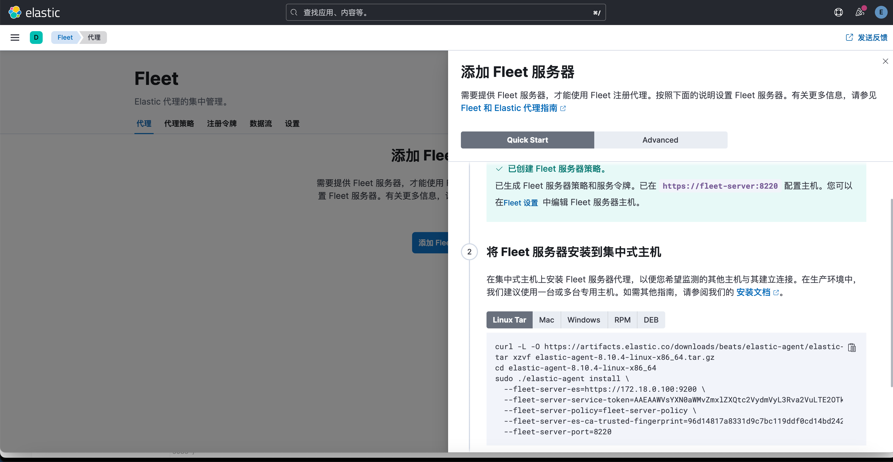
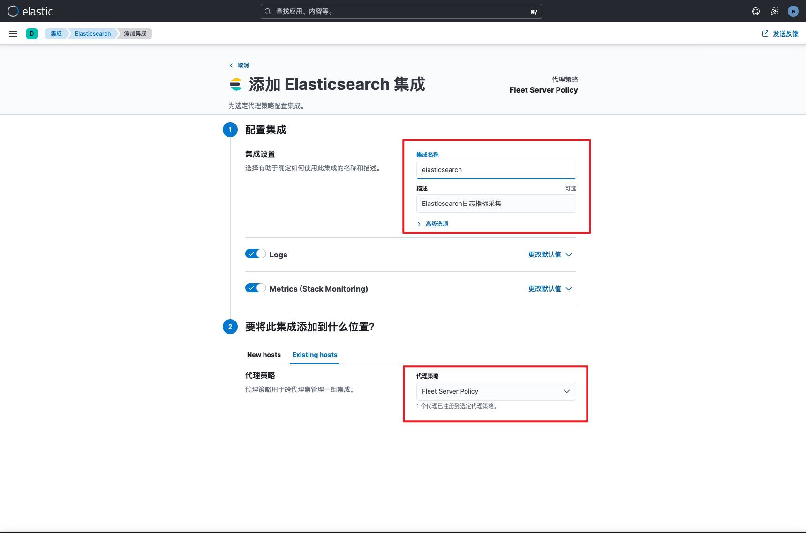
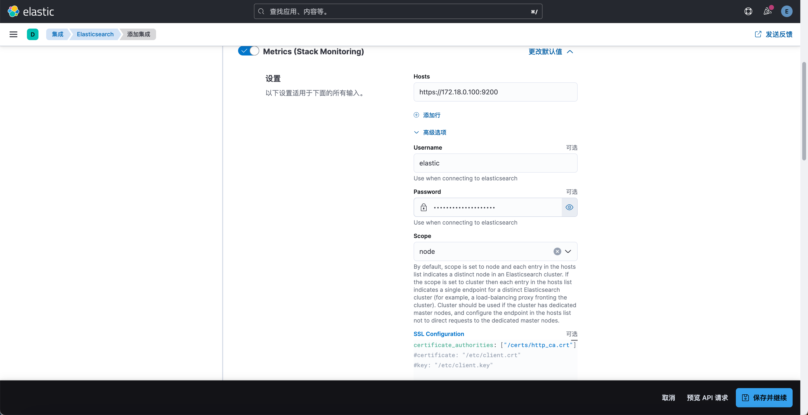
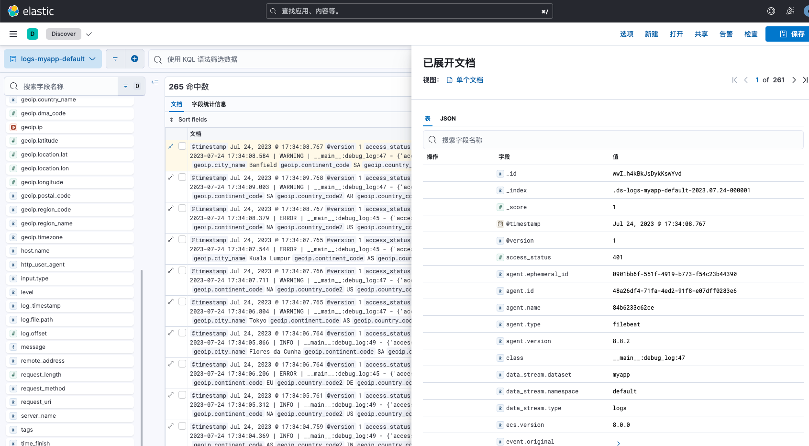

# Docker部署ELK8.11与日志采集
> 如果想在本地环境快速部署一套ELK服务，推荐使用docker方式部署。需要注意的是部署单节点es服务仅用于实验测试环境使用，未配置开机自启，所有容器未加<font style="color:rgb(34, 34, 38);">--restart=always参数。可根据实际情况添加该参数，生产环境建议使用eck部署和管理es容器集群。</font>
>

# ES与Kibana部署
## 创建自定义网络
由于容器每次重启后ip会发生变化，使得ssl证书主机IP地址不一致，导致其它服务连接es异常。因此需要自定义网络，并固定es的ip地址。

```bash
[root@elk ]# docker network create elk --subnet=172.18.0.0/16
```

## 启动ES容器
```bash
[root@elk ]# docker run -d --name elasticsearch --net elk --ip 172.18.0.100 -p 9200:9200 -v $PWD/es-data:/usr/share/elasticsearch/data -v $PWD/es-log:/usr/share/elasticsearch/logs -e "discovery.type=single-node" -m 1GB docker.elastic.co/elasticsearch/elasticsearch:8.11.3
```

+ -e "discovery.type=single-node"：指定单节点模式运行es
+ -m 1GB：指定内存最大为1G，此时jvm自动设置为512M

如果es启动后日志有如下报错

```bash
[root@elk ]# docker logs elasticsearch -f
Exception in thread "main" java.lang.RuntimeException: starting java failed with [1]
output:
[0.001s][error][logging] Error opening log file 'logs/gc.log': Permission denied
[0.001s][error][logging] Initialization of output 'file=logs/gc.log' using options 'filecount=32,filesize=64m' failed.
error:
Invalid -Xlog option '-Xlog:gc*,gc+age=trace,safepoint:file=logs/gc.log:utctime,level,pid,tags:filecount=32,filesize=64m', see error log for details.
Error: Could not create the Java Virtual Machine.
Error: A fatal exception has occurred. Program will exit.
        at org.elasticsearch.server.cli.JvmOption.flagsFinal(JvmOption.java:120)
        at org.elasticsearch.server.cli.JvmOption.findFinalOptions(JvmOption.java:87)
        at org.elasticsearch.server.cli.MachineDependentHeap.determineHeapSettings(MachineDependentHeap.java:59)
        at org.elasticsearch.server.cli.JvmOptionsParser.jvmOptions(JvmOptionsParser.java:138)
        at org.elasticsearch.server.cli.JvmOptionsParser.determineJvmOptions(JvmOptionsParser.java:91)
        at org.elasticsearch.server.cli.ServerProcess.createProcess(ServerProcess.java:208)
        at org.elasticsearch.server.cli.ServerProcess.start(ServerProcess.java:104)
        at org.elasticsearch.server.cli.ServerProcess.start(ServerProcess.java:88)
        at org.elasticsearch.server.cli.ServerCli.startServer(ServerCli.java:239)
        at org.elasticsearch.server.cli.ServerCli.execute(ServerCli.java:100)
        at org.elasticsearch.common.cli.EnvironmentAwareCommand.execute(EnvironmentAwareCommand.java:54)
        at org.elasticsearch.cli.Command.mainWithoutErrorHandling(Command.java:85)
        at org.elasticsearch.cli.Command.main(Command.java:50)
        at org.elasticsearch.launcher.CliToolLauncher.main(CliToolLauncher.java:64)
```

原因是挂载的es-data和es-log目录默认所有者是root，而es容器启动用户是id为1000的elasticsearch用户，此时修改权限即可。

```bash
[root@elk ]# chown 1000:1000 es-data
[root@elk ]# chown 1000:1000 es-log
[root@elk ]# docker restart elasticsearch
```

## 启动Kibana容器
```bash
[root@elk ]# docker run --name kibana -d --net elk -p 5601:5601 docker.elastic.co/kibana/kibana:8.11.3
```

## 初始化配置
es生成连接token

```bash
[root@elk ]# docker exec -it elasticsearch bash
elasticsearch@a15632b27a31:~$ elasticsearch-create-enrollment-token --scope kibana
eyJ2ZXIiOiI4LjguMiIsImFkciI6WyIxNzIuMTkuMC4xMDA6OTIwMCJdLCJmZ3IiOiI4NzNjYjMwNTQzODBkODRhNDcwMTcxMzQ0Mzc4ZDFmYmYxNmI2OTc2ODlkZjM1MGU1ZWM3OWJjYWIxNDgwNTI5Iiwia2V5IjoiLWp4MWtJa0I5T25GdkhMN2NsNGk6VHRoYWYxVTlUQS1BVVcwbGlwbEplUSJ9
```

登录Kibana，填写token完成es连接



kibana生成二次验证码

```bash
[root@elk ]# docker exec -it kibana bash       
kibana@1b35739cdeed:~$ kibana-verification-code
Your verification code is:  471 593
```

kibana填写二次验证码



es生成初始化密码

```bash
[root@elk ]# docker exec -it elasticsearch bash
elasticsearch@a15632b27a31:~$ elasticsearch-reset-password -u elastic
This tool will reset the password of the [elastic] user to an autogenerated value.
The password will be printed in the console.
Please confirm that you would like to continue [y/N]y


Password for the [elastic] user successfully reset.
New value: e2qaojjQrZKBKUUKKk41
```

kibana填写es账号密码


kibana登录成功


# 其他常用操作
## curl访问测试
安装完es后，自动为我们配置了用户密码和tls证书，我们使用curl命令即可访问测试

```bash
[root@elk ]# curl -k -u 'elastic:e2qaojjQrZKBKUUKKk41' https://127.0.0.1:9200/_cluster/health
{"cluster_name":"docker-cluster","status":"green","timed_out":false,"number_of_nodes":1,"number_of_data_nodes":1,"active_primary_shards":26,"active_shards":26,"relocating_shards":0,"initializing_shards":0,"unassigned_shards":0,"delayed_unassigned_shards":0,"number_of_pending_tasks":0,"number_of_in_flight_fetch":0,"task_max_waiting_in_queue_millis":0,"active_shards_percent_as_number":100.0}

[root@elk ]# curl -k -u 'elastic:e2qaojjQrZKBKUUKKk41' https://127.0.0.1:9200/_cat/nodes?v
ip           heap.percent ram.percent cpu load_1m load_5m load_15m node.role   master name
172.18.0.100           29          45   2    0.04    0.21     0.18 cdfhilmrstw *      630b895ac617
```

## ES证书导出
使用logstash或者filebeat，SDK连接es时，如果不指定ca证书，会提示x509错误，需要提前导出ca证书。

```bash
[root@elk ]# docker cp elasticsearch:/usr/share/elasticsearch/config/certs .                                                 
[root@elk ]# ls certs                                            
http.p12      http_ca.crt   transport.p12
```

## ES日志记录至文件
es的日志默认使用的console输出, 不记录到日志文件中, logs目录下面只有gc.log，我们可以通过配置log4j2设置，将日志写入对应文件中。

```bash
[root@elk ]# cat > log4j2.properties << EOF
status = error

appender.console.type = Console
appender.console.name = console
appender.console.layout.type = PatternLayout
appender.console.layout.pattern = [%d{ISO8601}][%-5p][%-25c{1.}] [%node_name]%marker %m%consoleException%n

######## Server JSON ############################
appender.rolling.type = RollingFile
appender.rolling.name = rolling
appender.rolling.fileName = ${sys:es.logs.base_path}${sys:file.separator}${sys:es.logs.cluster_name}_server.json
appender.rolling.layout.type = ECSJsonLayout
appender.rolling.layout.dataset = elasticsearch.server

appender.rolling.filePattern = ${sys:es.logs.base_path}${sys:file.separator}${sys:es.logs.cluster_name}-%d{yyyy-MM-dd}-%i.json.gz
appender.rolling.policies.type = Policies
appender.rolling.policies.time.type = TimeBasedTriggeringPolicy
appender.rolling.policies.time.interval = 1
appender.rolling.policies.time.modulate = true
appender.rolling.policies.size.type = SizeBasedTriggeringPolicy
appender.rolling.policies.size.size = 128MB
appender.rolling.strategy.type = DefaultRolloverStrategy
appender.rolling.strategy.fileIndex = nomax
appender.rolling.strategy.action.type = Delete
appender.rolling.strategy.action.basepath = ${sys:es.logs.base_path}
appender.rolling.strategy.action.condition.type = IfFileName
appender.rolling.strategy.action.condition.glob = ${sys:es.logs.cluster_name}-*
appender.rolling.strategy.action.condition.nested_condition.type = IfAccumulatedFileSize
appender.rolling.strategy.action.condition.nested_condition.exceeds = 2GB
################################################
######## Server -  old style pattern ###########
appender.rolling_old.type = RollingFile
appender.rolling_old.name = rolling_old
appender.rolling_old.fileName = ${sys:es.logs.base_path}${sys:file.separator}${sys:es.logs.cluster_name}.log
appender.rolling_old.layout.type = PatternLayout
appender.rolling_old.layout.pattern = [%d{ISO8601}][%-5p][%-25c{1.}] [%node_name]%marker %m%n

appender.rolling_old.filePattern = ${sys:es.logs.base_path}${sys:file.separator}${sys:es.logs.cluster_name}-%d{yyyy-MM-dd}-%i.log.gz
appender.rolling_old.policies.type = Policies
appender.rolling_old.policies.time.type = TimeBasedTriggeringPolicy
appender.rolling_old.policies.time.interval = 1
appender.rolling_old.policies.time.modulate = true
appender.rolling_old.policies.size.type = SizeBasedTriggeringPolicy
appender.rolling_old.policies.size.size = 128MB
appender.rolling_old.strategy.type = DefaultRolloverStrategy
appender.rolling_old.strategy.fileIndex = nomax
appender.rolling_old.strategy.action.type = Delete
appender.rolling_old.strategy.action.basepath = ${sys:es.logs.base_path}
appender.rolling_old.strategy.action.condition.type = IfFileName
appender.rolling_old.strategy.action.condition.glob = ${sys:es.logs.cluster_name}-*
appender.rolling_old.strategy.action.condition.nested_condition.type = IfAccumulatedFileSize
appender.rolling_old.strategy.action.condition.nested_condition.exceeds = 2GB
################################################

rootLogger.level = info
rootLogger.appenderRef.console.ref = console
rootLogger.appenderRef.rolling.ref = rolling
rootLogger.appenderRef.rolling_old.ref = rolling_old

######## Deprecation JSON #######################
appender.deprecation_rolling.type = RollingFile
appender.deprecation_rolling.name = deprecation_rolling
appender.deprecation_rolling.fileName = ${sys:es.logs.base_path}${sys:file.separator}${sys:es.logs.cluster_name}_deprecation.json
appender.deprecation_rolling.layout.type = ECSJsonLayout
# Intentionally follows a different pattern to above
appender.deprecation_rolling.layout.dataset = deprecation.elasticsearch
appender.deprecation_rolling.filter.rate_limit.type = RateLimitingFilter

appender.deprecation_rolling.filePattern = ${sys:es.logs.base_path}${sys:file.separator}${sys:es.logs.cluster_name}_deprecation-%i.json.gz
appender.deprecation_rolling.policies.type = Policies
appender.deprecation_rolling.policies.size.type = SizeBasedTriggeringPolicy
appender.deprecation_rolling.policies.size.size = 1GB
appender.deprecation_rolling.strategy.type = DefaultRolloverStrategy
appender.deprecation_rolling.strategy.max = 4

appender.header_warning.type = HeaderWarningAppender
appender.header_warning.name = header_warning
#################################################

logger.deprecation.name = org.elasticsearch.deprecation
logger.deprecation.level = WARN
logger.deprecation.appenderRef.deprecation_rolling.ref = deprecation_rolling
logger.deprecation.appenderRef.header_warning.ref = header_warning
logger.deprecation.additivity = false

######## Search slowlog JSON ####################
appender.index_search_slowlog_rolling.type = RollingFile
appender.index_search_slowlog_rolling.name = index_search_slowlog_rolling
appender.index_search_slowlog_rolling.fileName = ${sys:es.logs.base_path}${sys:file.separator}${sys:es.logs\
  .cluster_name}_index_search_slowlog.json
appender.index_search_slowlog_rolling.layout.type = ECSJsonLayout
appender.index_search_slowlog_rolling.layout.dataset = elasticsearch.index_search_slowlog

appender.index_search_slowlog_rolling.filePattern = ${sys:es.logs.base_path}${sys:file.separator}${sys:es.logs\
  .cluster_name}_index_search_slowlog-%i.json.gz
appender.index_search_slowlog_rolling.policies.type = Policies
appender.index_search_slowlog_rolling.policies.size.type = SizeBasedTriggeringPolicy
appender.index_search_slowlog_rolling.policies.size.size = 1GB
appender.index_search_slowlog_rolling.strategy.type = DefaultRolloverStrategy
appender.index_search_slowlog_rolling.strategy.max = 4
#################################################

#################################################
logger.index_search_slowlog_rolling.name = index.search.slowlog
logger.index_search_slowlog_rolling.level = trace
logger.index_search_slowlog_rolling.appenderRef.index_search_slowlog_rolling.ref = index_search_slowlog_rolling
logger.index_search_slowlog_rolling.additivity = false

######## Indexing slowlog JSON ##################
appender.index_indexing_slowlog_rolling.type = RollingFile
appender.index_indexing_slowlog_rolling.name = index_indexing_slowlog_rolling
appender.index_indexing_slowlog_rolling.fileName = ${sys:es.logs.base_path}${sys:file.separator}${sys:es.logs.cluster_name}\
  _index_indexing_slowlog.json
appender.index_indexing_slowlog_rolling.layout.type = ECSJsonLayout
appender.index_indexing_slowlog_rolling.layout.dataset = elasticsearch.index_indexing_slowlog


appender.index_indexing_slowlog_rolling.filePattern = ${sys:es.logs.base_path}${sys:file.separator}${sys:es.logs.cluster_name}\
  _index_indexing_slowlog-%i.json.gz
appender.index_indexing_slowlog_rolling.policies.type = Policies
appender.index_indexing_slowlog_rolling.policies.size.type = SizeBasedTriggeringPolicy
appender.index_indexing_slowlog_rolling.policies.size.size = 1GB
appender.index_indexing_slowlog_rolling.strategy.type = DefaultRolloverStrategy
appender.index_indexing_slowlog_rolling.strategy.max = 4
#################################################


logger.index_indexing_slowlog.name = index.indexing.slowlog.index
logger.index_indexing_slowlog.level = trace
logger.index_indexing_slowlog.appenderRef.index_indexing_slowlog_rolling.ref = index_indexing_slowlog_rolling
logger.index_indexing_slowlog.additivity = false


logger.org_apache_pdfbox.name = org.apache.pdfbox
logger.org_apache_pdfbox.level = off

logger.org_apache_poi.name = org.apache.poi
logger.org_apache_poi.level = off

logger.org_apache_fontbox.name = org.apache.fontbox
logger.org_apache_fontbox.level = off

logger.org_apache_xmlbeans.name = org.apache.xmlbeans
logger.org_apache_xmlbeans.level = off


logger.com_amazonaws.name = com.amazonaws
logger.com_amazonaws.level = warn

logger.com_amazonaws_jmx_SdkMBeanRegistrySupport.name = com.amazonaws.jmx.SdkMBeanRegistrySupport
logger.com_amazonaws_jmx_SdkMBeanRegistrySupport.level = error

logger.com_amazonaws_metrics_AwsSdkMetrics.name = com.amazonaws.metrics.AwsSdkMetrics
logger.com_amazonaws_metrics_AwsSdkMetrics.level = error

logger.com_amazonaws_auth_profile_internal_BasicProfileConfigFileLoader.name = com.amazonaws.auth.profile.internal.BasicProfileConfigFileLoader
logger.com_amazonaws_auth_profile_internal_BasicProfileConfigFileLoader.level = error

logger.com_amazonaws_services_s3_internal_UseArnRegionResolver.name = com.amazonaws.services.s3.internal.UseArnRegionResolver
logger.com_amazonaws_services_s3_internal_UseArnRegionResolver.level = error


appender.audit_rolling.type = RollingFile
appender.audit_rolling.name = audit_rolling
appender.audit_rolling.fileName = ${sys:es.logs.base_path}${sys:file.separator}${sys:es.logs.cluster_name}_audit.json
appender.audit_rolling.layout.type = PatternLayout
appender.audit_rolling.layout.pattern = {\
                "type":"audit", \
                "timestamp":"%d{yyyy-MM-dd'T'HH:mm:ss,SSSZ}"\
                %varsNotEmpty{, "cluster.name":"%enc{%map{cluster.name}}{JSON}"}\
                %varsNotEmpty{, "cluster.uuid":"%enc{%map{cluster.uuid}}{JSON}"}\
                %varsNotEmpty{, "node.name":"%enc{%map{node.name}}{JSON}"}\
                %varsNotEmpty{, "node.id":"%enc{%map{node.id}}{JSON}"}\
                %varsNotEmpty{, "host.name":"%enc{%map{host.name}}{JSON}"}\
                %varsNotEmpty{, "host.ip":"%enc{%map{host.ip}}{JSON}"}\
                %varsNotEmpty{, "event.type":"%enc{%map{event.type}}{JSON}"}\
                %varsNotEmpty{, "event.action":"%enc{%map{event.action}}{JSON}"}\
                %varsNotEmpty{, "authentication.type":"%enc{%map{authentication.type}}{JSON}"}\
                %varsNotEmpty{, "user.name":"%enc{%map{user.name}}{JSON}"}\
                %varsNotEmpty{, "user.run_by.name":"%enc{%map{user.run_by.name}}{JSON}"}\
                %varsNotEmpty{, "user.run_as.name":"%enc{%map{user.run_as.name}}{JSON}"}\
                %varsNotEmpty{, "user.realm":"%enc{%map{user.realm}}{JSON}"}\
                %varsNotEmpty{, "user.realm_domain":"%enc{%map{user.realm_domain}}{JSON}"}\
                %varsNotEmpty{, "user.run_by.realm":"%enc{%map{user.run_by.realm}}{JSON}"}\
                %varsNotEmpty{, "user.run_by.realm_domain":"%enc{%map{user.run_by.realm_domain}}{JSON}"}\
                %varsNotEmpty{, "user.run_as.realm":"%enc{%map{user.run_as.realm}}{JSON}"}\
                %varsNotEmpty{, "user.run_as.realm_domain":"%enc{%map{user.run_as.realm_domain}}{JSON}"}\
                %varsNotEmpty{, "user.roles":%map{user.roles}}\
                %varsNotEmpty{, "apikey.id":"%enc{%map{apikey.id}}{JSON}"}\
                %varsNotEmpty{, "apikey.name":"%enc{%map{apikey.name}}{JSON}"}\
                %varsNotEmpty{, "authentication.token.name":"%enc{%map{authentication.token.name}}{JSON}"}\
                %varsNotEmpty{, "authentication.token.type":"%enc{%map{authentication.token.type}}{JSON}"}\
                %varsNotEmpty{, "cross_cluster_access":%map{cross_cluster_access}}\
                %varsNotEmpty{, "origin.type":"%enc{%map{origin.type}}{JSON}"}\
                %varsNotEmpty{, "origin.address":"%enc{%map{origin.address}}{JSON}"}\
                %varsNotEmpty{, "realm":"%enc{%map{realm}}{JSON}"}\
                %varsNotEmpty{, "realm_domain":"%enc{%map{realm_domain}}{JSON}"}\
                %varsNotEmpty{, "url.path":"%enc{%map{url.path}}{JSON}"}\
                %varsNotEmpty{, "url.query":"%enc{%map{url.query}}{JSON}"}\
                %varsNotEmpty{, "request.method":"%enc{%map{request.method}}{JSON}"}\
                %varsNotEmpty{, "request.body":"%enc{%map{request.body}}{JSON}"}\
                %varsNotEmpty{, "request.id":"%enc{%map{request.id}}{JSON}"}\
                %varsNotEmpty{, "action":"%enc{%map{action}}{JSON}"}\
                %varsNotEmpty{, "request.name":"%enc{%map{request.name}}{JSON}"}\
                %varsNotEmpty{, "indices":%map{indices}}\
                %varsNotEmpty{, "opaque_id":"%enc{%map{opaque_id}}{JSON}"}\
                %varsNotEmpty{, "trace.id":"%enc{%map{trace.id}}{JSON}"}\
                %varsNotEmpty{, "x_forwarded_for":"%enc{%map{x_forwarded_for}}{JSON}"}\
                %varsNotEmpty{, "transport.profile":"%enc{%map{transport.profile}}{JSON}"}\
                %varsNotEmpty{, "rule":"%enc{%map{rule}}{JSON}"}\
                %varsNotEmpty{, "put":%map{put}}\
                %varsNotEmpty{, "delete":%map{delete}}\
                %varsNotEmpty{, "change":%map{change}}\
                %varsNotEmpty{, "create":%map{create}}\
                %varsNotEmpty{, "invalidate":%map{invalidate}}\
                }%n
# "node.name" node name from the `elasticsearch.yml` settings
# "node.id" node id which should not change between cluster restarts
# "host.name" unresolved hostname of the local node
# "host.ip" the local bound ip (i.e. the ip listening for connections)
# "origin.type" a received REST request is translated into one or more transport requests. This indicates which processing layer generated the event "rest" or "transport" (internal)
# "event.action" the name of the audited event, eg. "authentication_failed", "access_granted", "run_as_granted", etc.
# "authentication.type" one of "realm", "api_key", "token", "anonymous" or "internal"
# "user.name" the subject name as authenticated by a realm
# "user.run_by.name" the original authenticated subject name that is impersonating another one.
# "user.run_as.name" if this "event.action" is of a run_as type, this is the subject name to be impersonated as.
# "user.realm" the name of the realm that authenticated "user.name"
# "user.realm_domain" if "user.realm" is under a domain, this is the name of the domain
# "user.run_by.realm" the realm name of the impersonating subject ("user.run_by.name")
# "user.run_by.realm_domain" if "user.run_by.realm" is under a domain, this is the name of the domain
# "user.run_as.realm" if this "event.action" is of a run_as type, this is the realm name the impersonated user is looked up from
# "user.run_as.realm_domain" if "user.run_as.realm" is under a domain, this is the name of the domain
# "user.roles" the roles array of the user; these are the roles that are granting privileges
# "apikey.id" this field is present if and only if the "authentication.type" is "api_key"
# "apikey.name" this field is present if and only if the "authentication.type" is "api_key"
# "authentication.token.name" this field is present if and only if the authenticating credential is a service account token
# "authentication.token.type" this field is present if and only if the authenticating credential is a service account token
# "cross_cluster_access" this field is present if and only if the associated authentication occurred cross cluster
# "event.type" informs about what internal system generated the event; possible values are "rest", "transport", "ip_filter" and "security_config_change"
# "origin.address" the remote address and port of the first network hop, i.e. a REST proxy or another cluster node
# "realm" name of a realm that has generated an "authentication_failed" or an "authentication_successful"; the subject is not yet authenticated
# "realm_domain" if "realm" is under a domain, this is the name of the domain
# "url.path" the URI component between the port and the query string; it is percent (URL) encoded
# "url.query" the URI component after the path and before the fragment; it is percent (URL) encoded
# "request.method" the method of the HTTP request, i.e. one of GET, POST, PUT, DELETE, OPTIONS, HEAD, PATCH, TRACE, CONNECT
# "request.body" the content of the request body entity, JSON escaped
# "request.id" a synthetic identifier for the incoming request, this is unique per incoming request, and consistent across all audit events generated by that request
# "action" an action is the most granular operation that is authorized and this identifies it in a namespaced way (internal)
# "request.name" if the event is in connection to a transport message this is the name of the request class, similar to how rest requests are identified by the url path (internal)
# "indices" the array of indices that the "action" is acting upon
# "opaque_id" opaque value conveyed by the "X-Opaque-Id" request header
# "trace_id" an identifier conveyed by the part of "traceparent" request header
# "x_forwarded_for" the addresses from the "X-Forwarded-For" request header, as a verbatim string value (not an array)
# "transport.profile" name of the transport profile in case this is a "connection_granted" or "connection_denied" event
# "rule" name of the applied rule if the "origin.type" is "ip_filter"
# the "put", "delete", "change", "create", "invalidate" fields are only present
# when the "event.type" is "security_config_change" and contain the security config change (as an object) taking effect

appender.audit_rolling.filePattern = ${sys:es.logs.base_path}${sys:file.separator}${sys:es.logs.cluster_name}_audit-%d{yyyy-MM-dd}-%i.json.gz
appender.audit_rolling.policies.type = Policies
appender.audit_rolling.policies.time.type = TimeBasedTriggeringPolicy
appender.audit_rolling.policies.time.interval = 1
appender.audit_rolling.policies.time.modulate = true
appender.audit_rolling.policies.size.type = SizeBasedTriggeringPolicy
appender.audit_rolling.policies.size.size = 1GB
appender.audit_rolling.strategy.type = DefaultRolloverStrategy
appender.audit_rolling.strategy.fileIndex = nomax

logger.xpack_security_audit_logfile.name = org.elasticsearch.xpack.security.audit.logfile.LoggingAuditTrail
logger.xpack_security_audit_logfile.level = info
logger.xpack_security_audit_logfile.appenderRef.audit_rolling.ref = audit_rolling
logger.xpack_security_audit_logfile.additivity = false

logger.xmlsig.name = org.apache.xml.security.signature.XMLSignature
logger.xmlsig.level = error
logger.samlxml_decrypt.name = org.opensaml.xmlsec.encryption.support.Decrypter
logger.samlxml_decrypt.level = fatal
logger.saml2_decrypt.name = org.opensaml.saml.saml2.encryption.Decrypter
logger.saml2_decrypt.level = fatal
EOF
[root@elk ]# docker cp log4j2.properties elasticsearch:/usr/share/elasticsearch/config/
[root@elk ]# docker restart elasticsearch
[root@elk ]# ls es-log
docker-cluster.log                         docker-cluster_index_search_slowlog.json   gc.log.01
docker-cluster_audit.json                  docker-cluster_server.json                 gc.log.02
docker-cluster_deprecation.json            gc.log                                     gc.log.03
docker-cluster_index_indexing_slowlog.json gc.log.00                                  gc.log.04
```

## ES操作审计日志
默认情况下未开启es操作审计日志docker-cluster_audit.json文件内容为空，可修改elasticsearch配置文件开启审计日志记录功能。

```bash
[root@elk ]# docker cp elasticsearch:/usr/share/elasticsearch/config/elasticsearch.yml .
[root@elk ]# vim elasticsearch.yml
xpack.security.audit.enabled: true
[root@elk ]# docker cp elasticsearch.yml elasticsearch:/usr/share/elasticsearch/config/
[root@elk ]# docker restart elasticsearch
```

## GeoIP地理解析库手动导入
Elasticsearch会自动从 Elastic GeoIP 下载IP地理数据库文件，默认情况下，Elasticsearch 每三天检查一次数据库文件是否有更新，但有些情况下会导致下载失败，此时就需要提前下载GeoLite2-City.mmdb文件，并放于指定路径下才能使用。

+ 禁用数据库自动更新

```bash
PUT /_cluster/settings
{
  "persistent" : {
    "ingest.geoip.downloader.enabled" : false
  }
}
```

+ 拷贝文件

```bash
# 创建目录
[root@elk ]# docker exec -it --user root elasticsearch bash
root@630b895ac617:/# mkdir /usr/share/elasticsearch/config/ingest-geoip

# 拷贝文件
[root@elk ]# docker cp GeoLite2-City.mmdb elasticsearch:/usr/share/elasticsearch/config/ingest-geoip/my.mmdb

# 更改权限
[root@elk ]# docker exec -it --user root elasticsearch bash
root@630b895ac617:/# chown -R elasticsearch:root /usr/share/elasticsearch/config/ingest-geoip
```

+ 使用

在处理管道中指定数据库文件为my.mmdb即可。


## Kibana中文配置
```bash
[root@elk ]# docker cp kibana:/usr/share/kibana/config/kibana.yml .
[root@elk ]# vim kibana.yml
i18n.locale: "zh-CN"
[root@elk ]# docker cp kibana.yml kibana:/usr/share/kibana/config/ 
[root@elk ]# docker restart kibana
```

## kibana添加加密key
```bash
[root@elk ]# docker exec -it kibana bash       
kibana@68148c992019:~$ kibana-encryption-keys generate
## Kibana Encryption Key Generation Utility

The 'generate' command guides you through the process of setting encryption keys for:

xpack.encryptedSavedObjects.encryptionKey
    Used to encrypt stored objects such as dashboards and visualizations
    https://www.elastic.co/guide/en/kibana/current/xpack-security-secure-saved-objects.html#xpack-security-secure-saved-objects

xpack.reporting.encryptionKey
    Used to encrypt saved reports
    https://www.elastic.co/guide/en/kibana/current/reporting-settings-kb.html#general-reporting-settings

xpack.security.encryptionKey
    Used to encrypt session information
    https://www.elastic.co/guide/en/kibana/current/security-settings-kb.html#security-session-and-cookie-settings


Already defined settings are ignored and can be regenerated using the --force flag.  Check the documentation links for instructions on how to rotate encryption keys.
Definitions should be set in the kibana.yml used configure Kibana.

Settings:
xpack.encryptedSavedObjects.encryptionKey: a60108485b5ea9f08178cda313394180
xpack.reporting.encryptionKey: bd52a351b5805a2ccc6d0a43bb4b749c
xpack.security.encryptionKey: cefa8180c88eec6ff70cbed24966c232


[root@elk ]# docker cp kibana:/usr/share/kibana/config/kibana.yml .                    
[root@elk ]# vim kibana.yml   
xpack.encryptedSavedObjects.encryptionKey: a60108485b5ea9f08178cda313394180
xpack.reporting.encryptionKey: bd52a351b5805a2ccc6d0a43bb4b749c
xpack.security.encryptionKey: cefa8180c88eec6ff70cbed24966c232
[root@elk ]# docker cp kibana.yml kibana:/usr/share/kibana/config/ 
[root@elk ]# docker restart kibana                                 
```

## 获取es集群uuid


## 取消磁盘水位线预警
默认情况下，磁盘使用率超过90%索引变为只读状态，但docker运行实验环境时，磁盘可用空间较小，可取消磁盘水位线预警。

```bash
PUT _cluster/settings
{
  "transient": {
    "cluster.routing.allocation.disk.threshold_enabled": false
  }
}
```

也可直接写入配置文件中

```bash
[root@elk ]# docker cp elasticsearch:/usr/share/elasticsearch/config/elasticsearch.yml .
[root@elk ]# vim elasticsearch.yml
cluster.routing.allocation.disk.threshold_enabled: false
[root@elk ]# docker cp elasticsearch.yml elasticsearch:/usr/share/elasticsearch/config/
[root@elk ]# docker restart elasticsearch
```

# 日志模拟程序部署
## 克隆源码并构建镜像
```bash
[root@elk ]# git clone https://gitee.com/cuiliang0302/log_demo.git
[root@elk ]# cd log_demo/
[root@elk log_demo]# ls
Dockerfile  log.py  main.py  readme.md  requirements.txt
[root@elk log_demo]# docker build -t log_demo:1.0 .
```

## 运行程序
```bash
[root@elk ]# docker run --name log_demo -d -v $PWD/log:/opt/logDemo/log log_demo:1.0
```

# Filebeat部署
## 创建filebeat配置文件
```bash
[root@elk ]# cat > filebeat.yml << EOF
filebeat.inputs:
- type: log 
  enabled: true
  paths:
    - /log/info.log
output.logstash:
  hosts: ["logstash:5044"]
monitoring: # filebeat监控配置
  enabled: true
  cluster_uuid: "JhbjrKJzTVqXlkpHWDFhFg"
  elasticsearch:
    hosts:  ["https://172.19.0.100:9200"]
    username: "elastic" 
    password: "ANrjs2w+upw0O1a1Yuka"
    ssl.certificate_authorities: ["/certs/http_ca.crt"]
EOF
```

## 启动filebeat
启动时挂载了filebeat配置文件和采集日志的目录。

```bash
[root@elk ]# docker run --name filebeat -d --net elk -v $PWD/filebeat.yml:/usr/share/filebeat/filebeat.yml -v $PWD/log:/log -v $PWD/certs:/certs docker.elastic.co/beats/filebeat:8.8.2
```

# Logstash部署
## 文件目录准备
```bash
[root@elk ]# tree .                  
.
├── GeoLite2-City.mmdb # 地理位置信息文件
├── certs # es证书
│   ├── http.p12
│   ├── http_ca.crt
│   └── transport.p12
├── logstash-log # logstash日志
├── logstash.yml # logstash配置文件
└── logstash.conf # logstash pipeline
```

## 编辑logstash配置文件
```bash
[root@elk ]# cat > logstash.conf << EOF
api.enabled: true
api.http.host: 0.0.0.0
api.http.port: 9600
xpack.monitoring.enabled: false
monitoring.cluster_uuid: "JhbjrKJzTVqXlkpHWDFhFg"
EOF
```

## 编辑logstash pipeline
```bash
[root@elk ]# cat > logstash.yaml << EOF
input {
  beats {
    port => 5044
  }
}
filter{
    grok{
      match => {"message" => "%{TIMESTAMP_ISO8601:log_timestamp} \| %{LOGLEVEL:level} %{SPACE}* \| (?<class>[__main__:[\w]*:\d*]+) \- %{GREEDYDATA:content}"}
    }
    mutate {
        gsub =>[
            "content", "'", '"'
        ]
        lowercase => [ "level" ]
    }
    json {
        source => "content"
    }
    geoip {
        source => "remote_address"
        database => "/usr/share/logstash/GeoLite2-City.mmdb"
        ecs_compatibility => disabled
    }
    mutate {
        remove_field => ["content"]
    }
}
output {
    elasticsearch {
        hosts => ["https://172.19.0.100:9200"]
        data_stream => "true"
        data_stream_type => "logs"
        data_stream_dataset => "myapp"
        data_stream_namespace => "default"
        timeout => 120
        pool_max => 800
        validate_after_inactivity => 7000
        user => elastic
        password => "ANrjs2w+upw0O1a1Yuka"
        ssl => true
        cacert => "/certs/http_ca.crt"
    }  
}
EOF
```

## 启动logstash
启动时挂载了GeoIP数据库文件和logstash和pipeline，以及ca证书。并将logstash日志挂载出来，便于Elastic Agent采集logstash日志监控。

```bash
[root@elk ]# docker run --name logstash -d -p 5044:5044 -p 9600:9600 --net elk -v $PWD/certs:/certs -v $PWD/GeoLite2-City.mmdb:/usr/share/logstash/GeoLite2-City.mmdb -v $PWD/logstash.yml:/usr/share/logstash/config/logstash.yml -v $PWD/logstash.conf:/usr/share/logstash/pipeline/logstash.conf -v $PWD/logstash-log:/usr/share/logstash/logs docker.elastic.co/logstash/logstash:8.8.2
```

## logstash日志配置
docker部署的logstash默认情况下所有日志均在控制台打印，fleet无法采集logstash日志。我们需要修改log4j2配置，将日志打印至文件中。

```bash
[root@elk ]# cat > log4j2.properties << EOF
status = error
name = LogstashPropertiesConfig

appender.console.type = Console
appender.console.name = plain_console
appender.console.layout.type = PatternLayout
appender.console.layout.pattern = [%d{ISO8601}][%-5p][%-25c]%notEmpty{[%X{pipeline.id}]}%notEmpty{[%X{plugin.id}]} %m%n

appender.json_console.type = Console
appender.json_console.name = json_console
appender.json_console.layout.type = JSONLayout
appender.json_console.layout.compact = true
appender.json_console.layout.eventEol = true

appender.rolling.type = RollingFile
appender.rolling.name = plain_rolling
appender.rolling.fileName = ${sys:ls.logs}/logstash-plain.log
appender.rolling.filePattern = ${sys:ls.logs}/logstash-plain-%d{yyyy-MM-dd}-%i.log.gz
appender.rolling.policies.type = Policies
appender.rolling.policies.time.type = TimeBasedTriggeringPolicy
appender.rolling.policies.time.interval = 1
appender.rolling.policies.time.modulate = true
appender.rolling.layout.type = PatternLayout
appender.rolling.layout.pattern = [%d{ISO8601}][%-5p][%-25c]%notEmpty{[%X{pipeline.id}]}%notEmpty{[%X{plugin.id}]} %m%n
appender.rolling.policies.size.type = SizeBasedTriggeringPolicy
appender.rolling.policies.size.size = 100MB
appender.rolling.strategy.type = DefaultRolloverStrategy
appender.rolling.strategy.max = 30
appender.rolling.avoid_pipelined_filter.type = PipelineRoutingFilter

appender.json_rolling.type = RollingFile
appender.json_rolling.name = json_rolling
appender.json_rolling.fileName = ${sys:ls.logs}/logstash-json.log
appender.json_rolling.filePattern = ${sys:ls.logs}/logstash-json-%d{yyyy-MM-dd}-%i.log.gz
appender.json_rolling.policies.type = Policies
appender.json_rolling.policies.time.type = TimeBasedTriggeringPolicy
appender.json_rolling.policies.time.interval = 1
appender.json_rolling.policies.time.modulate = true
appender.json_rolling.layout.type = JSONLayout
appender.json_rolling.layout.compact = true
appender.json_rolling.layout.eventEol = true
appender.json_rolling.policies.size.type = SizeBasedTriggeringPolicy
appender.json_rolling.policies.size.size = 100MB
appender.json_rolling.strategy.type = DefaultRolloverStrategy
appender.json_rolling.strategy.max = 30
appender.json_rolling.avoid_pipelined_filter.type = PipelineRoutingFilter

appender.routing.type = PipelineRouting
appender.routing.name = pipeline_routing_appender
appender.routing.pipeline.type = RollingFile
appender.routing.pipeline.name = appender-${ctx:pipeline.id}
appender.routing.pipeline.fileName = ${sys:ls.logs}/pipeline_${ctx:pipeline.id}.log
appender.routing.pipeline.filePattern = ${sys:ls.logs}/pipeline_${ctx:pipeline.id}.%i.log.gz
appender.routing.pipeline.layout.type = PatternLayout
appender.routing.pipeline.layout.pattern = [%d{ISO8601}][%-5p][%-25c] %m%n
appender.routing.pipeline.policy.type = SizeBasedTriggeringPolicy
appender.routing.pipeline.policy.size = 100MB
appender.routing.pipeline.strategy.type = DefaultRolloverStrategy
appender.routing.pipeline.strategy.max = 30

rootLogger.level = ${sys:ls.log.level}
rootLogger.appenderRef.console.ref = ${sys:ls.log.format}_console
rootLogger.appenderRef.rolling.ref = ${sys:ls.log.format}_rolling
rootLogger.appenderRef.routing.ref = pipeline_routing_appender

# Slowlog

appender.console_slowlog.type = Console
appender.console_slowlog.name = plain_console_slowlog
appender.console_slowlog.layout.type = PatternLayout
appender.console_slowlog.layout.pattern = [%d{ISO8601}][%-5p][%-25c] %m%n

appender.json_console_slowlog.type = Console
appender.json_console_slowlog.name = json_console_slowlog
appender.json_console_slowlog.layout.type = JSONLayout
appender.json_console_slowlog.layout.compact = true
appender.json_console_slowlog.layout.eventEol = true

appender.rolling_slowlog.type = RollingFile
appender.rolling_slowlog.name = plain_rolling_slowlog
appender.rolling_slowlog.fileName = ${sys:ls.logs}/logstash-slowlog-plain.log
appender.rolling_slowlog.filePattern = ${sys:ls.logs}/logstash-slowlog-plain-%d{yyyy-MM-dd}-%i.log.gz
appender.rolling_slowlog.policies.type = Policies
appender.rolling_slowlog.policies.time.type = TimeBasedTriggeringPolicy
appender.rolling_slowlog.policies.time.interval = 1
appender.rolling_slowlog.policies.time.modulate = true
appender.rolling_slowlog.layout.type = PatternLayout
appender.rolling_slowlog.layout.pattern = [%d{ISO8601}][%-5p][%-25c] %m%n
appender.rolling_slowlog.policies.size.type = SizeBasedTriggeringPolicy
appender.rolling_slowlog.policies.size.size = 100MB
appender.rolling_slowlog.strategy.type = DefaultRolloverStrategy
appender.rolling_slowlog.strategy.max = 30

appender.json_rolling_slowlog.type = RollingFile
appender.json_rolling_slowlog.name = json_rolling_slowlog
appender.json_rolling_slowlog.fileName = ${sys:ls.logs}/logstash-slowlog-json.log
appender.json_rolling_slowlog.filePattern = ${sys:ls.logs}/logstash-slowlog-json-%d{yyyy-MM-dd}-%i.log.gz
appender.json_rolling_slowlog.policies.type = Policies
appender.json_rolling_slowlog.policies.time.type = TimeBasedTriggeringPolicy
appender.json_rolling_slowlog.policies.time.interval = 1
appender.json_rolling_slowlog.policies.time.modulate = true
appender.json_rolling_slowlog.layout.type = JSONLayout
appender.json_rolling_slowlog.layout.compact = true
appender.json_rolling_slowlog.layout.eventEol = true
appender.json_rolling_slowlog.policies.size.type = SizeBasedTriggeringPolicy
appender.json_rolling_slowlog.policies.size.size = 100MB
appender.json_rolling_slowlog.strategy.type = DefaultRolloverStrategy
appender.json_rolling_slowlog.strategy.max = 30

logger.slowlog.name = slowlog
logger.slowlog.level = trace
logger.slowlog.appenderRef.console_slowlog.ref = ${sys:ls.log.format}_console_slowlog
logger.slowlog.appenderRef.rolling_slowlog.ref = ${sys:ls.log.format}_rolling_slowlog
logger.slowlog.additivity = false

logger.licensereader.name = logstash.licensechecker.licensereader
logger.licensereader.level = error

# Silence http-client by default
logger.apache_http_client.name = org.apache.http
logger.apache_http_client.level = fatal

# Deprecation log
appender.deprecation_rolling.type = RollingFile
appender.deprecation_rolling.name = deprecation_plain_rolling
appender.deprecation_rolling.fileName = ${sys:ls.logs}/logstash-deprecation.log
appender.deprecation_rolling.filePattern = ${sys:ls.logs}/logstash-deprecation-%d{yyyy-MM-dd}-%i.log.gz
appender.deprecation_rolling.policies.type = Policies
appender.deprecation_rolling.policies.time.type = TimeBasedTriggeringPolicy
appender.deprecation_rolling.policies.time.interval = 1
appender.deprecation_rolling.policies.time.modulate = true
appender.deprecation_rolling.layout.type = PatternLayout
appender.deprecation_rolling.layout.pattern = [%d{ISO8601}][%-5p][%-25c]%notEmpty{[%X{pipeline.id}]}%notEmpty{[%X{plugin.id}]} %m%n
appender.deprecation_rolling.policies.size.type = SizeBasedTriggeringPolicy
appender.deprecation_rolling.policies.size.size = 100MB
appender.deprecation_rolling.strategy.type = DefaultRolloverStrategy
appender.deprecation_rolling.strategy.max = 30

logger.deprecation.name = org.logstash.deprecation, deprecation
logger.deprecation.level = WARN
logger.deprecation.appenderRef.deprecation_rolling.ref = deprecation_plain_rolling
logger.deprecation.additivity = false

logger.deprecation_root.name = deprecation
logger.deprecation_root.level = WARN
logger.deprecation_root.appenderRef.deprecation_rolling.ref = deprecation_plain_rolling
logger.deprecation_root.additivity = false
EOF
[root@elk ]# docker cp log4j2.properties logstash:/usr/share/logstash/config/log4j2.properties  
[root@elk ]# docker restart logstash
```

# Elastic Agent部署
## 生成安装命令
在Kibana中进入fleet菜单，点击添加fleet服务器，然后填写fleet服务器地址为https://fleet-server:8220，生成的安装参数如下所示：



接下来我们将原本的参数改为环境变量方式引入，容器启动命令如下，记得替换token和fingerprint参数。挂载es日志目录是为了采集es服务日志，挂载es证书是为了请求es接口获取监控指标信息。挂载logstash的日志目录是为了采集logstash服务日志。

```bash
[root@elk ]# docker run --name fleet-server -d -p 8200:8200 --net elk -v $PWD/es-log:/var/log/elasticsearch -v $PWD/certs:/certs -v $PWD/logstash-log:/var/log/logstash -e FLEET_SERVER_ENABLE=true -e FLEET_SERVER_ELASTICSEARCH_HOST=https://172.18.0.100:9200 -e FLEET_SERVER_SERVICE_TOKEN=AAEAAWVsYXN0aWMvZmxlZXQtc2VydmVyL3Rva2VuLTE2OTkzMzM2NTU5OTM6bmxHWmpWSVBUQUd1ZUIwcHNGX0kydw -e LEET_SERVER_POLICY_ID=fleet-server-policy -e FLEET_SERVER_ELASTICSEARCH_CA_TRUSTED_FINGERPRINT=96d14817a8331d9c7bc119ddf0cd14bd242739ba78bdf3453ec665f842f4c521 docker.elastic.co/beats/elastic-agent:8.11.3
```

容器运行后，查看fleet页面，以成功注册fleet server。


## 添加elasticsearch采集监控
进入Kibana集成菜单，搜索Elasticsearch并安装。


填写集成策略名称和描述，选择已有的Fleet Server Policy



在metrics配置中，填写es的地址和账号密码，并指定ca证书路径。logs配置无需更改，使用默认配置即可。



## 添加logstash采集监控
<font style="color:rgb(48, 49, 51);">配置代理策略，先添加Logstash集成。  
</font>

<font style="color:rgb(48, 49, 51);">metrics填写http://logstash:9600，代理策略选择Fleet Server Policy即可。  
</font>

# 访问验证
## 查看monitor信息


## 查看数据流信息
在kibana的索引管理中，查看数据流信息，已成功创建数据流，并向其中持续写入数据。


## 查看字段信息
在discover中可以看到写入es的数据，已经是logstash处理过的数据内容。

# 参考文档
elasticsearch docker方式部署：[https://www.elastic.co/guide/en/elasticsearch/reference/current/docker.html](https://www.elastic.co/guide/en/elasticsearch/reference/current/docker.html)

elasticsearch日志配置：[https://www.elastic.co/guide/en/elasticsearch/reference/8.8/logging.html#loggin-configuration](https://www.elastic.co/guide/en/elasticsearch/reference/8.8/logging.html#loggin-configuration)

kibana docker方式部署：[https://www.elastic.co/guide/en/kibana/current/docker.html](https://www.elastic.co/guide/en/kibana/current/docker.html)

logstash docker方式部署：[https://www.elastic.co/guide/en/logstash/current/docker.html](https://www.elastic.co/guide/en/logstash/current/docker.html)

elastic agent docker方式部署：[https://www.elastic.co/guide/en/fleet/current/elastic-agent-container.html](https://www.elastic.co/guide/en/fleet/current/elastic-agent-container.html)

filebeat docker方式部署：[https://www.elastic.co/guide/en/beats/filebeat/current/running-on-docker.html](https://www.elastic.co/guide/en/beats/filebeat/current/running-on-docker.html)

Logstash输入beats插件：[https://www.elastic.co/guide/en/logstash/master/plugins-inputs-beats.html](https://www.elastic.co/guide/en/logstash/master/plugins-inputs-beats.html)

Logstash正则匹配插件：[https://www.elastic.co/guide/en/logstash/master/plugins-filters-grok.html](https://www.elastic.co/guide/en/logstash/master/plugins-filters-grok.html)

Logstash字符处理插件：[https://www.elastic.co/guide/en/logstash/master/plugins-filters-mutate.html](https://www.elastic.co/guide/en/logstash/master/plugins-filters-mutate.html)

Logstash日期处理插件：[https://www.elastic.co/guide/en/logstash/current/plugins-filters-date.html](https://www.elastic.co/guide/en/logstash/current/plugins-filters-date.html)

Logstash json转换插件：[https://www.elastic.co/guide/en/logstash/master/plugins-filters-json.html](https://www.elastic.co/guide/en/logstash/master/plugins-filters-json.html)

Logstash地理位置插件：[https://www.elastic.co/guide/en/logstash/master/plugins-filters-geoip.html](https://www.elastic.co/guide/en/logstash/master/plugins-filters-geoip.html)

Logstash输出elasticsearch配置：[https://www.elastic.co/guide/en/logstash/master/plugins-outputs-elasticsearch.html](https://www.elastic.co/guide/en/logstash/master/plugins-outputs-elasticsearch.html)

