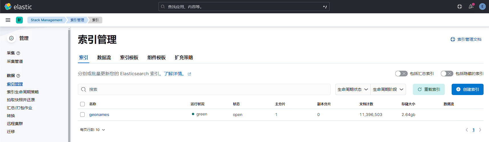

# 性能压测工具esrally
# 引言
## 什么是压测
压测，即压力测试，是指对计算机系统、软件应用或网络服务等进行负载测试，以模拟实际使用场景中的高负载情况，检验系统在压力下的性能、稳定性和可靠性。压测旨在确定系统在正常或极端负载下的性能极限，以便在生产环境中提供最佳的性能和可靠性。

## 为什么要压测
1. 了解ES各版本性能差异：ES版本更新很快，每次版本更新都会带来性能提升，但只有当我们进过性能测试后，才能清楚的知道性能提升幅度，再决定是否需要升级。
2. 针对ES参数做验证测试：我们都知道调整索引分片、副本数、刷新时间等参数可以提高读写性能，但具体需要设置为多少，可以通过压测有更直观的对比。
3. 了解集群性能瓶颈：只有针对ES集群做压测，才能清楚的知道集群读写性能峰值多少，性能瓶颈在磁盘还是网络带宽，通过找出并解决性能瓶颈，可以提高集群的性能和可靠性，提升用户体验。
4. 集群容量规划： 压测可以帮助我们规划系统的容量和资源需求，包括服务器配置、网络带宽、存储容量等。通过了解系统在不同负载下的资源消耗情况，可以合理规划资源投入，避免资源不足或浪费。

## 如何进行压测
1. 使用官方工具esrally：elastic官方提供了压测工具，内置多种数据集可模拟各个应用场景下的需求。模拟真实的生产环境中的负载，包括索引、搜索、聚合等操作，以便评估 Elasticsearch 在不同负载下的性能表现。支持测试不同版本的 Elasticsearch，用户可以轻松地比较不同版本之间的性能差异。生成详细的测试报告，包括测试结果、性能指标、图表等，帮助用户全面了解测试的结果。
2. 使用http压测工具：可以通过http协议的压测工具比如JMeter、httpload等，通过请求es的 Restful API接口进行性能测试。
3. 开发程序使用客户端请求测试：es支持多个语言的sdk包，可以针对特定使用场景开发程序进行性能测试。

# <font style="color:rgb(36, 41, 46);">esrally简介</font>
## esrally优点
1. 模拟真实场景： Rally 可以模拟真实的生产环境中的负载，包括索引、搜索、聚合等操作，以便评估 Elasticsearch 在不同负载下的性能表现。
2. 多种负载类型： Rally 提供了多种预置的负载类型，如Index、Search、Bulk、Update等，用户可以根据需求选择合适的负载类型进行测试。
3. 灵活的配置： Rally 允许用户对测试进行灵活的配置，包括索引设置、数据量、并发度等参数。用户可以根据自己的需求定制测试方案。
4. 自动化测试： Rally 支持自动化测试流程，可以通过简单的命令行操作启动测试，并自动收集性能数据、生成报告等。
5. 多版本支持： Rally 支持测试不同版本的 Elasticsearch，用户可以轻松地比较不同版本之间的性能差异。
6. 丰富的报告： Rally 生成详细的测试报告，包括测试结果、性能指标、图表等，帮助用户全面了解测试的结果。
7. 可扩展性： Rally 具有良好的可扩展性，用户可以编写自定义的测试插件，以满足特定的测试需求。
8. 社区支持： Rally 是一个开源项目，拥有活跃的社区支持，用户可以在 GitHub 上提交问题、提出建议，并参与到项目的开发和改进中来。

## <font style="color:rgb(36, 41, 46);">参考文档</font>
仓库地址：[https://github.com/elastic/rally](https://github.com/elastic/rally)

官方文档：[https://esrally.readthedocs.io/en/latest/quickstart.html](https://esrally.readthedocs.io/en/latest/quickstart.html)

# <font style="color:rgb(36, 41, 46);">安装esrally</font>
## 安装条件
Python3.8+

git 1.9+

jdk 1.8+

## 安装过程
```bash
# 安装软件包
[root@es-repo ~]# dnf -y install python3.11 python3.11-devel python3.11-pip git java-17-openjdk pbzip2

# 验证版本
[root@es-repo ~]# java -version
openjdk version "17.0.10" 2024-01-16 LTS
OpenJDK Runtime Environment (Red_Hat-17.0.10.0.7-1) (build 17.0.10+7-LTS)
OpenJDK 64-Bit Server VM (Red_Hat-17.0.10.0.7-1) (build 17.0.10+7-LTS, mixed mode, sharing)
[root@es-repo ~]# python3.11 -V
Python 3.11.5

# 添加java home环境变量
[root@es-repo ~]# cat >> /etc/profile <<EOF
export JAVA_HOME=/usr/lib/jvm/java-17-openjdk-17.0.10.0.7-2.el9.x86_64
export JRE_HOME=$JAVA_HOME/jre
PATH=$JAVA_HOME/bin:$JRE_HOME/bin:$PATH
EOF
[root@es-repo ~]# source /etc/profile
[root@es-repo ~]# echo $JAVA_HOME
/usr/lib/jvm/java-11-openjdk-11.0.22.0.7-2.el9.x86_64

# 安装esrally
[root@es-repo ~]# pip3.11 install esrally -i https://pypi.tuna.tsinghua.edu.cn/simple
[root@es-repo ~]# esrally --version
esrally 2.10.0


# 查看esrally测试数据集
[root@es-repo ~]# esrally list tracks

    ____        ____
   / __ \____ _/ / /_  __
  / /_/ / __ `/ / / / / /
 / _, _/ /_/ / / / /_/ /
/_/ |_|\__,_/_/_/\__, /
                /____/

Available tracks:

Name                     Description                                                                       Documents    Compressed Size    Uncompressed Size    Default Challenge                               All Challenges
-----------------------  --------------------------------------------------------------------------------  -----------  -----------------  -------------------  ----------------------------------------------  ----------------------------------------------------------------------------------------------------------------------------------------------------------------------------------------------------------------------------------------------------------------------------------------------------------
cohere_vector            Benchmark for vector search with Cohere Wikipedia data                            32,893,221   186.9 GB           507.0 GB             index-and-search                                index-and-search
dense_vector             Benchmark for dense vector indexing and search                                    10,000,000   7.2 GB             19.5 GB              index-and-search                                index-and-search
elastic/apm              Elastic APM benchmark for Rally                                                   19,557       N/A                52.4 MB              default                                         default
elastic/endpoint         Endpoint track                                                                    0            0 bytes            0 bytes              default                                         default
elastic/logs             Track for simulating logging workloads                                            16,469,078   N/A                N/A                  logging-indexing                                cross-clusters-search-and-replication,cross-clusters-search-and-snapshot,logging-disk-usage,logging-indexing-querying,logging-indexing,logging-querying-concurrent-stress,logging-querying,logging-snapshot-mount,logging-snapshot-restore,logging-snapshot,many-shards-quantitative,many-shards-snapshots
elastic/security         Track for simulating Elastic Security workloads                                   77,513,777   N/A                N/A                  security-querying                               generate-alerts-source-events,security-indexing-querying,security-indexing,security-querying
elser-ingest-speedtest   Benchmark weighted terms queries on ELSER tokens on the MS MARCO passage dataset  1,050,000    N/A                2.0 GB               ELSER-V2                                        ELSER-V1,ELSER-V2-PlatformSpecific,ELSER-V2,ELSER-Min-Latency-Multi-Doc-Multi-Parametric-Ingest,ELSER-Size-Search-Multi-Doc-Multi-Parametric-Ingest,ELSER-Multi-Doc-Multi-Parametric-Ingest,ELSER-Multi-Parametric-Ingest
eql                      EQL benchmarks based on endgame index of SIEM demo cluster                        60,782,211   4.5 GB             109.2 GB             default                                         default,index-sorting
geonames                 POIs from Geonames                                                                11,396,503   252.9 MB           3.3 GB               append-no-conflicts                             append-no-conflicts,append-no-conflicts-index-only,append-fast-with-conflicts,significant-text
geopoint                 Point coordinates from PlanetOSM                                                  60,844,404   482.1 MB           2.3 GB               append-no-conflicts                             append-no-conflicts,append-no-conflicts-index-only,append-fast-with-conflicts
geopointshape            Point coordinates from PlanetOSM indexed as geoshapes                             60,844,404   470.8 MB           2.6 GB               append-no-conflicts                             append-no-conflicts,append-no-conflicts-index-only,append-fast-with-conflicts
geoshape                 Shapes from PlanetOSM                                                             84,220,567   17.0 GB            58.7 GB              append-no-conflicts                             append-no-conflicts,append-no-conflicts-big
http_logs                HTTP server log data                                                              247,249,096  1.2 GB             31.1 GB              append-no-conflicts                             append-no-conflicts,runtime-fields,append-no-conflicts-index-only,append-sorted-no-conflicts,append-index-only-with-ingest-pipeline,update,append-no-conflicts-index-reindex-only
k8s_metrics              Index refresh benchmarks with a Kubernetes pod metrics dataset                    8,642,016    2.1 GB             86.1 GB              append-no-conflicts-metrics-index-with-refresh  append-no-conflicts-metrics-index-with-refresh,append-no-conflicts-metrics-index-with-intermittent-refresh,append-no-conflicts-metrics-index-only,append-no-conflicts-metrics-with-fast-refresh,fast-refresh-index-only,fast-refresh-index-with-search
metricbeat               Metricbeat data                                                                   1,079,600    87.7 MB            1.2 GB               append-no-conflicts                             append-no-conflicts
msmarco-passage-ranking  Benchmark bm25, semantic and hybrid search on the MS MARCO passage dataset        8,841,823    16.3 GB            53.6 GB              msmarco-passage-ranking                         msmarco-passage-ranking
nested                   StackOverflow Q&A stored as nested docs                                           11,203,029   663.3 MB           3.4 GB               nested-search-challenge                         nested-search-challenge,index-only
noaa                     Global daily weather measurements from NOAA                                       33,659,481   949.4 MB           9.0 GB               append-no-conflicts                             append-no-conflicts,append-no-conflicts-index-only,aggs,filter-aggs
nyc_taxis                Taxi rides in New York in 2015                                                    165,346,708  4.5 GB             74.3 GB              append-no-conflicts                             append-no-conflicts,append-no-conflicts-index-only,append-sorted-no-conflicts-index-only,update,update-only,append-ml,aggs,esql,update-aggs-only,autoscale,autoscale-v2
openai_vector            Benchmark for vector search using the OpenAI text-embedding-ada-002 model         2,680,961    31.0 GB            87.3 GB              index-and-search                                index-and-search
percolator               Percolator benchmark based on AOL queries                                         2,000,000    121.1 kB           104.9 MB             append-no-conflicts                             append-no-conflicts
pmc                      Full text benchmark with academic papers from PMC                                 574,199      5.5 GB             21.7 GB              append-no-conflicts                             append-no-conflicts,append-no-conflicts-index-only,append-sorted-no-conflicts,append-fast-with-conflicts,indexing-querying
random_vector            Benchmarking filtered search on random vectors                                    0            0 bytes            0 bytes              index-and-search                                index-and-search
so                       Indexing benchmark using up to questions and answers from StackOverflow           36,062,278   8.9 GB             33.1 GB              append-no-conflicts                             append-no-conflicts,transform,frequent-items
so_vector                Benchmark for vector search with StackOverflow data                               2,000,000    12.3 GB            32.2 GB              index-and-search                                index-and-search
sql                      SQL query performance based on NOAA Weather data                                  33,659,481   949.4 MB           9.0 GB               sql                                             sql
tsdb                     metricbeat information for elastic-app k8s cluster                                116,633,698  N/A                123.0 GB             append-no-conflicts                             append-no-conflicts,downsample
tsdb_k8s_queries         metricbeat information for elastic-app k8s cluster                                17,280,000   N/A                60.3 GB              append-no-conflicts                             append-no-conflicts-rampup,append-no-conflicts,append-no-conflicts-index-only,esql
wikipedia                Benchmark for search with Wikipedia data                                          22,986,185   17.9 GB            76.7 GB              index-and-search                                index-and-search

--------------------------------
[INFO] SUCCESS (took 60 seconds)
--------------------------------
```

可以看到esrally为我们内置了多种使用场景下的测试数据集，我们只需要按实际使用场景选择其中一种数据集进行测试即可。

# 使用esrally
## 在线快速测试
esrally可以在没有ES实列的情况下，去基于某一个指定版本的ES进行性能测试。

它的工作流程是：esrally会先去elastic官网下载对应的版本存在esrally目录里。下载完ES版本后，再去下载针对ES产品的性能测试数据。数据下载到本地后，再进行性能分析，最后将结果打印到控制台。

我们以目前最新的8.12.2版本为例，指定数据集为geopoint，测试类型为高速追加与并发索引操作场景下性能测试。

```bash
[root@es-repo ~]# useradd esrally
[root@es-repo ~]# su - esrally
[esrally@es-repo ~]$ esrally race --distribution-version=8.12.2 --track=geopoint --challenge=append-fast-with-conflicts

    ____        ____
   / __ \____ _/ / /_  __
  / /_/ / __ `/ / / / / /
 / _, _/ /_/ / / / /_/ /
/_/ |_|\__,_/_/_/\__, /
                /____/

[INFO] Race id is [069938ff-b7c5-476a-966c-e5f96c2be780]
[INFO] Preparing for race ...
[INFO] Downloading Elasticsearch 8.12.2 (592.4 MB total size)                     [100.0%]
[INFO] Downloading track data (482.1 MB total size)                               [100.0%]
[INFO] Decompressing track data from [/home/esrally/.rally/benchmarks/data/geopoint/documents.json.bz2] to [/home/esrally/.rally/benchmarks/data/geopoint/documents.json] (resulting size: [2.28] GB) ... [OK]
[INFO] Preparing file offset table for [/home/esrally/.rally/benchmarks/data/geopoint/documents.json] ... [OK]
[INFO] Racing on track [geopoint], challenge [append-fast-with-conflicts] and car ['defaults'] with version [8.12.2].
Running delete-index                                                           [100% done]
Running create-index                                                           [100% done]
Running check-cluster-health                                                   [100% done]
Running index-update                                                           [100% done]
Running refresh-after-index                                                    [100% done]
Running force-merge                                                            [100% done]
Running refresh-after-force-merge                                              [100% done]
Running wait-until-merges-finish                                               [100% done]

------------------------------------------------------
    _______             __   _____
   / ____(_)___  ____ _/ /  / ___/_________  ________
  / /_  / / __ \/ __ `/ /   \__ \/ ___/ __ \/ ___/ _ \
 / __/ / / / / / /_/ / /   ___/ / /__/ /_/ / /  /  __/
/_/   /_/_/ /_/\__,_/_/   /____/\___/\____/_/   \___/
------------------------------------------------------
            
|                                                         Metric |         Task |           Value |   Unit |
|---------------------------------------------------------------:|-------------:|----------------:|-------:|
|                     Cumulative indexing time of primary shards |              |    51.1839      |    min |
|             Min cumulative indexing time across primary shards |              |     8.50077     |    min |
|          Median cumulative indexing time across primary shards |              |     8.53849     |    min |
|             Max cumulative indexing time across primary shards |              |     8.5551      |    min |
|            Cumulative indexing throttle time of primary shards |              |     0           |    min |
|    Min cumulative indexing throttle time across primary shards |              |     0           |    min |
| Median cumulative indexing throttle time across primary shards |              |     0           |    min |
|    Max cumulative indexing throttle time across primary shards |              |     0           |    min |
|                        Cumulative merge time of primary shards |              |    17.3986      |    min |
|                       Cumulative merge count of primary shards |              |   119           |        |
|                Min cumulative merge time across primary shards |              |     2.46218     |    min |
|             Median cumulative merge time across primary shards |              |     2.69797     |    min |
|                Max cumulative merge time across primary shards |              |     4.05352     |    min |
|               Cumulative merge throttle time of primary shards |              |     0.429533    |    min |
|       Min cumulative merge throttle time across primary shards |              |     0.0546667   |    min |
|    Median cumulative merge throttle time across primary shards |              |     0.0624083   |    min |
|       Max cumulative merge throttle time across primary shards |              |     0.121967    |    min |
|                      Cumulative refresh time of primary shards |              |     9.8296      |    min |
|                     Cumulative refresh count of primary shards |              |   560           |        |
|              Min cumulative refresh time across primary shards |              |     1.51657     |    min |
|           Median cumulative refresh time across primary shards |              |     1.64044     |    min |
|              Max cumulative refresh time across primary shards |              |     1.74402     |    min |
|                        Cumulative flush time of primary shards |              |     0.688033    |    min |
|                       Cumulative flush count of primary shards |              |    24           |        |
|                Min cumulative flush time across primary shards |              |     0.0333333   |    min |
|             Median cumulative flush time across primary shards |              |     0.129933    |    min |
|                Max cumulative flush time across primary shards |              |     0.193933    |    min |
|                                        Total Young Gen GC time |              |    94.11        |      s |
|                                       Total Young Gen GC count |              |  2071           |        |
|                                          Total Old Gen GC time |              |     0           |      s |
|                                         Total Old Gen GC count |              |     0           |        |
|                                                     Store size |              |     2.59487     |     GB |
|                                                  Translog size |              |     3.07336e-07 |     GB |
|                                         Heap used for segments |              |     0           |     MB |
|                                       Heap used for doc values |              |     0           |     MB |
|                                            Heap used for terms |              |     0           |     MB |
|                                            Heap used for norms |              |     0           |     MB |
|                                           Heap used for points |              |     0           |     MB |
|                                    Heap used for stored fields |              |     0           |     MB |
|                                                  Segment count |              |   100           |        |
|                                    Total Ingest Pipeline count |              |     0           |        |
|                                     Total Ingest Pipeline time |              |     0           |      s |
|                                   Total Ingest Pipeline failed |              |     0           |        |
|                                                 Min Throughput | index-update | 22891.2         | docs/s |
|                                                Mean Throughput | index-update | 46390.4         | docs/s |
|                                              Median Throughput | index-update | 48999.4         | docs/s |
|                                                 Max Throughput | index-update | 50301           | docs/s |
|                                        50th percentile latency | index-update |   654.643       |     ms |
|                                        90th percentile latency | index-update |   985.375       |     ms |
|                                        99th percentile latency | index-update |  2593.74        |     ms |
|                                      99.9th percentile latency | index-update |  4959.35        |     ms |
|                                     99.99th percentile latency | index-update |  6490.22        |     ms |
|                                       100th percentile latency | index-update |  6621.38        |     ms |
|                                   50th percentile service time | index-update |   654.643       |     ms |
|                                   90th percentile service time | index-update |   985.375       |     ms |
|                                   99th percentile service time | index-update |  2593.74        |     ms |
|                                 99.9th percentile service time | index-update |  4959.35        |     ms |
|                                99.99th percentile service time | index-update |  6490.22        |     ms |
|                                  100th percentile service time | index-update |  6621.38        |     ms |
|                                                     error rate | index-update |     0           |      % |


----------------------------------
[INFO] SUCCESS (took 1400 seconds)
----------------------------------
```

测试结果中我们需要着重关注的参数如下：

| Median cumulative indexing time across primary shards | 主分片中索引文档所花费的最小、最大和中位数时间。 |
| --- | --- |
| Cumulative merge time of primary shards | 主分片合并时间总和：主分片在测试期间进行合并操作所花费的总时间。 |
| Median Throughput | 中位数吞吐量：在测试期间，每秒处理的中位数请求量。 |
| Max Throughput | 最大值吞吐量：在测试期间，每秒处理的最大值请求量。 |
| 99th percentile latency | 99th百分位数延迟：在所有的请求中，有99%的请求的响应时间都小于或等于该值，只有1%的请求的响应时间超过该值 |
| 99th percentile service time | 99th百分位数服务时间：有99%的请求的服务时间（即服务器实际处理请求的时间）都小于或等于该值，只有1%的请求的服务时间超过该值。这个指标更专注于服务器处理请求的实际时间，包括请求在服务器端的处理、查询执行、文档检索等 |


## 离线外部集群性能测试
<font style="color:rgb(51, 51, 51);">在</font>线测试便于我们快速了解指定版本的ES性能参数，但实际使用过程中，我们通常都是离线下载测试数据集，然后指定已有的ES集群进行性能测试。

```bash
# 下载离线数据包
[root@es-test ~]# curl -O https://raw.githubusercontent.com/elastic/rally-tracks/master/download.sh
[root@es-test ~]# chmod u+x download.sh
[root@es-test ~]# ./download.sh geonames
[root@es-test ~]# tar -xf rally-track-data-geonames.tar
# 拉取rally镜像
[root@es-test ~]# docker pull elastic/rally:2.10.0
```

需要注意的是rally默认设置了默认number_of_shards和number_of_replicas参数，我们可以删除相关配置，然后通过索引模板灵活设置索引参数。

```bash
[root@es-test ~]# cd /root/.rally/benchmarks/tracks/default/geonames
[root@es-test geonames]# ls
README.md  __pycache__  challenges  files.txt  index.json operations  terms.txt  track.json  track.py
[root@es-test geonames]# vim index.json
# 删除如下两行设置
"index.number_of_shards": {{number_of_shards | default(5)}},
"index.number_of_replicas": {{number_of_replicas | default(0)}},
```

接下来设置索引模板，可参考文档[https://www.cuiliangblog.cn/detail/section/110234776](https://www.cuiliangblog.cn/detail/section/110234776)，针对写入性能进行参数优化。

```bash
PUT _template/geonames
{
  "index_patterns": [
    "geonames*"
  ],
  "order": 100,
  "settings": {
    "refresh_interval": "30s",
    "number_of_shards": "3",
    "translog": {
      "sync_interval": "30s",
      "durability": "async"
    },
    "number_of_replicas": "1"
  }
}
```

启动容器，指定es集群的ip地址，并传入账号密码和跳过证书验证参数，将结果以csv格式输出并导出到文件中。

```bash
[root@es-test ~]# useradd -u 1000 rally
[root@es-test ~]# chown -R rally:rally /root/.rally
[root@es-test ~]# docker run -v /root/.rally:/rally/.rally elastic/rally:2.10.0 race \
--offline --track-path=/rally/.rally/benchmarks/tracks/default/geonames \
--pipeline=benchmark-only \
--target-hosts="https://192.168.10.50:9200" \
--client-options="use_ssl:true,verify_certs:false,basic_auth_user:'elastic',basic_auth_password:'NAtPtHVns1LcO4NUTg41'" \
--report-format=csv \
--report-file=/rally/result.csv
```

 接下来查看kibana索引信息，已创建指定分片和副本的测试数据。



# 压测对比实践
## 测试环境
我们分别使用3套完全相同配置的3台机器组成es集群，所有集群设置相同的索引参数。分别测试es不同版本，不同部署方式下es性能差异具体为多少。

| 集群名 | es版本 | 部署方式 | 配置信息 | 操作系统与内核版本 |
| --- | --- | --- | --- | --- |
| es-cluster1/3节点 | 8.12.2 | rpm | 4C8G50G(SSD) | Rocky Linux 8.9/4.18.0 |
| es-cluster2/3节点 | 8.12.2 | docker | 4C8G50G(SSD) | Rocky Linux 8.9/4.18.0 |
| es-cluster3/3节点 | 7.17.18 | rpm | 4C8G50G(SSD) | Rocky Linux 8.9/4.18.0 |


## 测试结果
由于测试结果项较多，此处不详细展示，测试结果文件已上传至网盘，有需要的可自行下载查看。

[ES压测结果.xlsx](https://www.yuque.com/attachments/yuque/0/2024/xlsx/2308212/1710946967093-734cee98-3054-49f7-aa53-c97b08f25b92.xlsx)

挑选几个重要指标进行对比，结果如下：

| <font style="color:black;">指标</font> | <font style="color:black;">docker-8.12.2</font> | <font style="color:black;">rpm-8.12.2</font> | <font style="color:black;">rpm-7.17.18</font> |
| --- | --- | --- | --- |
| <font style="color:black;">最大索引吞吐量(docs/s)</font> | <font style="color:black;">40671.03</font> | <font style="color:black;">51065.85</font> | <font style="color:black;">44341.6</font> |
| <font style="color:black;">term查询最大延迟(ms)</font> | <font style="color:black;">35.901875</font> | <font style="color:black;">18.676184</font> | <font style="color:black;">22.832434</font> |
| <font style="color:black;">scroll查询最大延迟(ms)</font> | <font style="color:black;">700.778035</font> | <font style="color:black;">310.298231</font> | <font style="color:black;">406.003485</font> |
| <font style="color:black;">排序查询最大延迟(ms)</font> | <font style="color:black;">18.52360867</font> | <font style="color:black;">9.996094999</font> | <font style="color:black;">11.29074433</font> |
| <font style="color:black;">聚合查询最大延迟(ms)</font> | <font style="color:black;">246.29214</font> | <font style="color:black;">217.2186607</font> | <font style="color:black;">230.9802593</font> |


以docker-8.12.2性能指标为基准来看，<font style="color:black;">rpm-8.12.2和rpm-7.17.18性能提升值如下：</font>

1. <font style="color:rgb(13, 13, 13);">最大索引吞吐量(docs/s)：</font>
    - <font style="color:rgb(13, 13, 13);">rpm-8.12.2：((51065.85 - 40671.03) / 40671.03) * 100% ≈ 25.59%</font>
    - <font style="color:rgb(13, 13, 13);">rpm-7.17.18：((44341.6 - 40671.03) / 40671.03) * 100% ≈ 9.05%</font>
1. <font style="color:rgb(13, 13, 13);">term查询最大延迟(ms)：</font>
    - <font style="color:rgb(13, 13, 13);">rpm-8.12.2：((18.676184 - 35.901875) / 35.901875) * 100% ≈ -47.97%</font>
    - <font style="color:rgb(13, 13, 13);">rpm-7.17.18：((22.832434 - 35.901875) / 35.901875) * 100% ≈ -36.40%</font>
2. <font style="color:rgb(13, 13, 13);">scroll查询最大延迟(ms)：</font>
    - <font style="color:rgb(13, 13, 13);">rpm-8.12.2：((310.298231 - 700.778035) / 700.778035) * 100% ≈ -55.69%</font>
    - <font style="color:rgb(13, 13, 13);">rpm-7.17.18：((406.003485 - 700.778035) / 700.778035) * 100% ≈ -42.00%</font>
3. <font style="color:rgb(13, 13, 13);">排序查询最大延迟(ms)：</font>
    - <font style="color:rgb(13, 13, 13);">rpm-8.12.2：((9.996094999 - 18.52360867) / 18.52360867) * 100% ≈ -45.97%</font>
    - <font style="color:rgb(13, 13, 13);">rpm-7.17.18：((11.29074433 - 18.52360867) / 18.52360867) * 100% ≈ -38.99%</font>
4. <font style="color:rgb(13, 13, 13);">聚合查询最大延迟(ms)：</font>
    - <font style="color:rgb(13, 13, 13);">rpm-8.12.2：((217.2186607 - 246.29214) / 246.29214) * 100% ≈ -11.79%</font>
    - <font style="color:rgb(13, 13, 13);">rpm-7.17.18：((230.9802593 - 246.29214) / 246.29214) * 100% ≈ -6.24%</font>

## 测试结论
通过压测可知在k8s部署的es服务无论在写入还是读取数据时，性能都低于rpm方式运行的es。

rpm方式部署的es8相较于es7，写入性能提升16%，读取性能提升5-13%。

因此在部署es集群时，优先选择rpm方式部署es8版本集群，当集群规模更大时，为减轻运维工作，再考虑迁移至k8s容器运行es集群。

# 参考文档
离线数据下载

[https://esrally.readthedocs.io/en/latest/offline.html](https://esrally.readthedocs.io/en/latest/offline.html)

命令行参数

[https://esrally.readthedocs.io/en/latest/command_line_reference.html?highlight=--client-options#command-line-flags](https://esrally.readthedocs.io/en/latest/command_line_reference.html?highlight=--client-options#command-line-flags)

