# 数据查询与数据可视化(Grafana)
> ES数据可视化除了使用kibana外，grafana也是常用的数据可视化工具。相较于kibana来说，grafana支持的图表样式等配置项更多，可以根据自己的需求灵活制作出各种复杂的图表，相应的上手难度略高于kibana。使用Grafana的好处是将来如果使用Prometheus监控，可以将业务日志图表与服务性能监控组合展示，可以按不同的dashboard设置权限方便不同组的用户查看与编辑。接下来让我们一起上手使用grafana，实现数据查询与图表制作。
>

# grafana部署与配置
## 部署grafana
为方便演示，此处使用docker命令快速部署grafana服务。

```bash
# docker run --name=grafana --net elk -d -p 3000:3000 --restart always grafana/grafana:10.0.3
```

## 修改为中文
```bash
# 拷贝grafana配置文件
docker cp grafana:/usr/share/grafana/conf/defaults.ini .

# 修改grafana配置，default_language改为zh-Hans
vim defaults.ini
# Default UI language (supported IETF language tag, such as en-US)
# default_language = en-US
default_language = zh-Hans

# 替换容器配置文件
docker cp defaults.ini grafana:/usr/share/grafana/conf  

# 重启容器
docker restart grafana 
```

容器运行后，我们访问本机ip:3000端口即可，初始用户名和密码都是admin，然后页面跳转强制修改密码。


## 添加数据源
接下来我们添加类型为elasticsearch的数据源

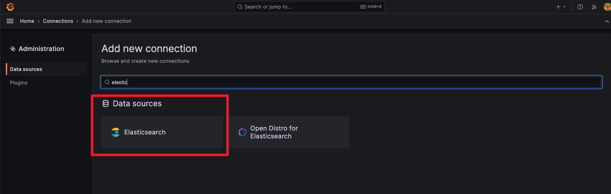

数据源配置如下所示


# 数据查询
> grafana同样也支持数据查询功能，但功能可选项略逊于kibana。
>

## 数据视图
点击grafana菜单——>Explore，即可跳转至数据浏览页面


需要注意的是该页面仅用于临时数据查询和折线图查看，不能保存视图设置。如果想要经常查询指定条件的数据，可以在dashboard中新建图表。

## 筛选时间范围
与Kibana类似，grafana的所有图表也是依赖时间范围的，可以点击右上角的时间按钮选择时间范围


## 条件查询过滤
例如我们需要查询access_status字段值为400的内容，我们只需要在query输入框输入查询条件即可。grafana支持所有的<font style="color:rgb(48, 49, 51);">URI Search查询，例如常见的关键字查询、布尔查询、逻辑AND OR查询、大于小于等于、正则查询等都支持，我们只需要将查询语句填写到Query数据框即可，具体可参考博客文章：</font>[<font style="color:rgb(48, 49, 51);">https://www.cuiliangblog.cn/detail/article/44</font>](https://www.cuiliangblog.cn/detail/article/44)

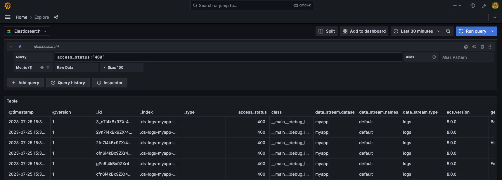

## 查询汇总数据
除了查询数据外，grafana也支持大多数query DSL的数据聚合查询，例如我们可以查询最近15分钟，request_method为GET的记录中，按access_status字段分组，统计每组的个数。

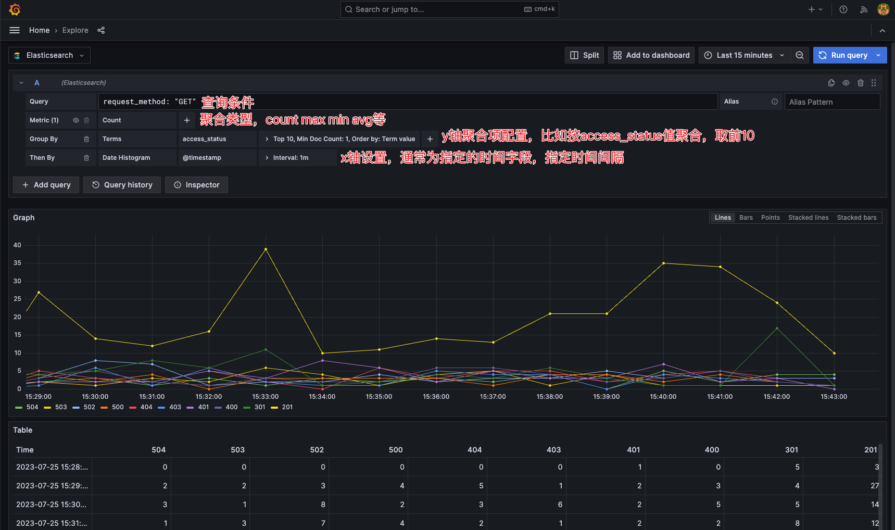

## 结果导出
点击inspector按钮，选择需要导出的列数据，即可导出CSV格式报告。


# dashboard与图表制作
在grafana中，我们也可以创建数据看板，以我们的自定义日志为例演示可视化分析效果。


## 全局变量
我们在查看数据时，经常需要使用全局变量，例如时间间隔，指定条件的数据等，在grafana中配置如下


以时间间隔为例，变量的可选项手动输入，配置如下


以请求状态码为例，这个变量的结果是从es中查询获得，配置如下：


如果想查询指定条件的数据，则查询语句为`{"find":"terms","field":"hostname","query":"tags:RT-sangfor"}`


## 图表类型
grafana同样也支持非常多的图表类型，在制作图表时，建议大家可以先使用time series调试查询语句配置，待查询语句配置无误后，再选择其他类型的图表，grafana会自动转换图表样式。


## 查询配置
es常用的url search和聚合查询grafana都支持，在查询语句配置区可根据自己的需要调试查询语句，如果对查询结果有疑问，点击Query inspector可以查看自动生成的查询语句，再反过来调试查询语句配置。

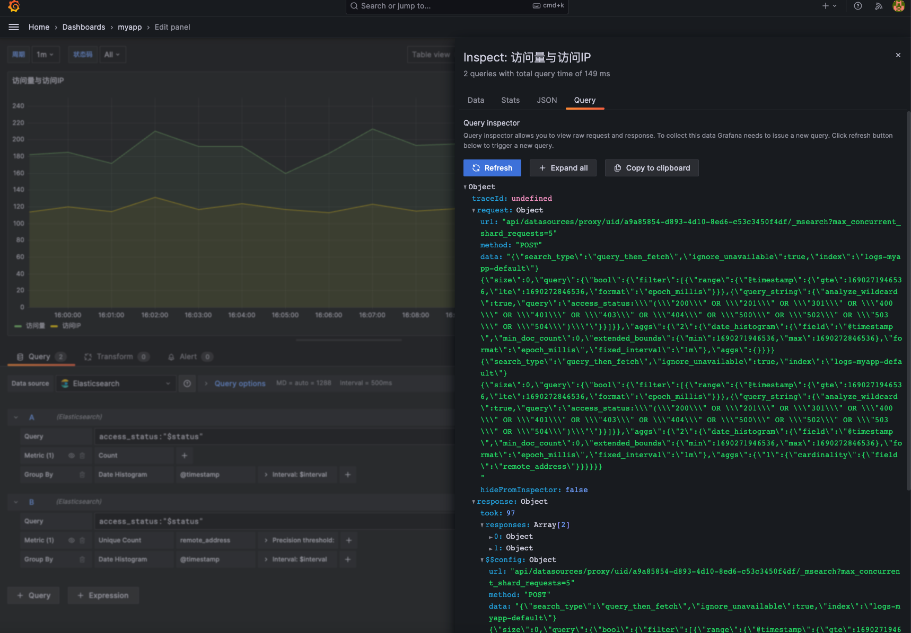

例如我们需要在一个图表中显示访问量(指定时间段内文档的count数)和访问IP(按remote_address字段聚合，统计不同的值出现的次数)，查询配置如下：

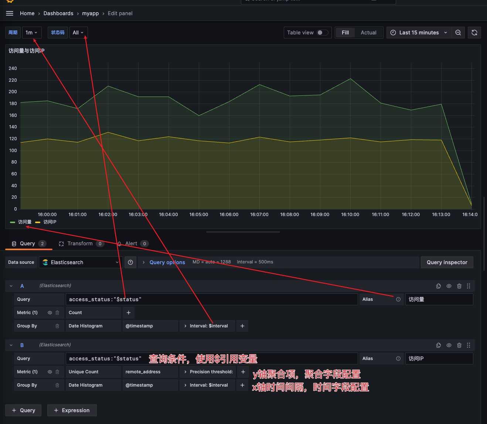

## 图表配置
右侧为图表配置区，常用的配置如下

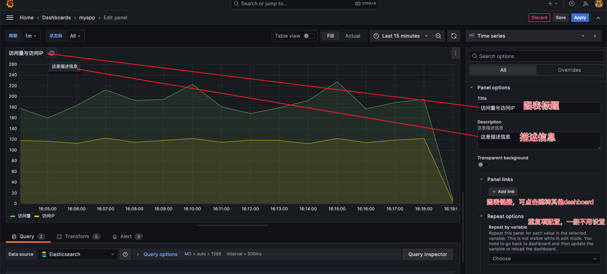


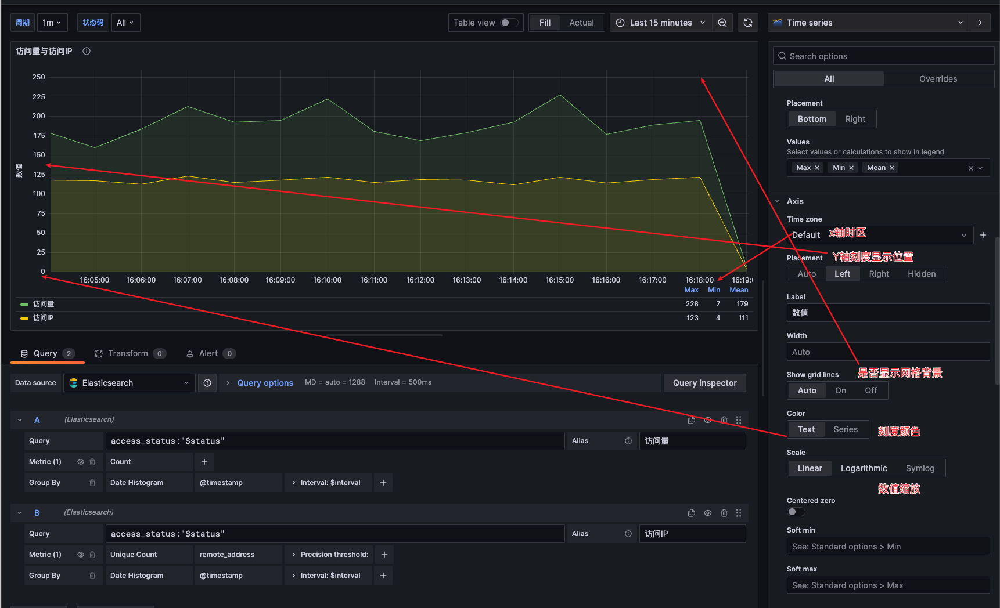

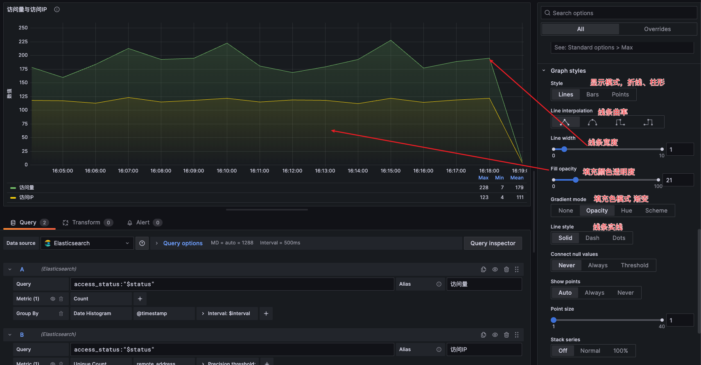

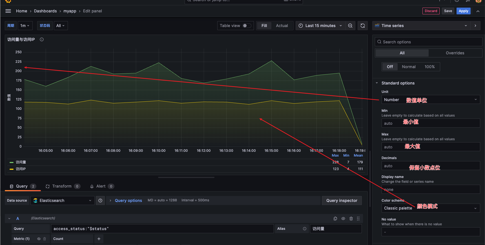

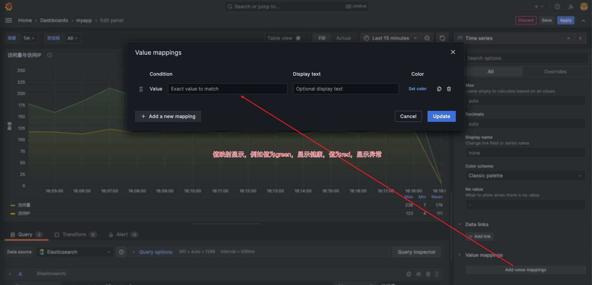

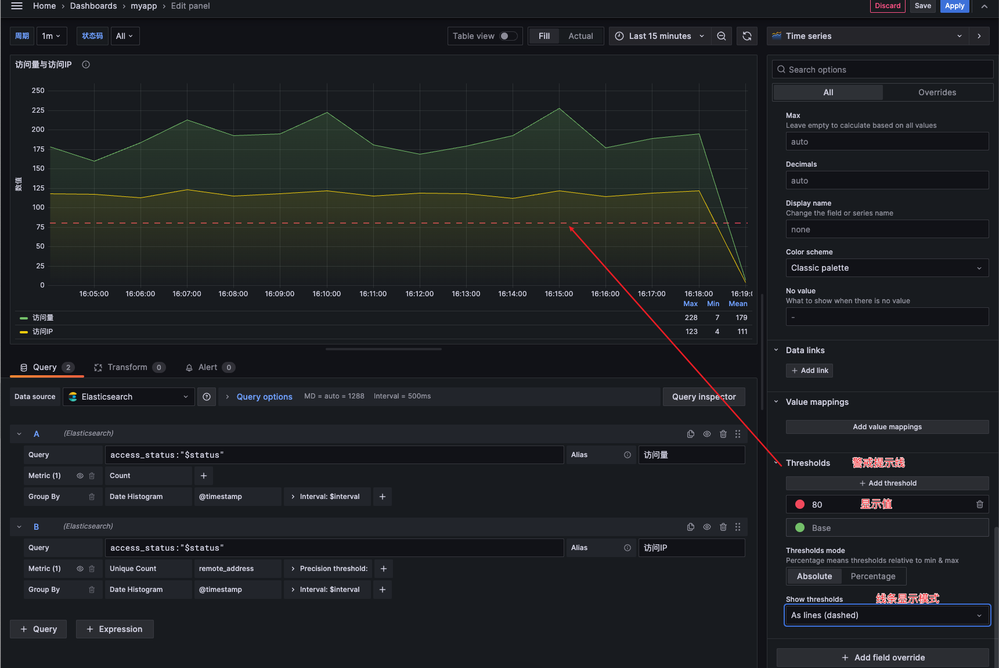

## 效果图
grafana的图表配置项很多，虽然官方文档对每个配置项功能都有解释，但在作图时参考意义并不大。还是建议多尝试点击切换各个选项查看效果，积累更多经验才能快速按需求做出合适的图表。最终制作的dashboard效果如下所示：

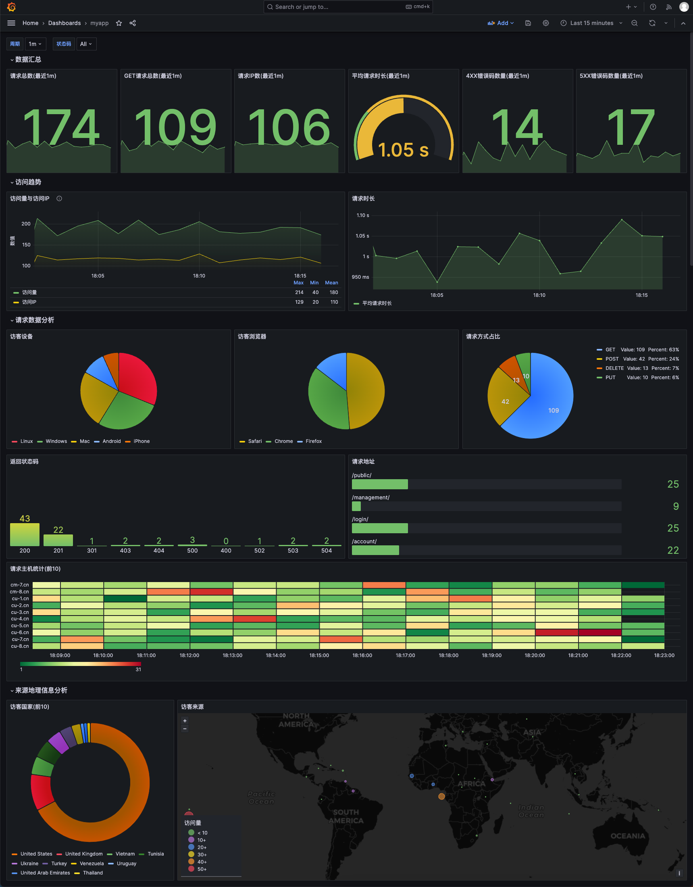

dashboard已导出为json文件方便大家导入grafana查看，json文件地址：[https://gitee.com/cuiliang0302/log_demo/blob/main/other/grafana%20dashboard/myapp-dashboard.json](https://gitee.com/cuiliang0302/log_demo/blob/main/other/grafana%20dashboard/myapp-dashboard.json)

# 地理热力图制作
> grafana同样也支持地理位置数据可视化分析显示。
>

## 查询配置
在前面的Logstash配置中，我们使用了geoip插件，它可以根据IP地址解析出对于的经纬度信息，并将geoip的location字段类型设置为geo_point，在查询语句中，类型改为Geo Hash Grid，字段为geoip.lacation，2维数组。

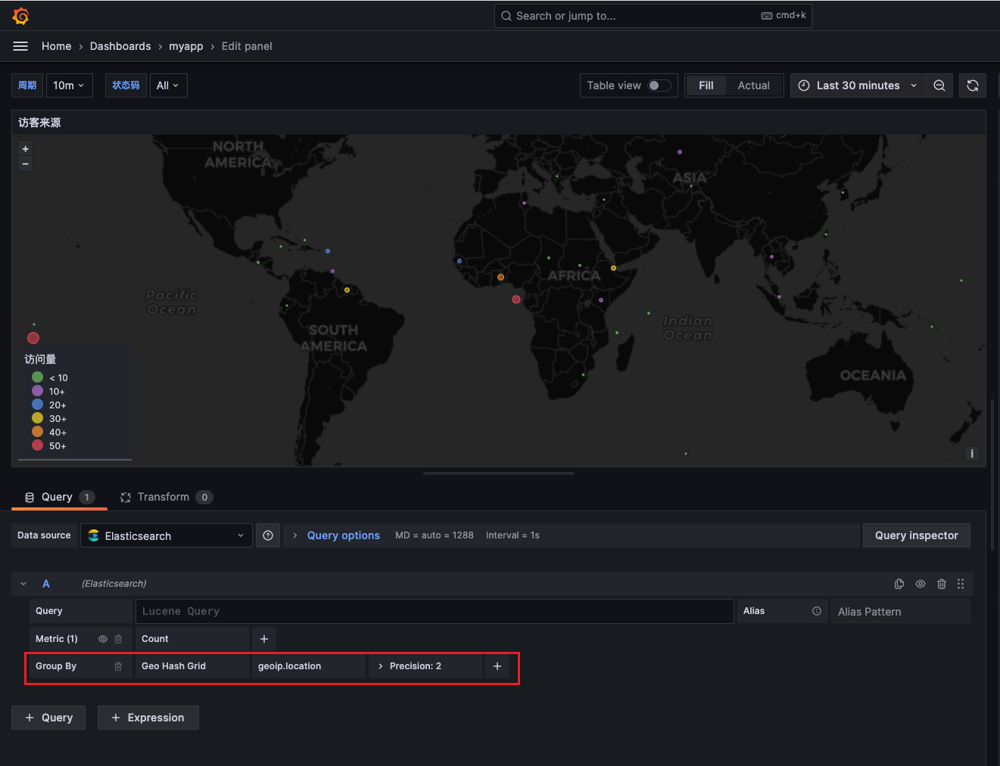

## 显示配置
grafana地理位置显示配置项较多，我们只需要按下图参数设置就可以正常显示热力图，接下来根据自己的需求调整样式即可。如果想了解各个配置项含义可参考官方文档地址：

[https://grafana.com/docs/grafana/latest/panels-visualizations/visualizations/geomap/](https://grafana.com/docs/grafana/latest/panels-visualizations/visualizations/geomap/)

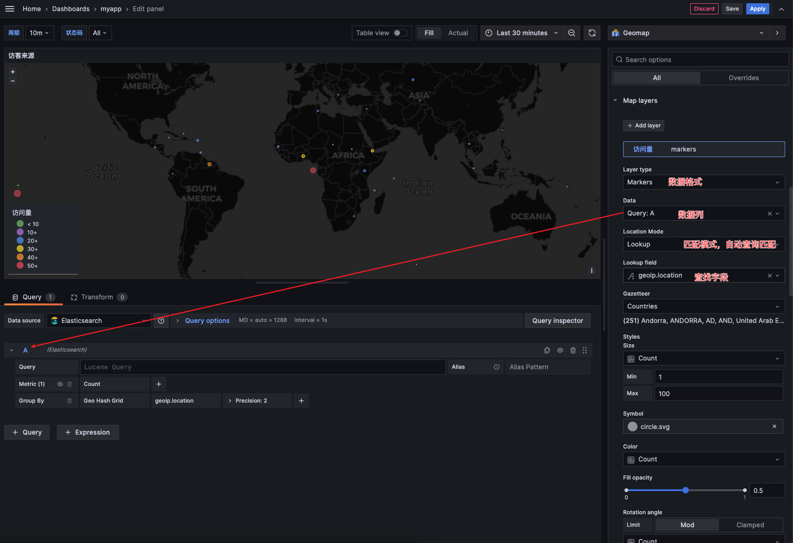

# 表格视图制作
## 查询配置


## 显示配置


# 参考文档
grafana dashboard全局变量:[https://grafana.com/docs/grafana/latest/datasources/elasticsearch/template-variables/](https://grafana.com/docs/grafana/latest/datasources/elasticsearch/template-variables/)

