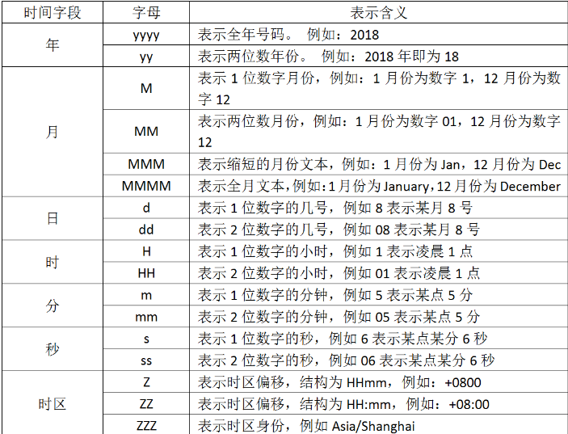

# 过滤插件-date时间处理
## @timestamp字段处理
> 在ELK的日志处理系统中，@timestamp字段会被elasticsearch用到，用来标注日志的生产时间，如此一来，日志生成时间就会发生混乱，要解决这个问题，需要用到另一个插件，即date插件，这个时间插件用来转换日志记录中的时间字符串，变成Logstash::Timestamp对象，然后转存到@timestamp字段里面
>


```json
[root@local-vm ~]# vim pipeline.conf
input {
  file {
    path => ["/tmp/demo.log"]
    type => "system"
    start_position => "beginning"
    sincedb_path => "/dev/null"
  }
}
filter{
  grok{
    match => {"message" => "\ -\ -\ \[%{HTTPDATE:timestamp}\]"}
  }
  date{
    match => ["timestamp","dd/MMM/yyyy:HH:mm:ss Z"]
  }
}
output {
  stdout {
  }   
}
```

+ <font style="background-color:transparent;">注意：时区偏移量需要用一个字母Z来转换。还有这里的“dd/MMM/yyyy”，你发现中间是三个大写的M，没错，这里确实是三个大写的M，我尝试只写两个M的话，转换失败</font>

追加测试数据

```json
[root@local-vm ~]# echo "172.16.213.132 - - [07/Feb/2018:16:24:19 +0800] "GET /HTTP/1.1" 403 5039" > /tmp/demo.log 
```

查看Logstash输出

```json
{
          "type" => "system",
     "timestamp" => "07/Feb/2018:16:24:19 +0800",
    "@timestamp" => 2018-02-07T08:24:19.000Z,
         "event" => {
        "original" => "172.16.213.132 - - [07/Feb/2018:16:24:19 +0800] GET /HTTP/1.1 403 5039"
    },
           "log" => {
        "file" => {
            "path" => "/tmp/demo.log"
        }
    },
          "host" => {
        "name" => "local-vm"
    },
       "message" => "172.16.213.132 - - [07/Feb/2018:16:24:19 +0800] GET /HTTP/1.1 403 5039",
      "@version" => "1"
}
```

## 时间处理（date）
> date插件对于排序事件和回填旧数据尤其重要，它可以用来转换日志记录中的时间字段，变成Logstash：：timestamp对象，然后转存到@timestamp字段里面。
>
> 为什么要使用这个插件呢？一方面由于Logstash会给收集到的每条日志自动打上时间戳（即@timestamp），但是这个时间戳记录的是input接收数据的时间，而不是日志生成的时间（因为日志生成时间与input接收的时间肯定不同），这样就可能导致搜索数据时产生混乱。
>

> 另一方面，在上面那段rubydebug编码格式的输出中，@timestamp字段虽然已经获取了timestamp字段的时间，但是仍然比北京时间晚了8个小时，这是因为在Elasticsearch内部，对时间类型字段都是统一采用UTC时间，而日志统一采用UTC时间存储，是国际安全、运维界的一个共识。其实这并不影响什么，因为ELK已经给出了解决方案，那就是在Kibana平台上，程序会自动读取浏览器的当前时区，然后在web页面自动将UTC时间转换为当前时区的时间。
>

如果你要解析你的时间，你要使用字符来代替，用于解析日期和时间文本的语法使用字母来指示时间（年、月、日、时、分等）的类型。以及重复的字母来表示该值的形式。在上面看到的"dd/MMM/yyy:HH:mm:ss Z"，他就是使用这种形式，我们列出字符的含义：



那我们是依据什么写出“dd/MMM/yyy:HH:mm:ss Z”这样子的形式的呢？

比如上面的试验数据是172.16.213.132 - - [07/Feb/2018:16:24:19 +0800] "GET /HTTP/1.1" 403 5039

现在我们想转换时间，那就要写出"dd/MMM/yyy:HH:mm:ss Z"，你发现中间有三个M，你要是写出两个就不行了，因为我们查表发现两个大写的M表示两位数字的月份，可是我们要解析的文本中，月份则是使用简写的英文，所以只能去找三个M。还有最后为什么要加上个大写字母Z，因为要解析的文本中含有“+0800”时区偏移，因此我们要加上去，否则filter就不能正确解析文本数据，从而转换时间戳失败。

