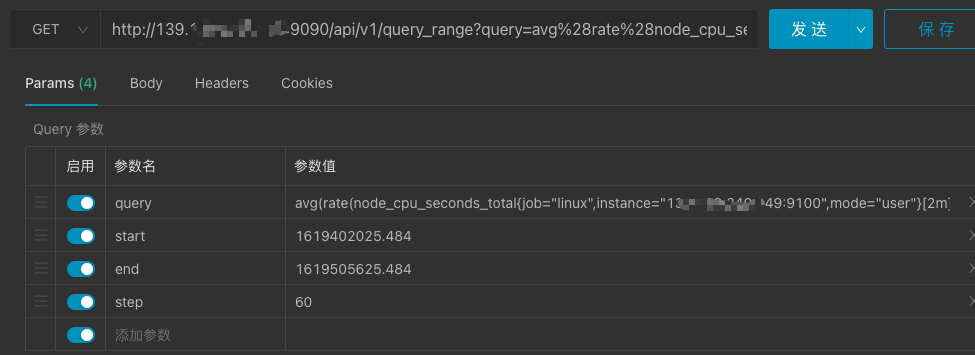
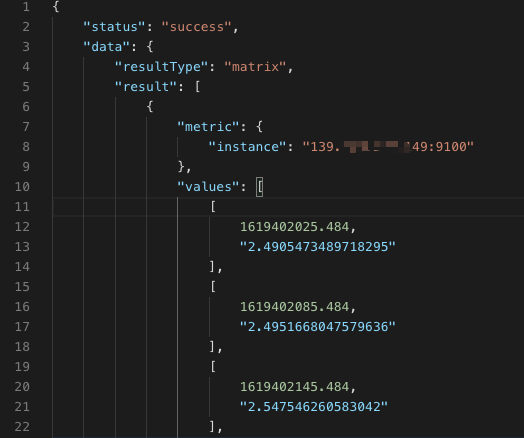
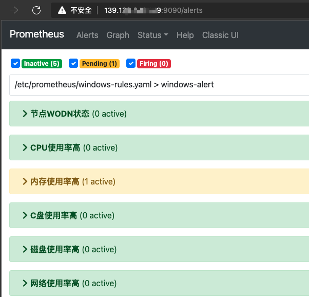
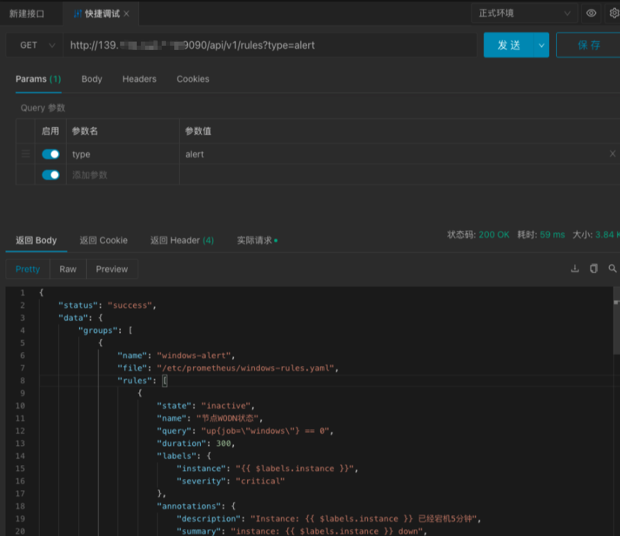

# 在HTTP API中使用PromQL
## 一、获取targets数据
### 1. prometheus查看targets数据

+ 如图所示，现在的prometheus共有三个targets，一个为prometheus，还有两个为Windows

### 2. 使用apifox模拟请求，获取数据
+ 调用http://<prometheus.address>/api/v1/targets并解析

## 二、获取当前时间指标值
适用于获取服务器的CPU核心数、操作系统内核版本、内存总容量等这些当前状态下的指标值

### 1. prometheus dashboard查询
+ 以查询Linux系统内核版本为例

+ 如图所示，执行 node_uname_info{job="linux",instance="139.***.***.149:9100"} 查询语句即可。

### 2. 使用apifox模拟请求，获取数据
+ 调用http://<prometheus.address>/api/v1/query?query=<expr>，其中expr为prometheus的查询语句。

  

## 三、获取时间范围内指标值
grafana的折线图数据，都是这种使用场景，例如在指定时间范围内的CPU使用率、内存使用率、系统负载等

### 1. prometheus dashboard查询
+ 以查询CPU使用率为例

### 2. 使用apifox模拟请求，获取数据
+ 调用http://<prometheus.address>/api/v1/query_range?query=<expr>&start=<startstamp>&end=<endstamp>&step=<step>
+ expr为prometheus的查询语句
+ startstamp为范围查询开始时间戳
+ endstamp为范围查询结束时间戳
+ step为查询时间间隔（单位为秒）

  

## 四、获取告警数据
### 1. prometheus查询

### 2. 使用apifox模拟请求，获取数据
+ 调用http://<prometheus.address>/api/v1/rules?type=alert并解析

