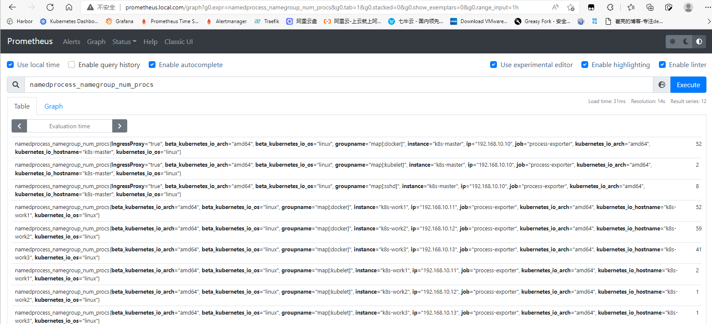

# Process Exporter
## Process Exporter简介
### process exporter功能
如果想要对主机的进程进行监控，例如chronyd，sshd等服务进程以及自定义脚本程序运行状态监控。我们使用node exporter就不能实现需求了，此时就需要使用process exporter来做<font style="color:rgb(64, 64, 64);">进程状态的监控。</font>

<font style="color:rgb(64, 64, 64);">项目地址：</font>[https://github.com/ncabatoff/process-exporter](https://github.com/ncabatoff/process-exporter)

### process exporter配置
process exporter的配置文件为yaml格式，需要在配置文件中指明需要监控的进程，并将进程分组，<font style="color:rgb(36, 41, 47);">一个进程只能属于一个组。</font>

+ 基本格式

```python
process_names:
  - name: "{{.Matches}}" # 匹配模板
    cmdline: 
    - 'redis-server' # 匹配名称
```

+ 匹配模板

| {{.Comm}}  | 包含原始可执行文件的名称，即<font style="color:rgb(36, 41, 47);">/proc/<pid>/stat</font> |
| --- | --- |
| {{.ExeBase}}  | 包含可执行文件的名称(默认) |
| {{.ExeFull}} | 包含可执行文件的路径 |
| {{.Username}} | 包含的用户名 |
| {{.Matches}}  | 包含所有正则表达式而产生的匹配项（建议使用） |
| {{.PID}} | 包含进程的PID，一个PID仅包含一个进程（不建议使用） |
| {{.StartTime}} | 包含进程的开始时间（不建议使用） |


### process exporter常用指标
| namedprocess_namegroup_num_procs | 运行的进程数 |
| --- | --- |
| namedprocess_namegroup_states | Running/Sleeping/Other/Zombie状态的进程数 |
| namedprocess_namegroup_cpu_seconds_total | 获取/proc/[pid]/stat 进程CPU <font style="color:rgb(36, 41, 47);">utime、stime状态</font>时间 |
| namedprocess_namegroup_read_bytes_total | 获取/proc/[pid]/io 进程读取字节数 |
| namedprocess_namegroup_write_bytes_total | 获取/proc/[pid]/io 进程写入字节数 |
| namedprocess_namegroup_memory_bytes | 获取进程使用的内存字节数 |
| namedprocess_namegroup_<font style="color:rgb(36, 41, 47);">open_filedesc</font> | <font style="color:rgb(36, 41, 47);">获取进程使用的文件描述符数量</font> |
| namedprocess_namegroup_thread_count | 运行的<font style="color:rgb(36, 41, 47);">线程数</font> |
| namedprocess_namegroup_<font style="color:rgb(36, 41, 47);">thread_cpu_seconds_total</font> | <font style="color:rgb(36, 41, 47);">获取线程CPU状态时间</font> |
| namedprocess_namegroup_<font style="color:rgb(36, 41, 47);">thread_io_bytes_total</font> | <font style="color:rgb(36, 41, 47);">获取线程IO字节数</font> |


## Process Exporter部署
实验场景：需要监控k8s集群每台linux服务器的chronyd sshd docker kubelet进程运行状态，当有进程异常时，触发告警。

### exporter配置文件
使用configmap的方式挂载配置文件内容，使用Matches模板正则匹配指定名称的进程。

```yaml
apiVersion: v1
kind: ConfigMap
metadata:
  name: process-exporter-config
  namespace: monitoring
data:
  process-exporter-config.yaml: |-
    process_names:
    - name: "{{.Matches}}"
      cmdline:
      - 'docker'
    - name: "{{.Matches}}"
      cmdline:
      - 'kubelet'
    - name: "{{.Matches}}"
      cmdline:
      - 'chronyd'
    - name: "{{.Matches}}"
      cmdline:
      - 'sshd'
```

### exporter控制器
由于集群内每台主机都需要进行进程监控，所以使用daemonset控制器。将配置文件和宿主机/proc目录挂载至pod中。

```yaml
apiVersion: apps/v1
kind: DaemonSet
metadata:
  name: process-exporter
  namespace: monitoring
  labels:
    app: process-exporter
spec:
  selector:
    matchLabels:
      app: process-exporter
  template:
    metadata:
      labels:
        app: process-exporter
    spec:
      hostPID: true
      hostIPC: true
      hostNetwork: true
      nodeSelector:
        kubernetes.io/os: linux
      containers:
        - name: process-exporter
          image: ncabatoff/process-exporter
          args:
            - -config.path=/config/process-exporter-config.yaml
          ports:
            - containerPort: 9256
          resources:
            requests:
              cpu: 10m
              memory: 10Mi
            limits:
              cpu: 150m
              memory: 180Mi
          securityContext:
            runAsNonRoot: true
            runAsUser: 65534
          volumeMounts:
            - name: proc
              mountPath: /proc
            - name: config
              mountPath: /config
      volumes:
        - name: proc
          hostPath:
            path: /proc
        - name: config
          configMap:
            name: process-exporter-config
```

+ exporter访问验证

访问任意一个process exporter的metrics，验证是否正常采集到指标

```bash
[root@k8s-master exporter]# kubectl get pod -n monitoring -o wide 
NAME                                 READY   STATUS    RESTARTS   AGE     IP              NODE         NOMINATED NODE   READINESS GATES
alertmanager-6f944cf9fb-x49bl        1/1     Running   3          122d    10.244.3.187    k8s-work1    <none>           <none>
blackbox-exporter-547df5d6bd-sppfh   1/1     Running   4          124d    10.244.2.108    k8s-work3    <none>           <none>
grafana-7b45bfcd8b-plcqq             1/1     Running   5          125d    10.244.3.184    k8s-work1    <none>           <none>
node-exporter-2rg5h                  1/1     Running   4          124d    10.244.0.50     k8s-master   <none>           <none>
node-exporter-rzl4v                  1/1     Running   4          124d    10.244.3.188    k8s-work1    <none>           <none>
node-exporter-sk8r8                  1/1     Running   5          124d    10.244.2.110    k8s-work3    <none>           <none>
node-exporter-xqwb5                  1/1     Running   11         124d    10.244.1.143    k8s-work2    <none>           <none>
process-exporter-46nqr               1/1     Running   0          5m10s   192.168.10.11   k8s-work1    <none>           <none>
process-exporter-9d5kd               1/1     Running   0          5m10s   192.168.10.10   k8s-master   <none>           <none>
process-exporter-kl8vc               1/1     Running   0          5m10s   192.168.10.13   k8s-work3    <none>           <none>
process-exporter-t8gd6               1/1     Running   0          5m10s   192.168.10.12   k8s-work2    <none>           <none>
prometheus-0                         1/1     Running   0          10m     10.244.3.200    k8s-work1    <none>           <none>
[root@k8s-master exporter]# curl 192.168.10.11:9256/metrics
namedprocess_namegroup_thread_major_page_faults_total{groupname="map[:docker]",threadname="alertmanager"} 0
namedprocess_namegroup_thread_major_page_faults_total{groupname="map[:docker]",threadname="calico-node"} 0
namedprocess_namegroup_thread_major_page_faults_total{groupname="map[:docker]",threadname="containerd-shim"} 0
namedprocess_namegroup_thread_major_page_faults_total{groupname="map[:docker]",threadname="coredns"} 0
namedprocess_namegroup_thread_major_page_faults_total{groupname="map[:docker]",threadname="dockerd"} 0
namedprocess_namegroup_thread_major_page_faults_total{groupname="map[:docker]",threadname="flanneld"} 0
namedprocess_namegroup_thread_major_page_faults_total{groupname="map[:docker]",threadname="grafana-server"} 0
namedprocess_namegroup_thread_major_page_faults_total{groupname="map[:docker]",threadname="kube-controller"} 0
namedprocess_namegroup_thread_major_page_faults_total{groupname="map[:docker]",threadname="kube-proxy"} 0
namedprocess_namegroup_thread_major_page_faults_total{groupname="map[:docker]",threadname="node_exporter"} 0
namedprocess_namegroup_thread_major_page_faults_total{groupname="map[:docker]",threadname="process-exporte"} 0
namedprocess_namegroup_thread_major_page_faults_total{groupname="map[:docker]",threadname="prometheus"} 0
namedprocess_namegroup_thread_major_page_faults_total{groupname="map[:kubelet]",threadname="kubelet"} 0
namedprocess_namegroup_thread_major_page_faults_total{groupname="map[:kubelet]",threadname="metrics-server"} 0
# HELP namedprocess_namegroup_thread_minor_page_faults_total Minor page faults for these threads
# TYPE namedprocess_namegroup_thread_minor_page_faults_total counter
namedprocess_namegroup_thread_minor_page_faults_total{groupname="map[:docker]",threadname="alertmanager"} 136
namedprocess_namegroup_thread_minor_page_faults_total{groupname="map[:docker]",threadname="calico-node"} 0
namedprocess_namegroup_thread_minor_page_faults_total{groupname="map[:docker]",threadname="containerd-shim"} 144
namedprocess_namegroup_thread_minor_page_faults_total{groupname="map[:docker]",threadname="coredns"} 0
namedprocess_namegroup_thread_minor_page_faults_total{groupname="map[:docker]",threadname="dockerd"} 0
namedprocess_namegroup_thread_minor_page_faults_total{groupname="map[:docker]",threadname="flanneld"} 26
namedprocess_namegroup_thread_minor_page_faults_total{groupname="map[:docker]",threadname="grafana-server"} 5
namedprocess_namegroup_thread_minor_page_faults_total{groupname="map[:docker]",threadname="kube-controller"} 2
namedprocess_namegroup_thread_minor_page_faults_total{groupname="map[:docker]",threadname="kube-proxy"} 0
namedprocess_namegroup_thread_minor_page_faults_total{groupname="map[:docker]",threadname="node_exporter"} 8028
namedprocess_namegroup_thread_minor_page_faults_total{groupname="map[:docker]",threadname="process-exporte"} 2389
namedprocess_namegroup_thread_minor_page_faults_total{groupname="map[:docker]",threadname="prometheus"} 953
namedprocess_namegroup_thread_minor_page_faults_total{groupname="map[:kubelet]",threadname="kubelet"} 4
namedprocess_namegroup_thread_minor_page_faults_total{groupname="map[:kubelet]",threadname="metrics-server"} 332
```

> namedprocess开头的指标均为process exporter采集的信息，指标采集正常，接下来配置prometheus的targets
>

### prometheus targets配置
```yaml
apiVersion: v1
kind: ConfigMap
metadata:
  name: prometheus-config
data:
  prometheus.yaml: |-
    global:
      scrape_interval: 30s
      evaluation_interval: 30s
    rule_files:
    - /etc/prometheus/rules/*.yaml
    scrape_configs:
    - job_name: 'process-exporter'
      scrape_interval: 1m
      scrape_timeout: 1m
      kubernetes_sd_configs:
      - role: node
      relabel_configs:
      - source_labels: [__address__]
        regex: '(.*):10250'
        replacement: '${1}:9256'
        target_label: __address__
        action: replace
      - action: labelmap
        regex: __meta_kubernetes_node_label_(.+)
      - source_labels: [__meta_kubernetes_node_address_InternalIP]
        action: replace
        target_label: ip
```

+ prometheus targets验证


+ 输入指标名称验证



> prometheus采集无误，接下来我们配置告警规则。由于namedprocess_namegroup_num_procs这个指标显示的是指定服务的进程数，我们可以设置条件，当这个指标值为0的时候触发告警。
>

### prometheus rules配置
```yaml
apiVersion: v1
kind: ConfigMap
metadata:
  name: prometheus-rule
  labels:
    name: prometheus-rule
  namespace: monitoring
data:
  alert-rules.yaml: |-
    groups:
    - name: node-alert
      rules:
      - alert: service not running
        expr: namedprocess_namegroup_num_procs == 0
        for: 1m
        labels:
          severity: warning
          team: server
        annotations:
          summary: "{{$labels.ip}} service status not running"
          description: "{{$labels.ip}} {{$labels.groupname}} service status not running"
          value: "{{$labels.groupname}}"
```

+ 接下来。我们将node3的chronyd服务人为停止，模拟触发故障，查看alert信息


### grafana配置
process exporter已经为我们准备好了现成的grafana dashboard模板，我们只需要直接导入即可，模板ID为249


