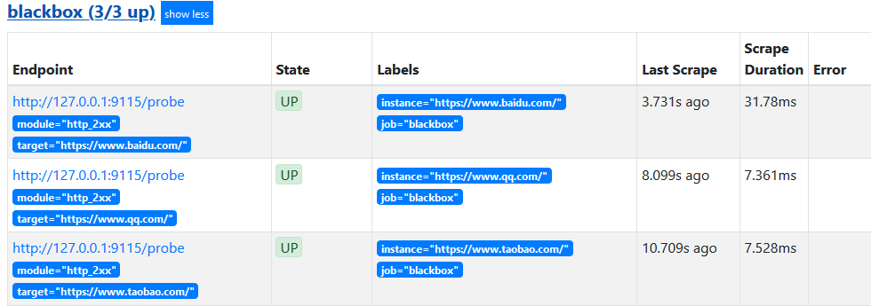
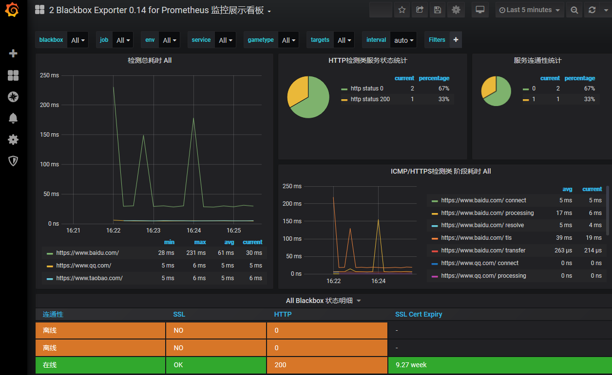

# Blackbox Exporter
# 白盒测试与黑盒测试
1. 我们监控主机的资源用量、容器的运行状态、数据库中间件的运行数据。      这些都是支持业务和服务的基础设施，通过白盒能够了解其内部的实际运行状态，通过对监控指标的观察能够预判可能出现的问题，从而对潜在的不确定因素进行优化。
2. 黑盒监控即以用户的身份测试服务的外部可见性，常见的黑盒监控包括HTTP探针、TCP探针等用于检测站点或者服务的可访问性，以及访问效率等。
3. 黑盒监控相较于白盒监控最大的不同在于黑盒监控是以故障为导向当故障发生时，黑盒监控能快速发现故障，而白盒监控则侧重于主动发现或者预测潜在的问题。
4. 一个完善的监控目标是要能够从白盒的角度发现潜在问题，能够在黑盒的角度快速发现已经发生的问题。

# 使用Blackbox Exporter
## 配置文件简介
+ 运行Blackbox      Exporter时，需要用户提供探针的配置信息，这些配置信息可能是一些自定义的HTTP头信息，也可能是探测时需要的一些TSL配置，也可能是探针本身的验证行为。
+ 在Blackbox      Exporter每一个探针配置称为一个module，并且以YAML配置文件的形式提供给Blackbox Exporter。
+ 每一个module主要包含以下配置内容，包括探针类型（prober）、验证访问超时时间（timeout）、以及当前探针的具体配置项

## 安装部署
1. 下载软件包
+ [下载地址](https://prometheus.io/download/#blackbox_exporter)
2. 解压到/usr/local下

```bash
tar -zxvf blackbox_exporter-0.16.0.linux-amd64.tar.gz
```

3. 启动Blackbox      Exporter

```bash
# ./blackbox_exporter
```

4. 通过systemd注册服务

```bash
[root@monitoring ~]# cat /etc/systemd/system/blackbox-exporter.service
[Unit]
Description=Prometheus Blackbox Exporter
After=network.target

[Service]
Type=simple
User=root
Group=root

ExecStart=/opt/blackbox_exporter/blackbox_exporter \
--config.file=/opt/blackbox_exporter/blackbox.yml \
--web.listen-address=:9115
Restart=on-failure

[Install]
WantedBy=multi-user.target
[root@monitoring ~]# 
[root@monitoring ~]# systemctl enable --now blackbox-exporter.service 
```

5. 访问http://127.0.0.1:9115/probe?module=http_2xx&target=baidu.com对baidu.com进行探测。
+ 通过在URL中提供module参数指定了当前使用的探针，target参数指定探测目标，探针的探测结果通过Metrics的形式返回：


## 与Prometheus集成
1. 修改/etc/prometheus/prometheus.yml，将Blackbox Exporter添加监控数据采集任务目标当中：

```yaml
- job_name: baidu_http2xx_probe
  params:
    module:
    - http_2xx
    target:
    - baidu.com
  metrics_path: /probe
  static_configs:
  - targets:
    - 127.0.0.1:9115
- job_name: prometheus_http2xx_probe
  params:
    module:
    - http_2xx
    target:
    - prometheus.io
  metrics_path: /probe
  static_configs:
  - targets:
    - 127.0.0.1:9115
```

+ 这里分别配置了名为baidu_http2x_probe和prometheus_http2xx_probe的采集任务，并且通过params指定使用的探针（module）以及探测目标（target）。
2. 假如有N个目标站点且都需要M种探测方式，那么Prometheus中将包含N * M个采集任务，这里采用Relabling的方式对这些配置进行简化，配置方式如下


3. 这里针对每一个探针服务（如http_2xx）定义一个采集任务，并且直接将任务的采集目标定义为我们需要探测的站点。在采集样本数据之前通过relabel_configs对采集任务进行动态设置。
+ 第1步，根据Target实例的地址，写入__param_target标签中。__param_<name>形式的标签表示，在采集任务时会在请求目标地址中添加<name>参数，等同于params的设置；
+ 第2步，获取__param_target的值，并覆写到instance标签中；
+ 第3步，覆写Target实例的__address__标签值为BlockBox      Exporter实例的访问地址。
4. 重新启动Prometheus服务:
5. 在Prometheus UI中查看到当前所有的Target状态：

## grfana查看数据
导入仪表盘（id9965）



# 完整配置示例
```bash
# ping检测
- job_name: blackbox_exporter_ping
  metrics_path: /probe
  params:
    module: [icmp]
  static_configs:
  - targets:
    - 192.168.1.1
    labels:
      group: 'gateway'
  relabel_configs:
  - source_labels: [__address__]
    target_label: __param_target
  - source_labels: [__param_target]
    target_label: instance
  - target_label: __address__
    replacement: 127.0.0.1:9115

# tcp端口检测
- job_name: blackbox_exporter_tcp
  metrics_path: /probe
  params:
    module: [tcp_connect]
  static_configs:
  - targets:
    - 192.168.1.100:3306
    labels:
      group: 'mysql'
  relabel_configs:
  - source_labels: [__address__]
    target_label: __param_target
  - source_labels: [__param_target]
    target_label: instance
  - target_label: __address__
    replacement: 127.0.0.1:9115

# http状态码监控
- job_name: blackbox_exporter_http
  metrics_path: /probe
  params:
    module: [http_2xx]
  static_configs:
  - targets:
    - https://www.baidu.com
    - http://kibana.test.com:5601
  relabel_configs:
  - source_labels: [__address__]
    target_label: __param_target
  - source_labels: [__param_target]
    target_label: instance
  - target_label: __address__
    replacement: 127.0.0.1:9115

# ssl证书有效期监控
- job_name: blackbox_exporter_ssl
  metrics_path: /probe
  params:
    module: [http_2xx]
  static_configs:
  - targets:
    - https://kubernetes.default.svc:443
    labels:
      group: kube-apiserver
  relabel_configs:
  - source_labels: [__address__]
    target_label: __param_target
  - source_labels: [__param_target]
    target_label: instance
  - target_label: __address__
    replacement: 127.0.0.1:9115
```

 

