# 配置和管理虚拟网络
# 一、什么是虚拟网络？什么是虚拟交换机
1. 虚拟网络：可为使用虚拟交换机的主机和虚拟机提供网络连接。
2. 虚拟交换机：
+ 用于引导虚拟机之间的网络流量并链接到外部网络。
+ 用户合并多个网络适配器的带宽并均衡他们之间的流量。此外还可用于处理物理网卡的故障切换。
+ 模仿物理以太网交换机

# 二、常见组件和术语
1. vsphere标准交换机：基于软件的交换机，负责管理虚拟机的流量。用户必须在各个ESXI主机独立管理vsphere标准交换机（即，每台主机都至少有一个vsphere标准交换机）
2. Sphere分布式交换机：基于软件的交换机，由位于一个vsphere数据中心中的ESXi主机和集群来分享和管理。（即，多个主机可共用一个分布式交换机）
3. 端口/端口组：vswitch的逻辑对象，一个虚拟交换机可以包含一个VMkernel端口或一个虚拟机端口组。
4. VMkerneI端口：一种特殊的虚拟交换机端口类型，配置有一个ip地址，用于支持虚拟机管理程序管理流量、vMotion、vSAN流更、NAS、NFS访问等。
5. 虚拟机端口组：虚拟交换机端口，共享一组相同的配置，并且允许虚拟机访问在相同的端口组、可访问PVLAN上或物理网络上配置的其他虚拟机。
6. 虚拟LAN:虚拟或物理交换机上配置的逻辑LAN,可以提供高效的流量分段、广播控制和安全性，同时指向为特定虚拟LAN(VLAN)配置的端口传输流量，从而提高带宽使用率。
7. 中继端口：物理交换机端口，负责监听和执行多个VLAN的流量传输。采用的方法是保存将流量从中继端口传输到所连接设备的802·IqVLAN标记。中继端口通常用于交换机与交换机的通信，使不同交换机上的多个VLAN能够自由通信。虚拟交换机支持VLAN，并且使用VLAN中继实现VLAN与虚拟交换机的自由连接。

# 三、虚拟交换机
1. 虚拟交换机分类及功能

1. 虚拟交换机使用类型

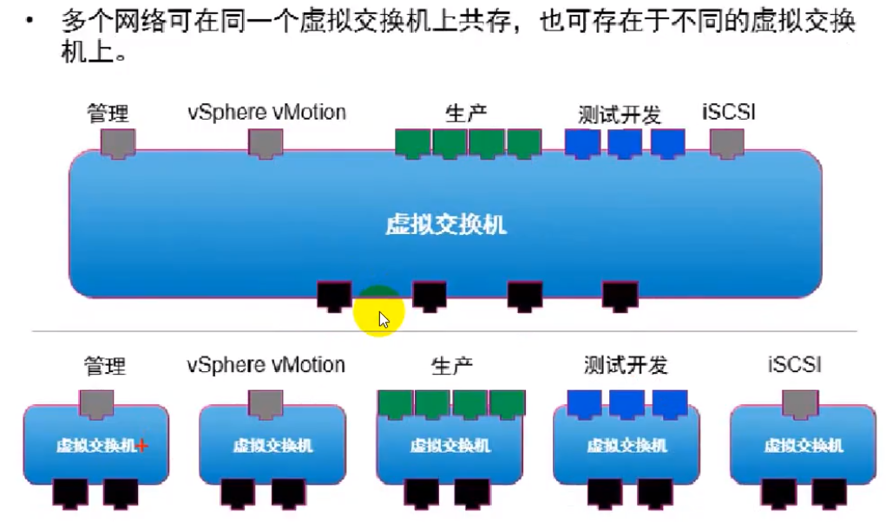

1. 虚拟交换机vlan

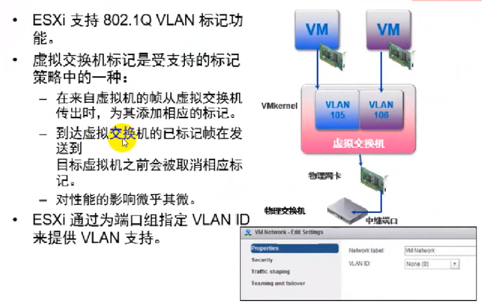

1. 虚拟交换机类型

# 四、分布式虚拟交换机
1. 逻辑结构

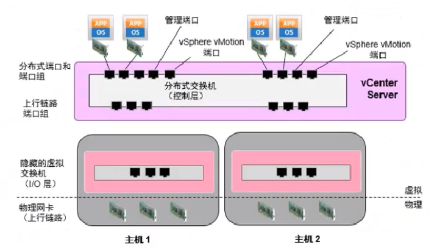

1. 分布式交换机与标准交换机区别

# 五、安全策略

1. 混杂模式

在同一个VLAN里的虚拟枧能收到该VLAN的所有数据包。假如客户安装Wireshark或者其他抓包工具，就可以看到目标是其它虚拟机的数据包和广播包。

1. MAC地址更改

ESXi主机发现虚拟机篡改了MAC地址（网卡MAC地址改为与\/M)(文件中定义的MAC地址不同）。

+ 拒绝：如果虚拟机修改了MAC地址，与该虚拟机连接的虚拟交换机端口就被禁用。（执行者是虚拟交换机）
+ 接受：虚拟机修改了MAC地址，不会禁用端口。（如果使用网络负载均衡，或连接iSCSl存储，就需要设置为"接受"）
1. 伪传输

修改MAC地址后，发出的帧的源MAC相应也会改变，但有些软件（或者是木·马）会直接修改以太网帧的源MAC。此时正在传输的帧的源MAC与虚拟网卡的MAC不同，本策略关注的就是这点：是否有软件修改了帧的源MAC地址，使其与网卡的'有效MAC地址"不符。有软件以伪造的源MAC地址向外发送数据帧，虚拟网卡就删除该帧，但放行合法的帧。这说明本策略的执行动作是'过滤"，而非一刀切的"断网'。

# 六、流量调整

1. 流量调整是一种用于控制虚拟机网络带宽的机制。在vswitch中，平均带宽、峰值带宽、突发大小均可配置。
2. 默认禁用状态

适用于标准虚拟交换机中的每个虚拟网卡

1. 流量调整仅控制出站流量

# 七、绑定与故障切换
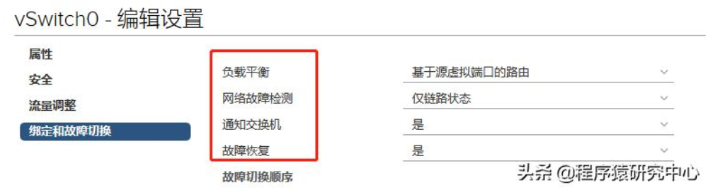

1. 负载平衡
+ 基于IP哈希的路由

虚拟交换机可根据每个数据包的源和目标IP地址选择虚拟机的上行链路。任何虚拟机都可根据源和目标|P地址使用网卡组中的任何上行链路。因此，每台虚拟机都可以使用网卡组中任何上行链路的带宽。

如果虚拟机在包含大量独立虚拟机的环境中运行，则IP哈希算法可在组中的网卡之间均匀地分布流量。当虚拟机与多个目标IP地址通信时，虚拟交换机可为每个目标|P生成不同的哈希。因此，数据包可以使用虚拟交换机上的不同上行链路，从而可能实现更高的吞吐

如果环境中包含的IP地址较少，则虚拟交换机可能会始终通过组中的一个上行链路传递流量。例如，如果一个应用程序服务器访问一个数据库服务器，则虚拟交换机会始终计算同一个上行链路，因为只存在一个源-目标对。

+ 基于源虚拟端口的路由

将每一个虚拟交换机端口绑定到vswitch关联的一个特定上行链路。算法会尝试在所有链路上保持相同数量的端口与上行链路配对，从而实现负载平衡。

该策略可保证来自一个连接虚拟交换机端口的特定虚拟网络适配器的流量总是使用同一个物理网络适配器。如果有一条上行链路出现问题，那么出现故障的上行链路的流量会转移到另外一个物理网络适配器上。

所以该策略并不支持动态负载均衡，但是支持冗余性。

+ 基于源MAC哈希的路由

该策略也容易出现与基于虚拟交换机端口策略相同的问题，因为来源MAC地址和vswitch端口一样都是静态的。当虚拟网络适配器比物理网络适配器多的时候，最好也是使用基于来源

MAC策略。当虚拟机使用多个虚拟网络适配器时会有多个来源MAC地址，因此可以使用多个物理网络适配器。

1. 网络故障检测
+ 仅链路状态

通过物理网络适配器提供的链路状态判断链路的故障。物理交换机上的一些事件会判断故

障，例如，线路断开或电源故障。链路状态故障恢复检测设置的缺点是无法判断错误配置，

也无法交换机线路错误连接到其他网络设备。

其他方法：例如：思科产品中有链路状态跟踪特性，可以让交换机检测到上游端口断开和重新响应状态。可以减少信号检测的使用，甚至

完全取代信号检测。

+ 信标探测

采用信标探测的故障恢复设置也会使用链路状态，会给所有物理网络适配器发送广播帧。这些广播帧可以帮助vswitch检测上有网络连接故障。

# 八、上链路端口冗余操作
1. exsi主机添加四块网卡

1. 进入到esxi主机web管理界面，查看网卡信息

1. 进入到vcenter，主机——配置——虚拟交换机——添加主机网络

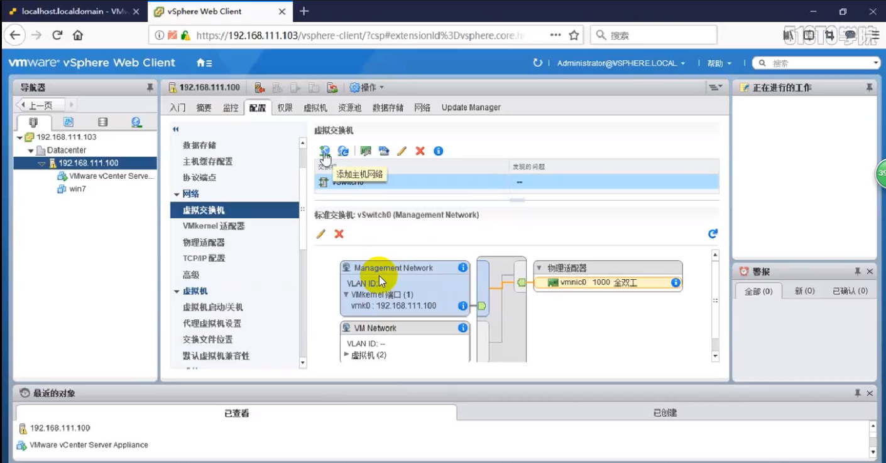

1. 选择物理网络适配器

1. 选择目标设备

1. 选择物理网卡

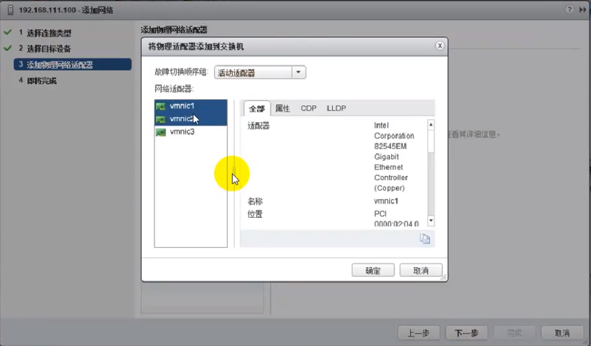

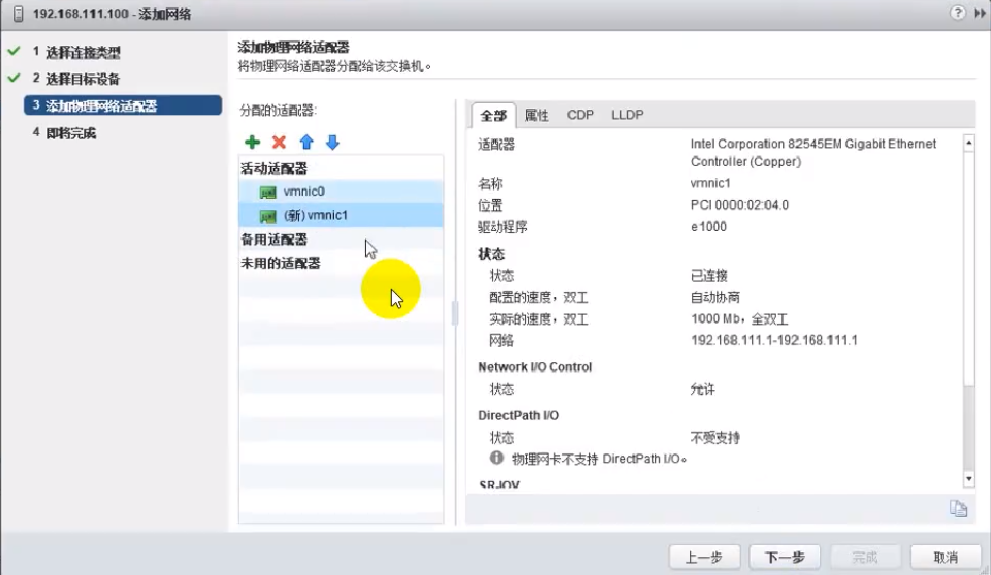

1. 即将完成

1. 查看网络拓扑

# 九、添加vlan端口组（物理交换机也要有对应的vlan id）
1. 选择操作的虚拟交换机，点添加主机网络

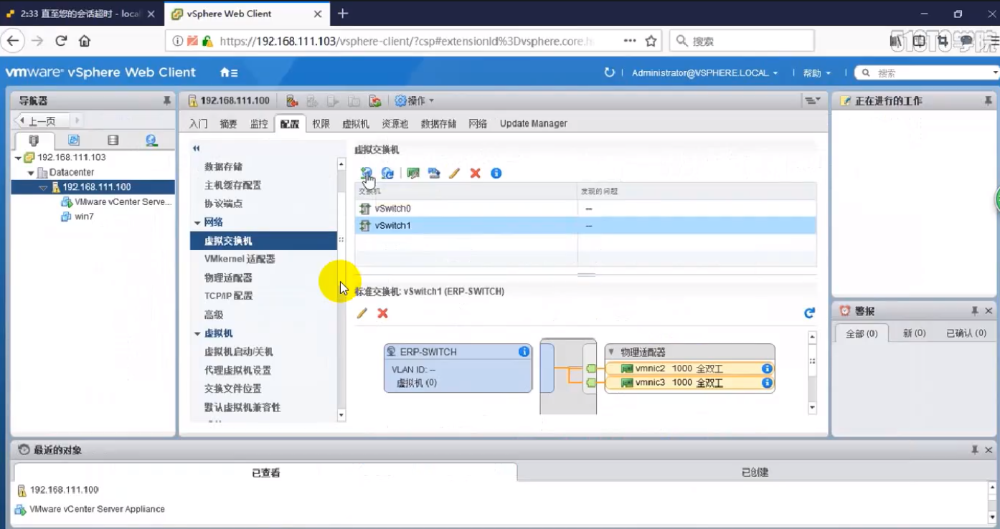

1. 选择标准交换机虚拟机端口组

1. 选择交换机

1. 创建vlan

1. 查看网络拓扑

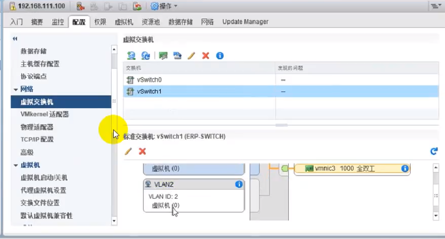

1. 将虚拟机切换到vlan2

# 十、创建分布式交换机
1. 新建分布式交换机

1. 设置名称和位置

1. 选择dvs版本

1. 编辑设置

# 十一、分布式交换机添加上行链路网卡
1. 选中分布式交换机——添加管理主机

1. 选择添加主机任务

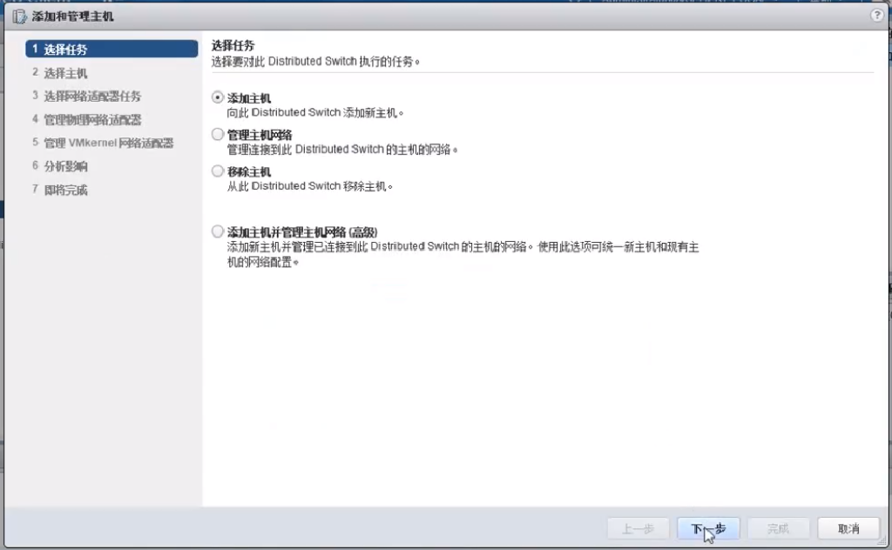

1. 选择主机

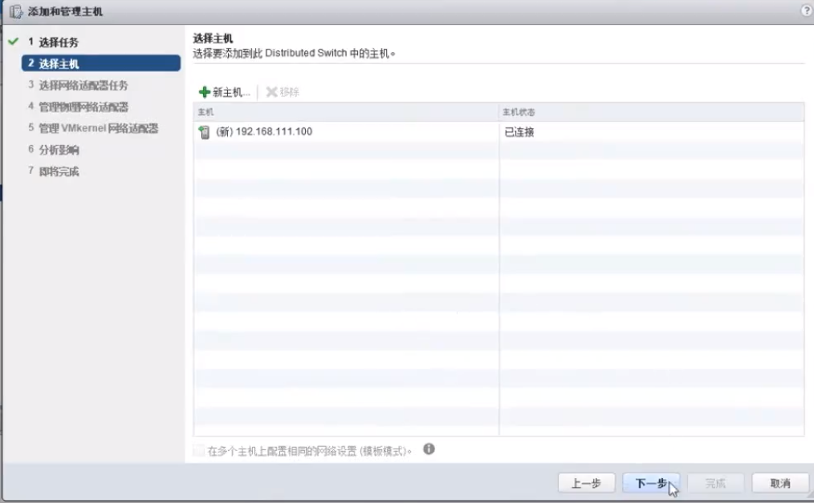

1. 选择网络适配器任务

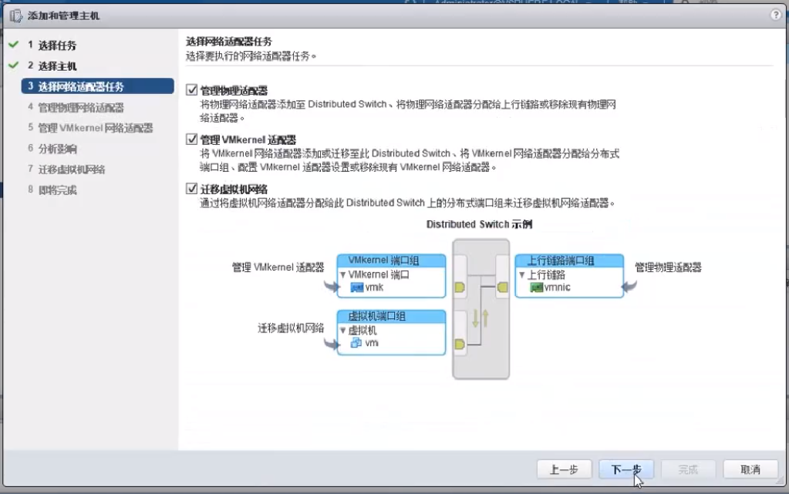

1. 选中网卡，分配上行链路

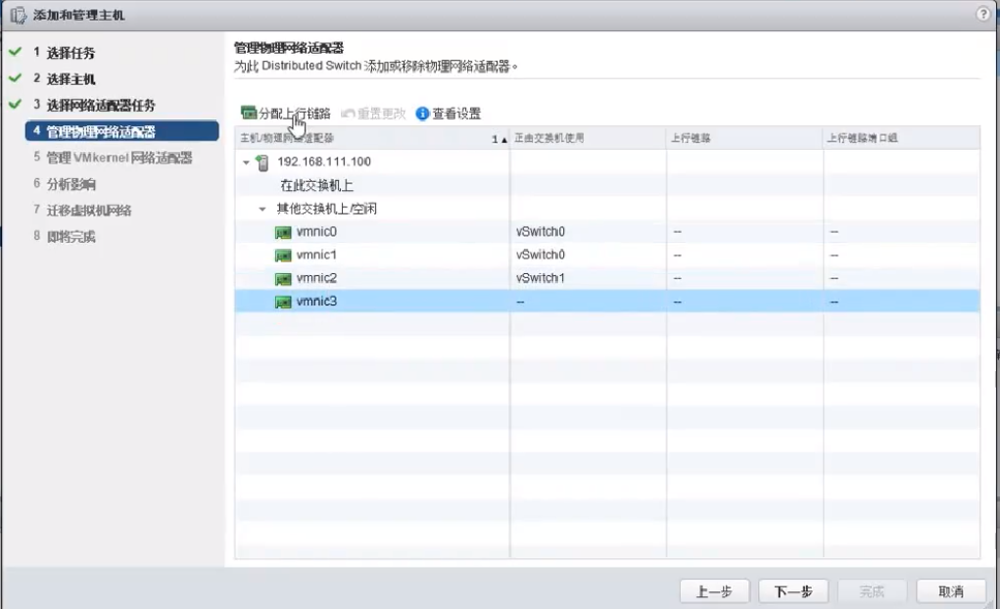

1. 完成操作

# 十二、分布式交换机添加vlan端口组
1. 点击新建分布式端口组

1. 设置名称

1. 设置vlan

1. 编辑虚拟机设置，选择更多网络

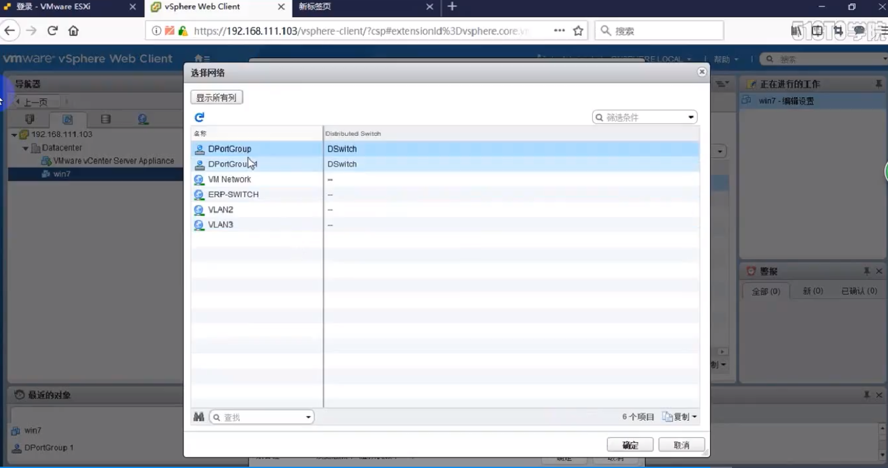

# 十三、vmotion网络配置
1. 虚拟机迁移是报错

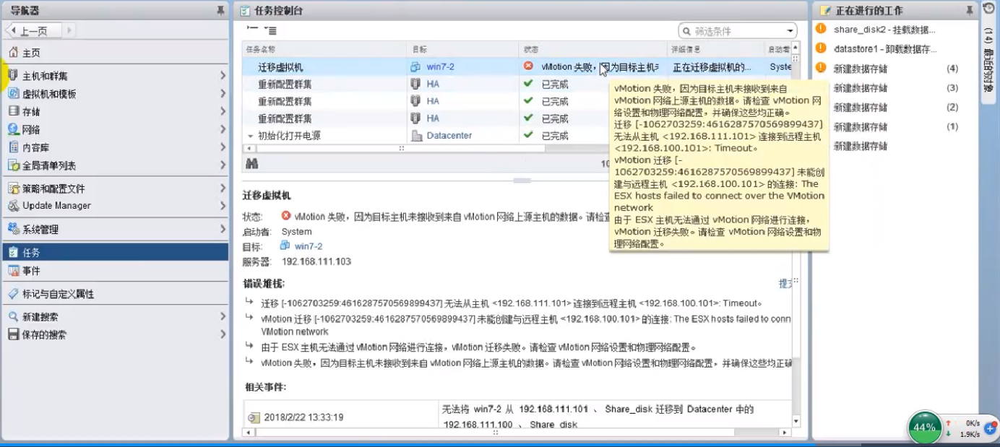

1. 主机——配置——vmkernel适配器——vmotion

1. 编辑设置——勾选vmotion

 

