# 分布式交换机配置流量镜像
# 一、创建分布式交换机
1. Web浏览器启动Vmware vSphereWeb Client,连接到vCenter Server Appliance界面
2. 单击"主页"，选择"网络'

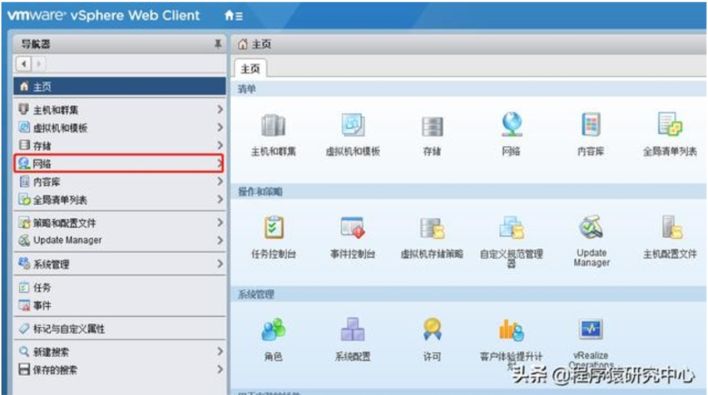

1. 右击"数据中心"，单击Distributed Switch中的"新建Distributed Switch"

1. 输入分布式交换机名称

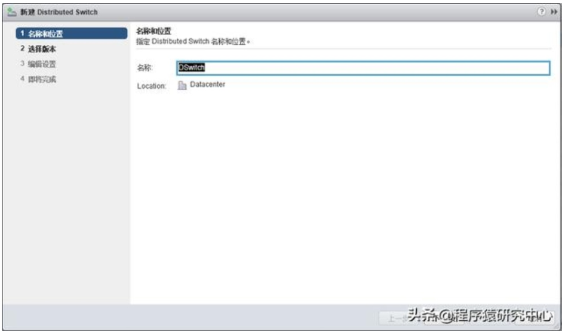

1. 选择版本

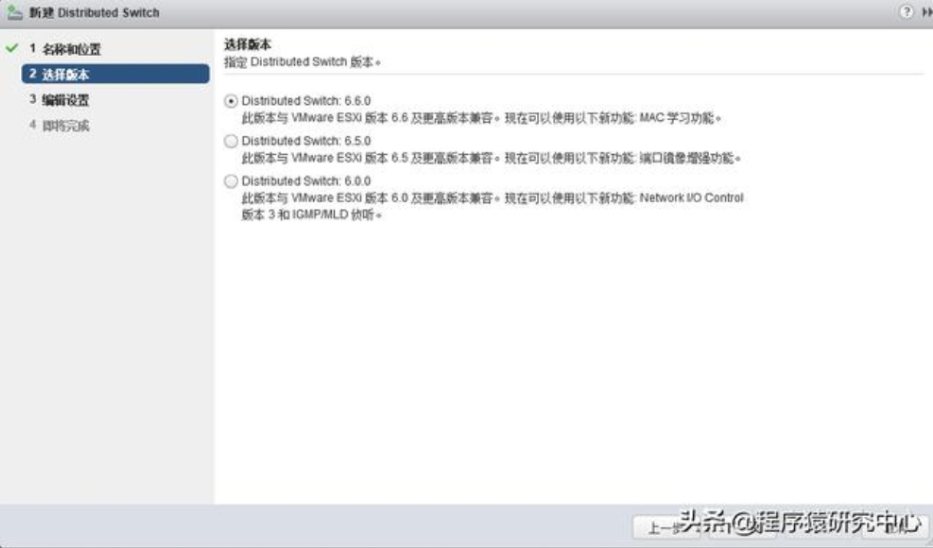

1. 指定上行链路端口数，IO Control及默认端口组名称

1. 完成，会建议你后续可新建分布式端口组，以及添加和管理主机

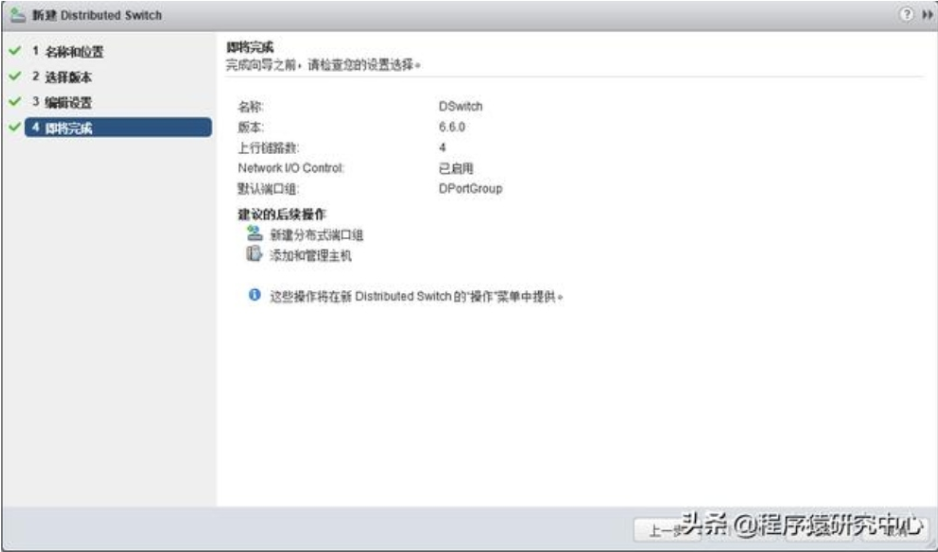

# 二、添加主机至分布式交换机
1. 右击分布式交换机，然后选择"添加和管理主机"

1. 添加主机

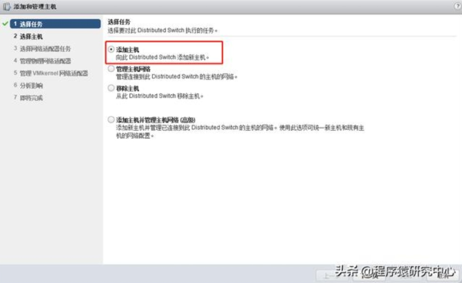

1. 选择"新主机"，然后添加主机

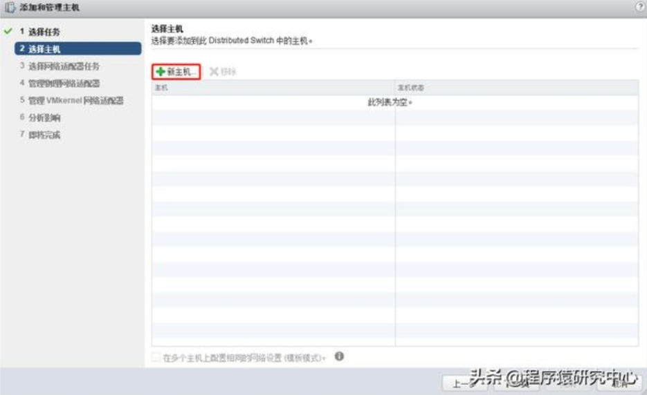

1. 勾选'管理物理适配器'，后续可自行添加管理VMkernel适配器；迁移虚拟机网络，将在后面操作。

1. 将主机上的网卡分配至上行链路，可选择链路或者自动分配

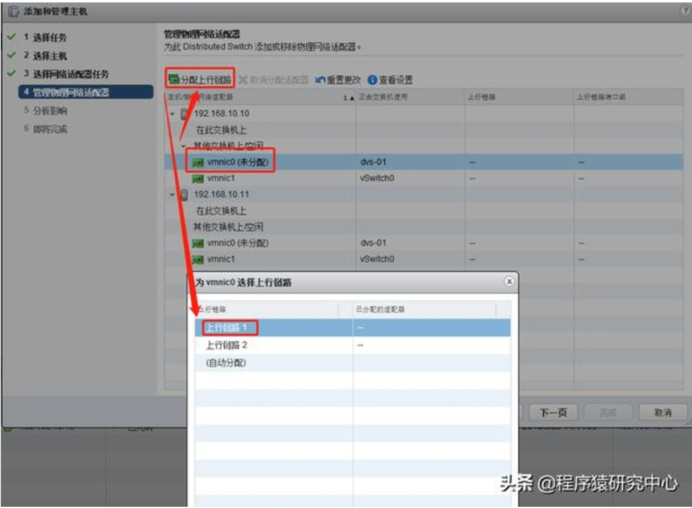

1. 分配完成

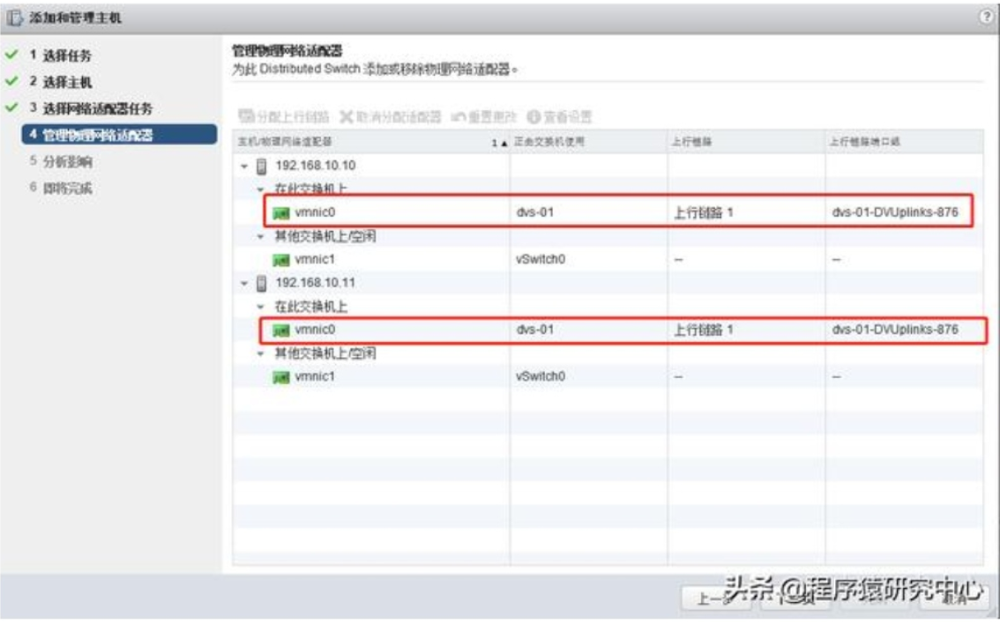

1. 分析影响

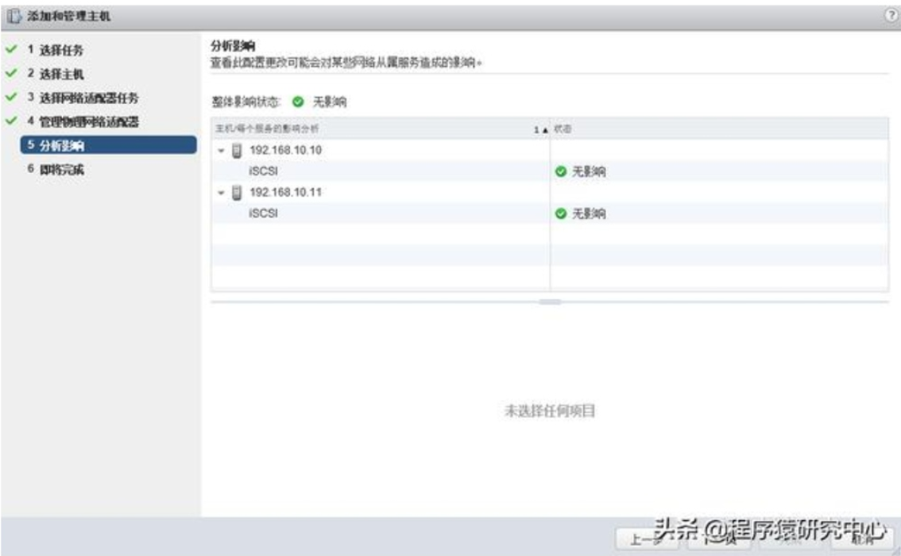

# 三、将虚拟机迁移到分布式交换机端口组
1. 右击分布式交换机名称，选择“将虚拟机迁移至其他网络”

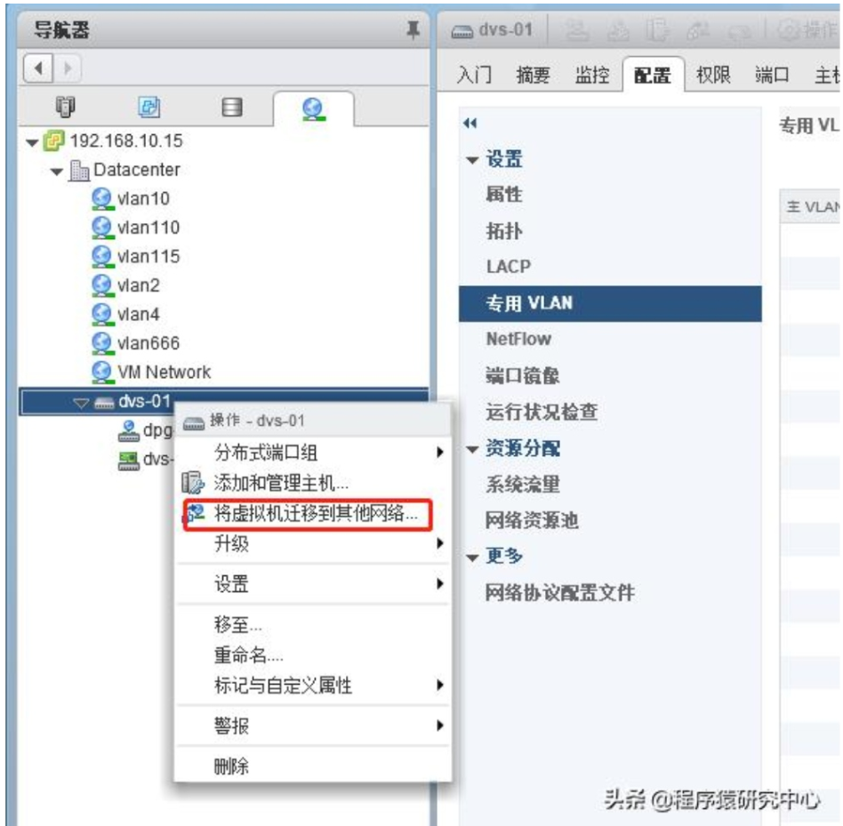

1. 将虚拟机从标准交换机迁移至该分布式交换机，例如，从标准交换机VMnetwork端口组迁移至分布式交换机的默认端口组等。也可以将未连接网络的虚拟枧迁移至该分布式交换机端口组。

1. 确认各项配置，检查端口、虚拟机、主机及拓扑等是否正常设置

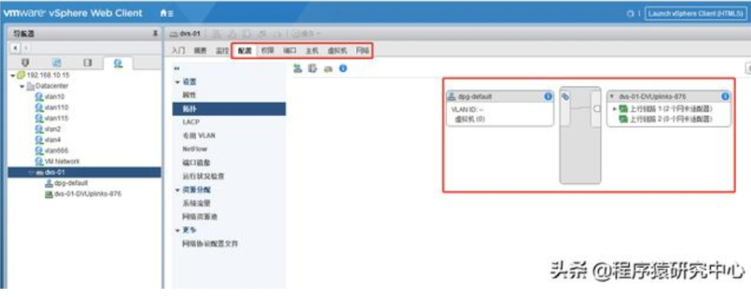

至此，分布式交换机简单部署完成。下一步，部署流量镜像，实现该vCenter环境中一台虚拟机监控所有虚拟机流量。

# 四、分布式交换机端口镜像分类
1. 过分布式端口镜像：将网络流量从一组分布式端口镜像到其他分布式端口。源和目标虚拟机必须在同一主机上。
2. 远程镜像源：将网络流量从一组分布式端口镜像到特定上行链路端口。
3. 远程镜像目标：将网络流量从一组VLAN镜像到分布式端口。
4. 已封装远程镜像(L3)源：将网络流量从一组分布式端口镜像到远程代理的|P地址。

# 五、分布式端口镜像（同一主机中的虚拟机）
1. 在vspherewebClient导航器中，浏览到分布式交换机。
2. 单击配置选项卡并展开设置。
3. 选择端口镜像选项并单击新建。
4. 选择端口镜像会话的会话类型

1. 输入"名称"、"状态"启用等信息，下一步

1. 选择端口镜像会话的源端口

1. 同样，选择目标端口即用来获取流量的端口，FINISH

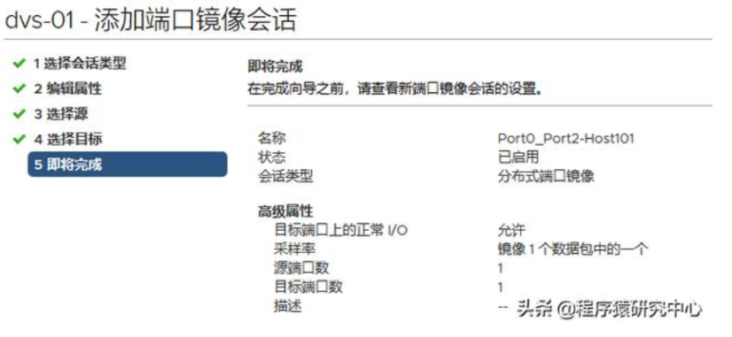

1. 测试，在源端口对应虚拟机上做ping测试，在目标端口对应虚拟机进行抓包测试

经测试，可获取到流量数据。

# 六、远程镜像源·远程镜像目标（不同主机中的虚拟机）
实现目标：主机2中的虚拟机B可以获取到主机1中的虚拟机A的进出流量

设计方案：创建远程镜像源将主枧1中的虚拟机A流量封装成VLANx然后镜像至主机1的上行端口1；创建远程镜像目标，将封装的VLANx镜像至待接收的主机2上的虚拟机B。

1. 在vspherewebClient导航器中，浏览到分布式交换机。
2. 单击配置选项卡并展开设置。
3. 选择端口镜像选项并单击新建。
4. 选择端口镜像会话的会话类型

1. 编辑属性，名称、是否启用、封装的VLANID、正常IO不影响

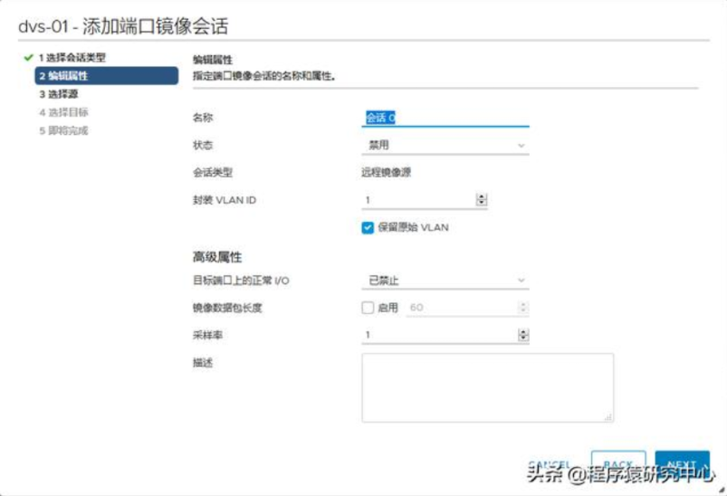

1. 选择源

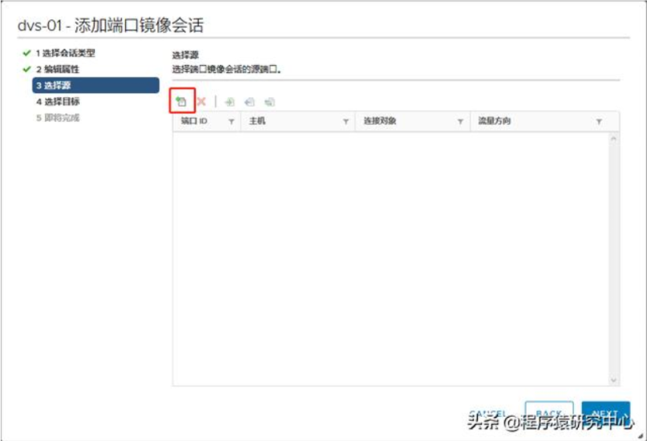

1. 选择要镜像的端口

1. 选择目标-链路

注：以上上行链路的配置，如果选择了和源不是一个主机，最后保存的时候会报如下错

1. 确认配置，FINISH

至此，某端口流量已经封装成VLANx并镜像至上行链路，接下来，只需把该VLAN流量镜像至需要的端口即可。

# 七、创建"远程镜像目标"
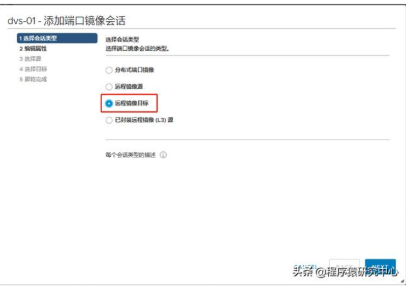

1. 编辑属性

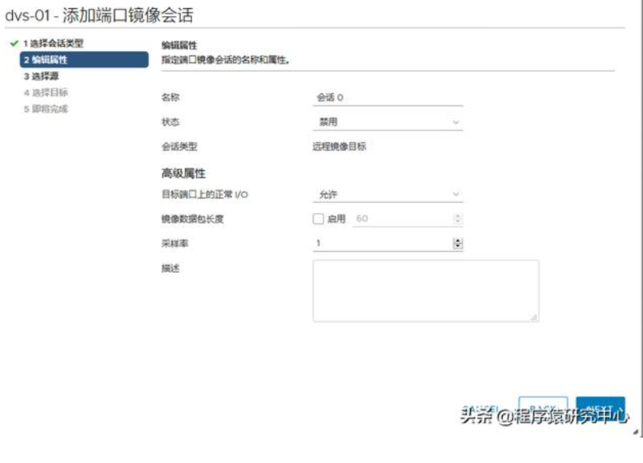

1. 选择源，配置以上封装的VLAN

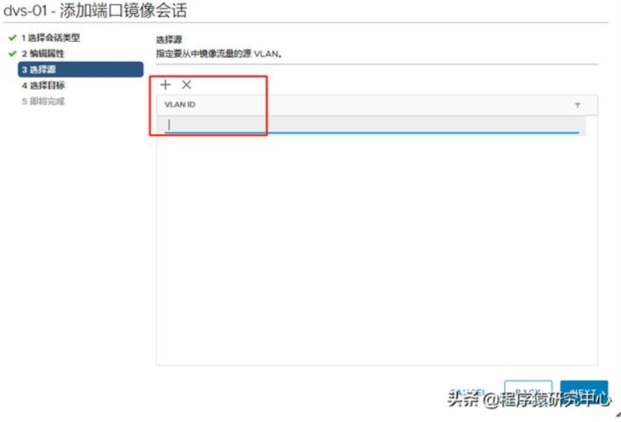

1. 选择镜像目标，配置需要这些流量的端口

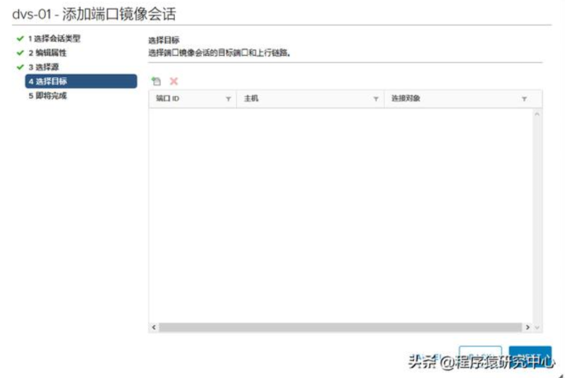

1. 完成配置，确保镜像会话都已启动

1. 测试

 

